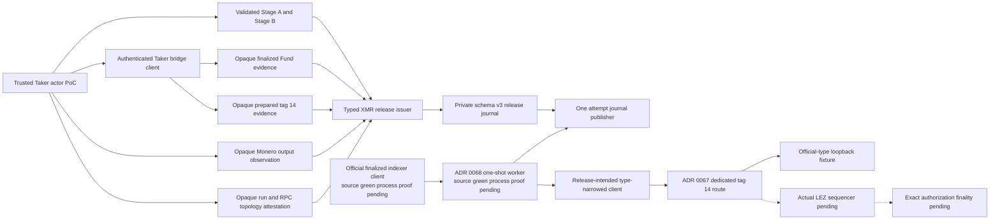
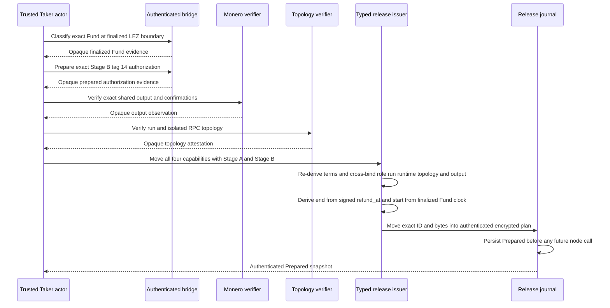

# ADR 0065: Bind XMR release to opaque evidence and the signed guest deadline

Status: Accepted for the M4 component checkpoint

Date: 2026-07-19

## Context

The schema-v3 release journal and its internal publisher already protect one
exact publication with authenticated encrypted storage, one
Prepared-to-PublicationStarted compare-and-swap winner, a second finalized-clock
gate, and terminal observe-only outcomes. That machinery previously accepted
only a private raw ReleasePlan created by tests. It did not prove that the plan
came from the countersigned XMR agreement, canonical finalized LEZ Fund
evidence, the exact Monero output, or the authenticated local topology.

The checked guest obtains the claim deadline from the initialized metadata. Tag
14 does not carry a deadline in its transaction message. Stage A signs
refund_at_ms, Stage B commits Stage A, the bridge terms copy that exact value,
initialization writes it into metadata, and checked execution admits claim
authorization only while consensus time is less than refund_at. The journal
uses an operational half-open interval with an additional lower gate. Therefore
only the exclusive upper deadline is identical; the guest has no equivalent
lower bound.

The prepared authorization wrapper is private-field and non-Clone, but the
release-authority and bridge-adapter are separate Rust crates. Rust has no
cross-crate friend visibility. A consuming public extraction is therefore still
needed for this in-process PoC. The PoC threat model trusts the actor process and
keeps generic tag-14 submission rejected and direct node access isolated. This
is not hostile-caller or production non-bypassability.

## Decision

Add ReleaseStore.prepare_xmr_claim_release as the only public path into the
private ReleasePlan. It consumes by ownership:

- validated Stage A and Stage B references;
- private-field finalized LEZ Fund evidence minted by the authenticated Taker
  bridge client;
- private-field prepared tag-14 authorization evidence minted by the
  authenticated Taker bridge client;
- a private-field exact Monero output observation; and
- a private-field run, chain, RPC-origin, and credential-topology attestation.

The issuer re-derives Stage B and requires exact Taker role, run, runtime, and
full v3 terms equality. It binds the topology to the same run and observation,
then compares Monero network, genesis, shared address, amount, and confirmation
policy with the signed agreement.

Callers cannot provide the publication ID, publication bytes, journal deadline,
resource identity, topology commitment, LEZ commitment, or raw release plan.
The issuer derives:

- the publication ID and exact bytes from the consumed prepared authorization;
- the exclusive journal end from the shared signed refund_at_ms;
- the lower operational gate from the canonical finalized Fund clock;
- the claim-partial commitment from the same v3 terms;
- a domain-separated run digest and swap/run activation identity;
- a full runtime-and-terms target; and
- domain-separated commitments to finalized LEZ and topology evidence.

The clone-enabling borrowed authorization accessor is removed. Exact
authorization bytes move once into Zeroizing storage. A consuming
into_unsubmitted_authorization escape hatch remains public only for the trusted
single-process PoC boundary. Production must replace it with a dedicated
release-service process and UID that owns the bridge capability, journal key,
and sequencer client; the actor must never receive signed tag-14 bytes.

The generic sidecar submission method remains unchanged and must continue to
reject tag 14 with zero sequencer sends.

## Component view

## Issuance sequence

## Atomicity contribution

This decision does not create a distributed cross-chain commit. It closes one
release-side gap in the XMR atomicity argument:

1. The Taker LEZ Fund must be canonical and finalized before the Maker can be
   induced to lock XMR.
2. The exact Maker XMR output must match the signed agreement and reach the
   required canonical confirmations before the Taker claim partial is admitted
   to the journal.
3. The claim partial is committed by Stage B and can only be published through
   the exact checked guest authorization before the signed refund boundary.
4. The exact authorization is encrypted and persisted before publication can
   start. The publisher grants one local sender, samples finalized time again
   after its durable CAS, never sends at or after refund_at, and never retries an
   uncertain send.
5. Once actual authorization finality is composed, the Maker can use the
   published partial to complete the LEZ claim while the Taker obtains the
   corresponding adaptor information required for the Monero spend path.

The argument still depends on actual-node submission, actual authorization
finality, actor/network isolation, and the later signed refund and punishment
recovery branches. Admitted is not finalized.

## Consequences

Positive:

- Raw caller-selected deadlines and publication identifiers cannot enter the
  journal.
- The journal and checked guest share the same signed exclusive upper deadline.
- Reopening uses a deterministic domain-separated run digest without exposing
  raw private plan construction.
- Generic submission remains closed, preserving the planned journal-owned
  release route.
- Exact bytes are moved instead of cloned at the issuer boundary.

Residuals and production work:

- The trusted actor can consume prepared bytes in the in-process PoC. A
  dedicated release-service process is required before hostile-caller claims.
- ADR 0067's separate route now reloads the durable authorization, decodes
  official bytes, and verifies canonical returned-ID behavior against an
  official-type loopback fixture. Dedicated-service bearer ownership,
  actual-sequencer evidence, and reconciliation between the release and sidecar
  journals remain.
- Finalized current time must come from a genesis-bound finalized indexer route,
  not the sequencer-current clock method.
- Exact tag-14 finalized classification, definitive absence policy, actor
  composition, actual-local execution, rollback anchoring, and crash/chaos
  hardening remain.
- The release-authority trusted dependency surface now includes the bridge
  adapter, protocol, swap core, and XMR SDK. They are existing workspace
  MIT-or-Apache components and remain under cargo-deny policy.

## Rejected alternatives

Accept raw release fields from an actor: rejected because a caller could choose
another deadline, publication ID, or evidence marker.

Enable generic sidecar submission for tag 14: rejected because it bypasses the
Monero, topology, finalized-Fund, and journal gates.

Use the existing sequencer current-clock method as finalized time: rejected
because that route explicitly does not establish finalized-indexer time.

Call the complete journal window identical to the guest window: rejected
because the guest has no lower bound; only the exclusive upper deadline is the
same.

Import the standalone official LEZ graph into the release-authority crate:
rejected because official decoding and node calls belong in the isolated
sidecar and carry a separate dependency and distribution-review surface.
