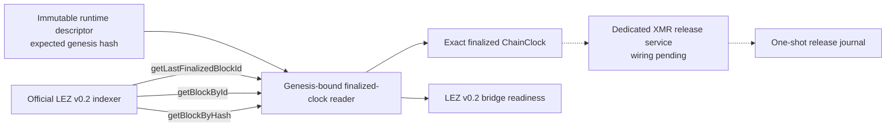
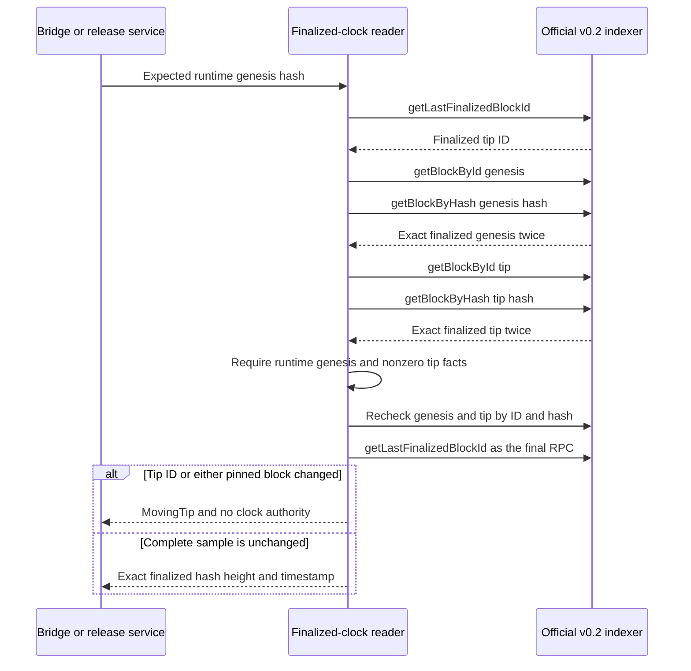

# 0066 Bind release time to a stable finalized chain and exact genesis

Status: Accepted as an M4 official-indexer clock component checkpoint.

## Context

The XMR release journal uses a half-open operational interval whose exclusive
end is the exact signed refund_at_ms enforced by the checked LEZ guest. A
publisher therefore needs authoritative LEZ time after winning its one-shot
compare-and-swap. The existing current-clock observation reads the canonical
sequencer tip, which is useful for ordinary state observation but is not a
finality statement. Reading only getLastFinalizedBlockId also does not prove
that the indexer serves the runtime descriptor's chain.

A stale clock is unsafe at this boundary: it could appear to remain before the
signed deadline even after the finalized chain has crossed it. A moving sample
must fail closed instead of returning the earlier value.

## Decision

Add read_genesis_bound_finalized_clock to the pinned LEZ v0.2 sidecar.

For every sample it:

1. reads getLastFinalizedBlockId and requires at least genesis;
2. reads genesis and the finalized tip by numeric ID;
3. independently rereads each block by hash and requires exact equality and
   Finalized status;
4. requires the genesis hash to equal the immutable runtime descriptor;
5. rejects a zero tip hash or timestamp;
6. rereads genesis and the tip, then makes a finalized-ID equality check the
   final RPC; and
7. returns the exact tip ChainClock only if the complete sample is unchanged.

Any tip advance or regression during the sample is MovingTip. This strictness
is deliberate for deadline authorization: returning the older finalized time
would trade safety for liveness.

The executable lez-v02-bridge-poc now performs this check before publishing
readiness. The primitive remains inside the separately locked compatibility
crate with the official v0.2 indexer client. The release publisher is not yet
wired to it; that connection belongs in the dedicated release-service process,
not in a role actor and not in the generic submission route.

## Components and RPCs

The component test uses an in-memory implementation of the same
FinalizedIndexerApi; it has no RPC, public endpoint, peer, faucet, funds, or
external finality service. Actual bridge startup uses the configured official
indexer endpoint, which is a dynamic literal-loopback RPC in the local PoC.

## Stable-sample flow

## Atomicity and deadline argument

This component does not make a cross-chain swap atomic and does not prove tag-14
submission or finality. It closes one necessary release-admission premise:

- the release journal's post-CAS time is drawn from a finalized LEZ block;
- the finalized indexer is bound to the same genesis as the signed runtime;
- the returned sample cannot be the stale first half of a moving observation;
- the publisher can compare that timestamp to the exact signed exclusive end;
  and
- failure yields no clock authority and therefore no release send.

ADR 0067 separately supplies the type-narrowed release-intended route and
canonical returned-ID behavior against an official-type loopback fixture. The
happy claim path still needs actual-local finalized Fund evidence,
release-service bearer ownership and clock/route wiring, actual-sequencer
execution, finalized authorization classification, claim completion, and
independent actors. Generic actor-facing submission remains closed.

This read is not atomic with a later sequencer send. The finalized tip can
advance immediately after return. The checked guest's exact signed deadline
remains the definitive on-chain enforcement; the clock prevents an internally
stale bracket from granting publisher admission and reduces futile late sends.

## Evidence

The focused integration gate proves:

- the exact stable tip hash, height, and timestamp are returned for the expected
  genesis;
- a wrong configured genesis is rejected;
- a finalized-tip advance exposed only by the final RPC is rejected; and
- exactly two finalized-tip ID reads occur, with the equality read last.

The complete pinned sidecar suite passes 142 of 142 tests. Strict Clippy,
warning-free Rustdoc, dependency policy, and repository gates remain required
before the checkpoint is pushed.

## Consequences and residuals

- Rapid local finalization may cause a transient MovingTip. A caller may take
  a new complete sample; it must not reuse the rejected earlier clock.
- This checkpoint does not expose a new actor RPC or release capability.
- The local PoC trusts the official indexer's finalized classification once the
  ID/hash/genesis consistency checks pass. Production should independently
  review rollback anchoring, indexer compromise, and cross-source finality.
- ADR 0067's sealed publisher now consumes a clock-only trait and narrow client
  in its loopback integration. ADR 0068 wires the official v0.2 indexer client
  into the real worker against an indexer-wire fixture. Actual-local execution,
  exclusive different-UID ownership, and moving preparation behind the service
  boundary remain.
