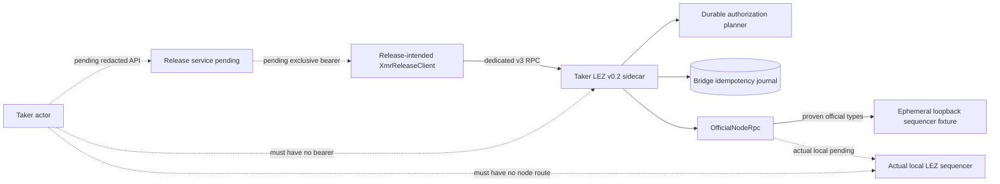
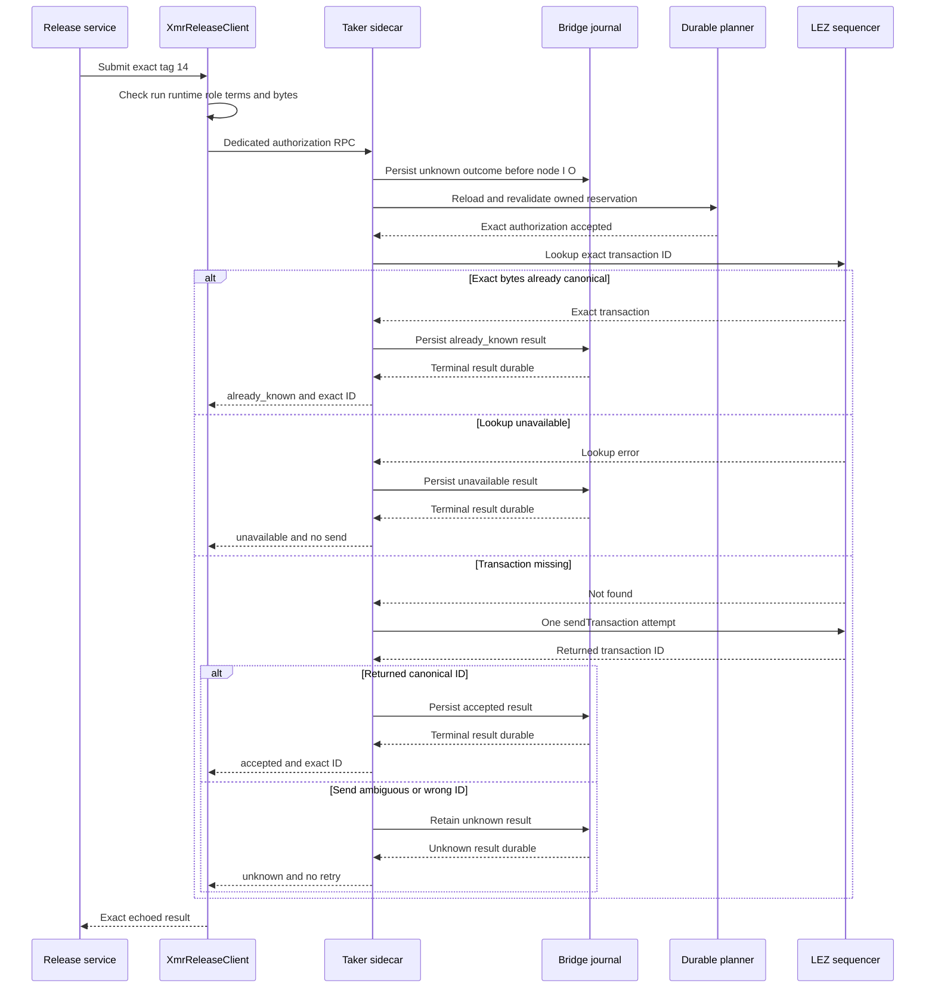

# ADR 0067: Submit XMR claim authorization through a dedicated one-attempt route

- Status: Accepted for the M4 component checkpoint
- Date: 2026-07-20

## Context

The checked XMR guest requires a Taker-signed tag-14 authorization before the
Maker claim can succeed. ADR 0063 intentionally stopped at durable preparation,
and generic `submit_transaction` intentionally rejected tag 14. ADRs 0064 and
0065 made the release journal the semantic publication authority, but its node
publisher was still an in-process seam. Widening generic submission would let
any holder of an actor sidecar capability bypass the release decision.

The next progressive-PoC slice needs a concrete submission transport without
claiming finality or weakening the generic boundary.

## Decision

Add one strict protocol method:

`lez_bridge.v3.submit_native_xmr_claim_authorization`.

Its request carries the exact run/role context, immutable runtime descriptor,
complete v3 terms, and exact prepared authorization. Its response echoes the
context and terms and returns the exact authorization transaction ID plus
`accepted` or `already_known`. Admission is never called finality.

Expose the method in the typed Rust client API only through
`XmrReleaseClient`, a narrow Taker-only client intended for ownership by the
release-service process. Do not add it to the ordinary `BridgeClient` API. The
process boundary remains decisive: the actor must not receive the
release-service bearer or direct access to the sidecar or sequencer namespace.

The sidecar keeps tag 14 outside `validate_owned_submission`. The dedicated
route instead reloads and revalidates the exact durable authorization
reservation, including run, Taker role, runtime, terms, Fund-plus-one nonce,
checked ABI, account order, signer, canonical bytes, and transaction ID.

Before either exact lookup or send, the sidecar journal durably records an
`UnknownSubmissionOutcome` replay result. It then performs an official
`getTransaction` lookup. Exact byte identity returns `already_known`; a miss
permits exactly one official `sendTransaction`. The official client decodes the
transaction, derives its canonical hash, and requires the returned ID to match.
A lookup transport failure is typed unavailable and permits no send. Once a
send is attempted, timeout, transport failure, or returned-ID drift remains
unknown and is never retried for that request ID.

## Components

The pending service box is deliberate. This checkpoint supplies its typed
client and sidecar transport, not the process, actor API, or network isolation.

The route itself does not consume Fund, Monero output, topology, deadline, or
release-journal evidence. The typed client is not a security boundary by
itself; exclusive process ownership of its bearer and network path is required.

## One-attempt flow

## Safety and atomicity contribution

This route preserves a narrow safety property; it does not alone make the
cross-chain swap atomic.

1. Generic actor submission cannot admit tag 14.
2. Durable unknown state precedes both lookup and send, so a crash cannot grant
   the same request ID another attempt.
3. Only the exact planner-owned authorization can reach official node I/O.
4. `already_known` requires a byte-identical official transaction under the
   canonical ID.
5. `accepted` requires the official returned ID to equal the locally derived
   canonical ID.
6. No client or server retry turns uncertainty into a second send.

End-to-end atomicity still requires the release journal to grant only one
semantic publication across all request IDs, exact authorization finality
before Maker claim, canonical claim revelation, DLEQ recheck, and reconstructed
Monero spend. A new sidecar request ID is not a substitute for the release
journal compare-and-swap.

## Evidence and limits

The focused authenticated route test proves:

- generic tag-14 submission fails before any sequencer send;
- a byte-identical canonical lookup returns `already_known` after one lookup
  and zero sends;
- a missing lookup permits one official send;
- the mock sequencer returns the canonical hash derived from the decoded
  official transaction;
- the canonical response is accepted only with the exact returned ID;
- a wrong official returned ID becomes `UnknownSubmissionOutcome`, and
  same-request replay performs neither another lookup nor another send;
- deleting planner state makes a fresh request ID fail closed without
  increasing the send count.

The protocol and client tests additionally prove strict JSON, unknown-field
rejection, Taker-only construction, local drift rejection with zero calls, and
wrong returned-ID rejection after one call.

These tests use ephemeral literal-loopback JSON-RPC fixtures and deterministic
local keys. They use no Docker, public RPC, faucet, public funds, peer, or
external finality service. They are component evidence, not actual-local-node
evidence.

## Residuals

- The dedicated release-service process and low-privilege redacted actor API
  are not implemented yet.
- The PoC must isolate the actor from the sidecar bearer and unauthenticated
  sequencer route with a private network namespace, not only a separate UID.
- The sidecar route trusts bearer ownership; any holder with the exact durable
  authorization could call it before the release decision.
- The bridge journal, release journal, and chain are not one transaction.
- The release journal remains the only semantic one-attempt authority across
  different sidecar request IDs.
- Authorization admission is not finality. Claim preparation remains disabled
  until exact finalized authorization evidence exists.
- Crash after journal reservation can sacrifice liveness by replaying unknown;
  this is the safe PoC choice.
- Actual-local sequencer submission, server-restart unknown replay, exact
  authorization finality, and definitive absence remain unproved.
- Same-host rollback, journal clone, cancellation-after-CAS hardening, public
  node trust, and operational recovery remain production work.

## Consequences

The release service can now use a small typed client rather than a generic
transaction API. The actual-local M4 path can proceed to service ownership,
authorization finality, and claim execution without relaxing the tag-14
boundary. The `m4-complete` tag remains forbidden until the full milestone
evidence and closure gates pass.
