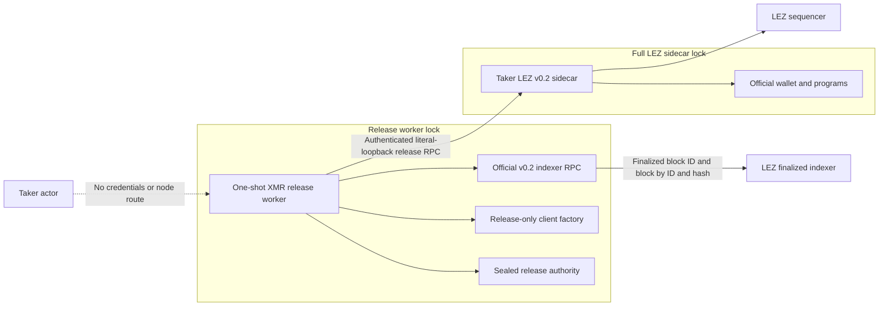
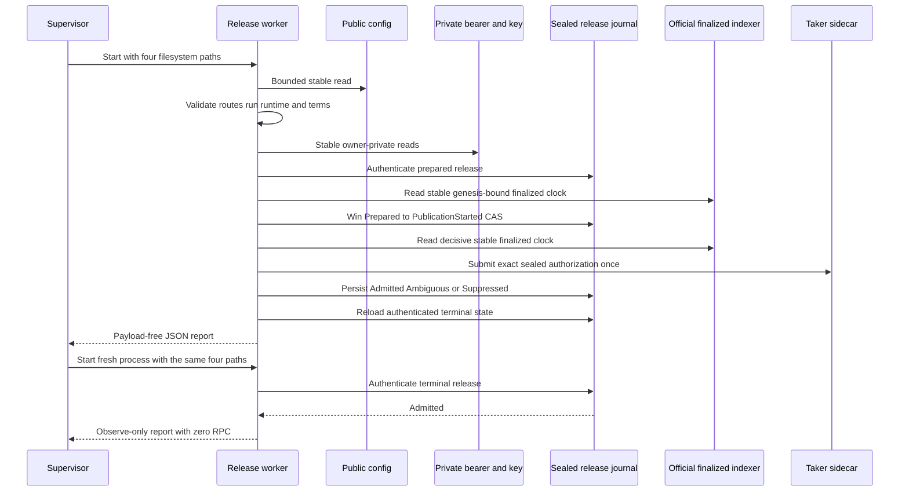

# ADR 0068: Isolate the XMR release worker from the full LEZ sidecar graph

- Status: Accepted; process gates and one actual-local working-tree publication GREEN
- Date: 2026-07-20

## Context

ADR 0067 provided the sealed publisher, release-only bridge client, dedicated
tag-14 sidecar method, and official finalized-clock algorithm as independently
green components. M4 still needed one process to own the bearer, journal key,
sealed journal, finalized-indexer route, and sole publication attempt.

Putting that process inside the existing separately locked LEZ v0.2 sidecar
package created an unsatisfiable Cargo graph. The sidecar intentionally carries
the full official wallet and program stack, whose key-protocol branch selects
the stable digest 0.11 line. The release authority reaches the exact Zcash
script graph through the bridge adapter, whose pinned pre-release HMAC requires
digest 0.11.0-pre.9. Cargo correctly refuses to merge those semver-compatible
but mutually exclusive selections.

Repinning either upstream would weaken the already checked M2/M3 and LEZ v0.2
boundaries. Importing the full wallet into a process that needs only finalized
indexer reads would also enlarge its dependency and attack surface.

## Decision

Create the standalone package
`compat/lez-v0_2-xmr-release-service` with its own lockfile. It depends on:

- the existing release authority, release-only client factory, and strict bridge
  protocol from the root workspace;
- the exact official LEZ v0.2 indexer protocol and generated RPC client pinned
  to tag v0.2.0;
- the established JSON-RPC, URL, SQLite, zeroizing credential, and async
  libraries already accepted by repository policy.

It does not depend on the official wallet, key protocol, programs, Risc0
runtime, sequencer protocol, or general LEZ sidecar package. The official
indexer client uses the generated v0.2 RPC methods directly through a bounded,
single-concurrency, no-retry HTTP client.

The worker accepts only four filesystem locations:

- one bounded public JSON config;
- one fixed owner-private state directory containing
  `xmr-release.sqlite3`;
- one owner-private sidecar bearer file;
- one owner-private journal protection-key file.

The public config contains exact run, runtime, terms, route profile, sidecar
endpoint, indexer endpoint, and a non-secret key-rotation ID. It contains no
bearer, key material, authorization bytes or ID, request ID, deadline override,
journal path, or timeout override.

The process validates the complete public route and terms-to-runtime binding
from a stable regular config file owned by the worker UID, linked once, and
non-writable by group or others before private reads. The config is public in
confidentiality, not mutable by an untrusted local principal. It then loads both credentials through the hardened
owner, mode, link, descriptor/path, bounds, and post-read stability checks,
authenticates the existing sealed journal, constructs only
`XmrReleaseClient`, samples the official genesis-bound finalized clock, and
invokes the sealed publication wrapper. The journal is reloaded after the
attempt before one allowlisted JSON report is emitted.

Process success requires the authenticated post-attempt journal state to be
`Admitted`. An ambiguous, suppressed, prepared, or publication-started state
is still reported without payloads but exits unsuccessfully.

## Dependency boundary

The two packages communicate through the already strict authenticated bridge
protocol. They do not share Rust types from the official wallet graph, and no
dependency pin is relaxed.

## One-shot flow

The first and second finalized-clock samples each read the finalized ID before
and after, then read genesis and tip independently by both numeric ID and hash.
A changed finalized ID, wrong genesis, non-finalized block, hash mismatch,
changed block, zero hash, or zero timestamp fails closed.

## Atomicity contribution

The worker narrows authority; it does not create a distributed transaction
across LEZ, Monero, and SQLite.

1. The actor API carries no release credential or authorization payload.
2. Public route and signed terms drift fail before credential or journal use.
3. Only the fixed authenticated journal record selects the swap and exact
   authorization.
4. One durable semantic CAS precedes decryption and sidecar submission.
5. A second finalized sample suppresses a regressed, expired, or unavailable
   attempt without a node call.
6. Any uncertain post-CAS submission is terminal and never retried.
7. The emitted report omits transaction identity, authorization, credentials,
   deadlines, private paths, and peer errors.
8. A fresh worker must observe the authenticated journal and cannot re-arm the
   attempt.

Exact authorization finality and the subsequent canonical LEZ claim remain
separate required gates. The process cannot honestly claim full swap atomicity
until those effects and the Monero share-reconstruction path execute through
independent actors.

## Evidence

At this checkpoint:

- the standalone graph resolves offline to 432 locked packages;
- all library and binary targets compile;
- three focused tests prove closed endpoint profiles, exact payload-free report
  shape, and error/path redaction;
- a fourth regression proves that group-writable or multiply linked public
  config is rejected;
- strict no-deps Clippy and warning-fatal Rustdoc pass;
- advisories, bans, licenses, and sources pass under a real graph-local policy
  that mirrors the root rules and adds only the official Logos repository;
- CI independently runs locked test, Clippy, Rustdoc, and dependency-audit
  gates for this separately locked graph;
- one checked integration seeds the journal through the public typed issuer,
  first requires a redacted rejection and zero RPC for a group-writable route
  config, then starts the real worker binary and observes exactly one accepted
  submission after four finalized-ID, eight block-by-ID, and eight block-by-hash
  calls; a fresh process reports observe-only with zero additional RPC or
  submission calls, and every child is kill-on-drop bounded to 15 seconds;
- the official source is allowlisted only at the exact Logos execution-zone
  repository in the worker policy and remains pinned by manifest and lockfile
  to tag v0.2.0; the root graph has no Git-source exception.

No Docker, public RPC, faucet, public funds, peer, or external finality service
is used by these compile, unit, or process gates. The process proof uses
ephemeral authenticated official v0.2 indexer-wire and typed bridge-protocol loopback services and deterministic
typed fixtures; it does not claim actual-node behavior. Cold cache setup can
require crates.io and the pinned official Git source.

## Residuals

- ADR 0074 supplies the exclusive preparer; working-tree actual-local execution
  is GREEN, while exact committed replay and different-UID isolation remain.
- The source boundary does not by itself prove a different UID, mount
  namespace, or network namespace. The later isolated runtime lane must deny the
  actor access to the credential paths, sidecar, indexer, and sequencer.
- The pinned official v0.2 genesis block ID is one. A later Logos version
  requires an explicit compatibility update and fresh tests, not silent reuse.
- The working-tree claim executed fresh Monero funding, preparer/publisher,
  authorization finality, LEZ tag 15, extraction, and the wallet sweep. Exact
  committed replay, signed recovery, and M4 closure remain.
- The root adapter graph still carries pre-existing upstream deprecation
  warnings. The worker is clean under strict no-deps lint; dependency warnings
  remain tracked separately from worker-owned code.

## Working-tree actual-local evidence update

The separately locked worker now has one actual local working-tree publication in addition to its fixture gates. It consumed the fresh sealed `release3` database and made the tag-14 attempt used by the successful claim. Two failed preparation states remain quarantined. This does not prove different-UID/network isolation or production custody.

This is not milestone certification. The public packet is [m4-actual-claim-poc-20260721.json](../evidence/m4-actual-claim-poc-20260721.json), explicitly pending exact committed-tree replay and scoped cleanup. Signed recovery, F7, U9, D1 XMR, and post-PoC hardening remain.
