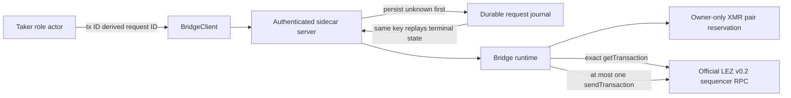
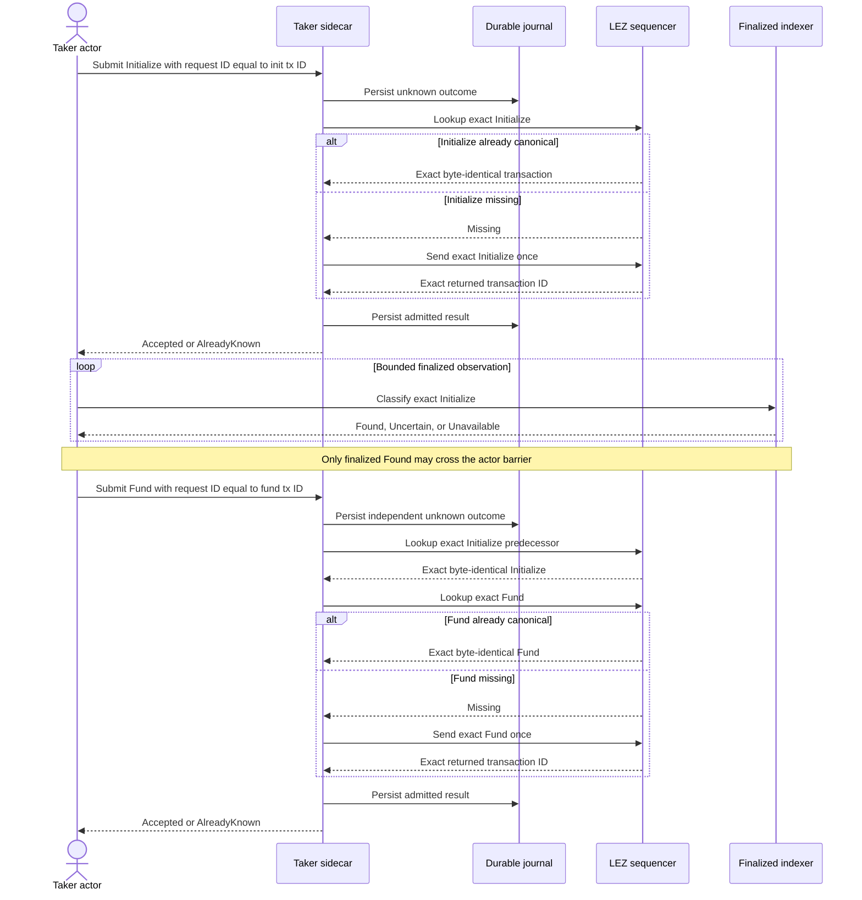

# ADR 0069: Bind XMR tag-13 attempts to transaction identity

- Status: Accepted for the M4 tag-13 component checkpoint
- Date: 2026-07-20
- Decision owners: Gateway implementation team

## Context

The checked M4 guest and Taker planner already produce one exact, owner-only
durable `InitializeNativeXmr` and `FundNative` pair. The established generic
submission route durably records `SubmissionInFlight` before its official
sequencer lookup or send. That journal is keyed by the caller's request ID,
however. Merely adding the XMR pair to the generic allowlist would let a caller
present the same transaction under a fresh ID and obtain another attempt.

Adding a second submission route or journal would duplicate working
authentication, persistence, exact lookup, returned-ID checking, and recovery
logic. The protocol already has one stable identity for an exact effect: its
canonical 32-byte transaction ID.

## Decision

For the two tag-13 effects only:

1. the request ID is exactly the transaction ID's 64-character lowercase
   hexadecimal encoding;
2. every Linux submission reloads the owner-only durable XMR pair, revalidates
   its generated ABI, signature, accounts, nonces, runtime, run, role, exact
   bytes, and IDs, and rejects missing or changed state before node I/O;
3. the established generic server journal persists the unknown outcome before
   the official exact lookup or possible send;
4. funding additionally requires the exact initialization to be present in
   canonical sequencer storage before the funding lookup or send; and
5. the actor must still classify initialization as finalized before it invokes
   funding. The sequencer-presence check is defense in depth, not finality.

`TransactionId::submission_request_id()` is the single protocol helper for the
canonical key. No dependency, RPC method, schema version, or second journal is
added. Tag 14 remains excluded from generic submission and continues through
the release-intended route.

## Ordered flow and crash behavior

The same canonical request ID and byte-identical payload replays stored success,
error, or unknown state without another node call. A changed method or payload
under that ID conflicts in the existing journal. The same XMR transaction under
an arbitrary fresh ID fails planner validation before node I/O.

A crash after the durable unknown record, whether before or after the network
call, never rearms submission. The effect can remain safely stranded and must be
observed; this is at-most-once delivery, not exactly-once delivery. This retains
ADR 0026's preference for a possible safe nonterminal state over a duplicate
ambiguous send.

## Atomicity contribution

Tag 13 neither reveals an adaptor scalar nor spends escrow to either party.
Initialization creates empty metadata and zero custody. Funding is admitted
only as the exact second transaction of the same checked, owner-only pair after
the exact initialization is visible. Canonical request identities prevent
caller-selected IDs from rearming either effect.

These properties preserve the prerequisites for the later atomic construction;
they do not prove it. The role actor still has to wait for finalized
initialization, obtain finalized Fund evidence, gate tag 14 on the exact Monero
output, finalize tag 15, extract the Maker scalar, and execute the official
Monero claim. No M4 swap or cross-chain atomicity claim follows from this
component checkpoint.

## Evidence

- protocol RED then GREEN proves the stable 64-character lowercase request ID;
- route RED reproduced a second accepted send for the same transaction under a
  fresh ID;
- the GREEN route rejects that fresh ID with unchanged node counters;
- the happy component admits initialization once, includes it, then admits
  funding once with cumulative lookup/send counters `3/2`;
- same-request replays leave those counters unchanged;
- a canonical premature Fund is terminal at one predecessor lookup and zero
  sends, and its replay changes neither counter; and
- deletion of the owner-only pair before first submission fails with zero
  lookup and zero send.

The complete separately locked sidecar suite is 145 of 145 GREEN at this
checkpoint. Strict Clippy, warning-fatal Rustdoc, dependency policy, and the
repository closure gate are GREEN for this checkpoint.

## External resources and residual work

Focused tests use an official-type literal-loopback sequencer fixture,
temporary owner-only files, and deterministic keys. They use no Docker, public
RPC, faucet, peer, public funds, or external finality service. Cold Cargo/Git
cache population and the pinned Rapidsnark static libraries remain build-time
requirements.

Actual-local LEZ submission, finalized-Initialize classification, role-process
ordering, tag-14/tag-15 finality, tag-15 planning, adaptor extraction, and the
official-wallet Monero claim remain M4 PoC work. Finality and actor ordering are
deliberately not inferred from an accepted sequencer response.
