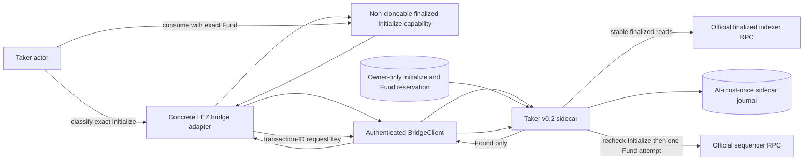
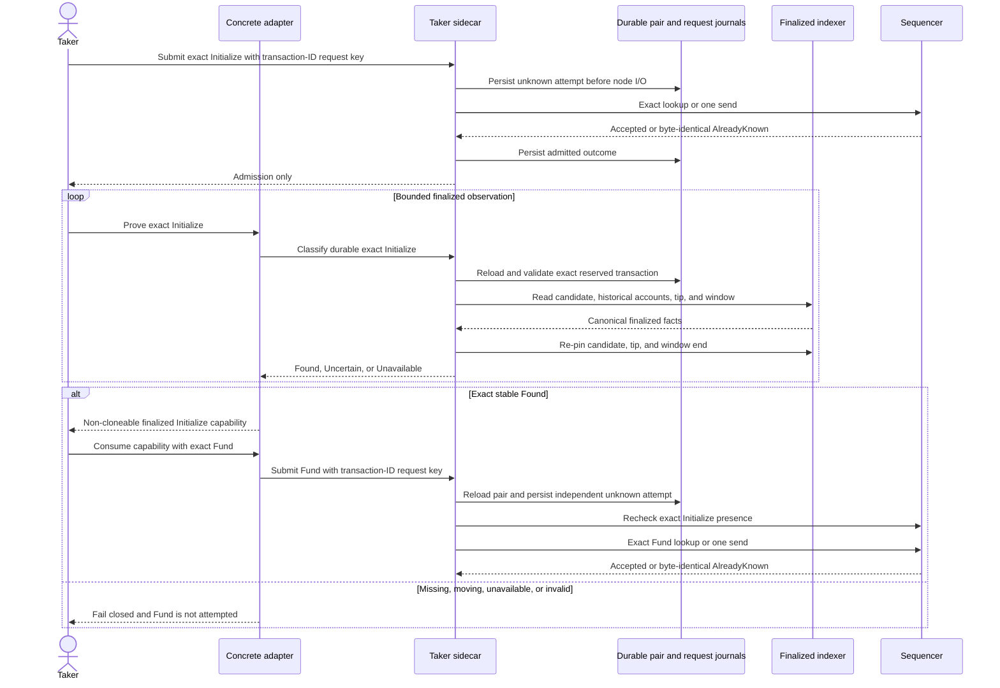

# ADR 0070: Require finalized XMR Initialize before Fund

- Status: Accepted for the M4 pre-funding component checkpoint
- Date: 2026-07-20
- Decision owners: Gateway implementation team

## Context

ADR 0069 binds each tag-13 submission attempt to its transaction ID and makes
the sidecar check exact Initialize presence before it attempts Fund. Presence
in sequencer storage is not finalized chain evidence, however. Letting an actor
treat an accepted Initialize response as final would allow Fund to race a
discarded or non-final predecessor.

The strict v3 classifier previously admitted only the exact durable Fund
target. The protocol result already supports effect-specific finalized facts,
and the durable Taker reservation already contains both exact transactions, so
a second observer, reservation, or submission journal would duplicate existing
machinery.

## Decision

1. The Taker sidecar classifier admits only exact durable `Initialize` and
   `Fund` targets. It selects the corresponding transaction from the same
   owner-only reservation before any indexer read.
2. Initialize classification validates the canonical generated
   `InitializeNativeXmr` bytes, six ordered accounts, sole depositor signer,
   absent proof, exact transaction bytes and ID, historical `Empty` metadata,
   and zero custody at the containing finalized block.
3. Fund retains the equivalent exact checks for `FundNative`, historical
   `Funded` metadata, and the exact funded custody balance.
4. Both effects re-pin the candidate block, finalized tip, and requested window
   end. A missing target remains `Uncertain`; unavailable history or a moving
   tip never mints authority.
5. Only `LezBridgeAdapter<BridgeClient>` can mint
   `FinalizedXmrLezInitializationEvidenceV3`. The capability has private fields,
   no public constructor, and is deliberately non-`Clone`.
6. The Taker Fund method consumes that capability, rechecks run, role, runtime,
   terms, exact initialization facts and bytes, derives the Fund request ID
   from its transaction ID, and then calls the established authenticated
   one-attempt submission route. The sidecar independently reloads the durable
   pair and checks Initialize presence again.

## Components and trust boundaries

The adapter cannot construct positive evidence from raw caller facts. The
sidecar remains the official-wire and durable-reservation authority. The
finalized indexer is trusted for canonical history under the pinned local-v0.2
profile; cryptographic account proofs and dishonest-indexer resistance remain
production work.

## Ordered flow and crash behavior

A crash after the Initialize attempt can strand progress but cannot mint the
capability. A crash after the Fund journal records unknown cannot rearm the
same Fund request. The two journals do not form a distributed transaction;
the design chooses at-most-once effects and conservative non-progress over a
duplicate ambiguous send.

## Atomicity contribution

Initialize creates only agreement-bound metadata with empty custody. It
reveals no adaptor share. Fund moves the Taker's LEZ into custody but is now
unreachable through the typed actor method until the exact Initialize is
stable in finalized history. This preserves the checked guest's state ordering
and prevents an admission response from being mistaken for canonicality.

This is necessary but not sufficient for the swap's atomic outcome. The happy
path still requires exact finalized Fund, the confirmed Maker-funded Monero
output, finalized tag 14, the aggregate tag-15 claim, extraction of Maker share
`s_a`, and an official-wallet Monero spend. Signed refund and punishment remain
the next progressive slice after the happy PoC.

## Evidence

- Behavioral RED: an exact durable Initialize could not be classified as
  `Found` through the Fund-only classifier.
- GREEN: exact Initialize and existing Fund cases pass under the pinned
  sidecar graph.
- Initialize negative coverage includes missing, moving tip, unavailable
  finality/history, proof-bearing or malformed transactions, wrong account
  order, wrong historical metadata, and nonzero custody.
- The complete sidecar package, strict all-target/all-feature Clippy,
  warning-fatal Rustdoc, formatting, and diff hygiene pass.
- The adapter package passes 99 tests including three doctests; strict Clippy,
  Rustdoc, formatting, and diff hygiene pass. A mismatched capability fails
  before transport.

## External resources and residual work

Focused evidence uses synthetic or authenticated literal-loopback fixtures,
owner-only temporary files, and deterministic keys. It uses no Docker, public
RPC, faucet, peer, public funds, or external finality service. Building the
separately locked sidecar still requires the digest-pinned local Rapidsnark
libraries and cached locked dependencies; cold cache population can be
network-sensitive.

An actual local LEZ v0.2 deployment and finalized-indexer execution still must
exercise this exact boundary. The local finalized indexer is trusted rather
than proof-verified, and finality immutability is a pinned runtime assumption.
Public/stagenet trust, reorg and dishonest-indexer handling, process isolation,
and rollback anchors remain production hardening.
