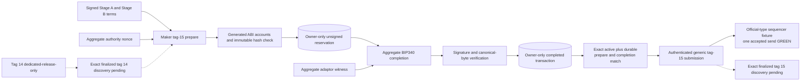
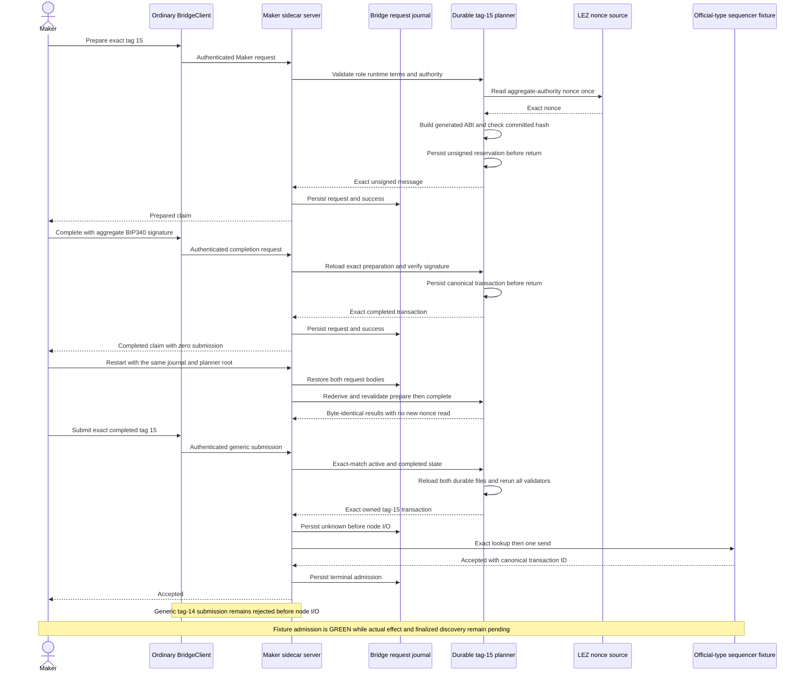

# ADR 0071: Durably prepare and complete the exact XMR tag-15 claim before submission

- Status: Accepted; exact tag-15 submission/finality and role composition are working-tree GREEN, exact committed replay pending
- Date: 2026-07-20
- Milestone: M4 progressive local-functional PoC

## Context

The checked M4 guest accepts `ClaimNativeXmr` as tag 15 only when the claim
authority supplies the aggregate BIP340 witness for the exact generated
message. Stage A commits `claim_message_hash`, so a host that chooses another
nonce, account order, instruction, or program cannot repair the mismatch after
either lock. Returning unsigned or completed bytes without durable ownership
would also make restart regenerate or replay a different effect.

ADR 0063 durably prepares tag 14, ADR 0067 gives tag 14 a dedicated one-attempt
submission path, and ADR 0070 prevents Fund before exact finalized Initialize.
Those decisions do not construct the Maker-owned tag-15 claim. Conversely,
building tag 15 does not prove that tag 14 is finalized. Node admission is now
available only after the generic route exact-matches and revalidates the active
and completed durable tag-15 reservations; admission still is not finality.

## Decision

The Maker sidecar implements the existing strict
`prepare_native_xmr_claim_v3` and `complete_native_xmr_claim_v3` protocol
methods. No parallel wire type or alternate transaction library is introduced.

Preparation:

1. requires Maker role and the exact signed runtime and XMR terms;
2. derives the aggregate authority account from the committed x-only public key;
3. reads that account's nonce once;
4. builds generated tag 15 with ordered
   `[metadata, custody, claimant, claim_authority]` accounts;
5. requires the resulting message hash to equal the immutable Stage-A
   `claim_message_hash`; and
6. owner-only persists the exact unsigned message before returning it.

Completion reloads and revalidates that exact reservation, verifies the
aggregate BIP340 signature against the exact message and authority, constructs
one canonical public transaction, and owner-only persists it in a separate
completion record. Neither method submits. The bridge request journal retains
both request bodies and rederives both successful results during startup, so a
missing, corrupt, or inconsistent planner record prevents cached-success replay.

Generic submission remains a separate step. It admits tag 15 only when the
candidate exactly equals the active completed claim and both in-memory records
exactly equal the owner-only preparation and completion files. The sidecar then
reruns the existing role, runtime, terms, ABI, signer, signature, canonical-byte,
and transaction-ID validator before the ordinary authenticated route may use
its existing lookup/send boundary. This does not admit tag 14 generically.

Solid edges are component-GREEN, including one official-type fixture send.
Dotted edges are actual-local effect, finality, or actor composition work; tag
14 remains excluded from generic submission.

## Component flow and restart rule

## Atomicity argument

This decision preserves only the host-side preconditions needed by the XMR
economic construction; it is not a cross-chain atomic commit:

- Tag 15 cannot be silently rebound after locks because the exact nonce-dependent
  message hash is already committed in Stage A.
- Completion cannot attach an arbitrary witness because the pinned BIP340
  verifier checks the aggregate signature for that exact message and authority.
- Persist-before-return plus startup rederivation prevents a successful cached
  response from surviving the loss or corruption of its owned planner record.
- Preparation and completion remain zero-send; publication becomes reachable
  only after exact in-memory and durable ownership revalidation.
- The actor must still prove exact finalized tag 14 before preparation and must
  submit and finalize the exact completed tag 15 before treating Maker's share
  as canonically revealed.

Under the supported `TakerSellsLez` flow, canonical tag-15 execution reveals
Maker share `s_a`; the Taker combines it with retained `s_b` to spend the
Monero output. If no canonical claim occurs, the signed-refund/punishment
branches described in ADR 0055 remain the recovery mechanism. This component
does not make those branches or an actual swap GREEN.

## External resources and flakiness

The component tests use authenticated in-process literal-loopback sidecars, an
official-type sequencer fixture for dedicated tag-14 admission and restored-
sidecar generic tag-15 admission, a deterministic nonce source, and owner-only
temporary directories. They use no Docker, actual chain node, public RPC, peer,
faucet, public funds, or external finality service.
After locked dependencies and pinned Rapisnark libraries are cached, runtime
external resources are empty. Cold dependency acquisition can still fail due
to registry, Git, or pinned native-library availability; that is setup
flakiness, not chain-finality evidence.

## Consequences and residuals

- Four of seven transaction-building routes are now functional; refund prepare,
  refund complete, and punishment prepare remain fail-closed `Unavailable`.
- Working-tree tag-14/tag-15 finality, fresh role ownership, and adaptor
  extraction are GREEN. Exact committed replay and signed recovery remain.
- Stage A construction must coordinate or pre-reserve the aggregate-authority
  nonce before the immutable claim-message hash is signed.
- The bridge journal's inherited same-request-ID concurrent overwrite race is a
  post-PoC hardening item; the certified progressive path remains one actor and
  one in-flight request per swap.
- Generic tag-14 submission stays closed and dedicated-release-only. Exact
  durable tag-15 publication uses the ordinary authenticated generic route;
  finalized tag-14/tag-15 discovery remains a separate authority boundary and
  executed in the working-tree claim.

## Verification

The actor-realistic regression submits exact durable tag 14 through the
dedicated route, prepares and completes tag 15, restarts the Maker sidecar, and
submits that exact completed transaction through the ordinary generic route.
It checks ABI/accounts/nonce/hash, aggregate signature, role/runtime/terms,
byte-identical restart, transaction-ID and exact-byte drift, and missing durable
completion rejection. The fixture observes one tag-14 send and one tag-15 send;
generic tag-14 submission remains zero-send rejected. The three focused planner
tests, all seven authenticated XMR route tests, the sidecar library suite,
strict Clippy, warning-fatal Rustdoc, formatting, dependency policy, and diff
hygiene remain milestone gates.

## Working-tree actual-local evidence update

Maker tag-15 prepare/complete, submission, role-local finality, Taker ingestion, and extraction executed in the working-tree claim. The exact transaction finalized at height 4208 with terminal custody zero. The three recovery builders remain unavailable, and the clean committed replay plus signed recovery paths remain open.

This is not milestone certification. The public packet is [m4-actual-claim-poc-20260721.json](../evidence/m4-actual-claim-poc-20260721.json), explicitly pending exact committed-tree replay and scoped cleanup. Signed recovery, F7, U9, D1 XMR, and post-PoC hardening remain.
