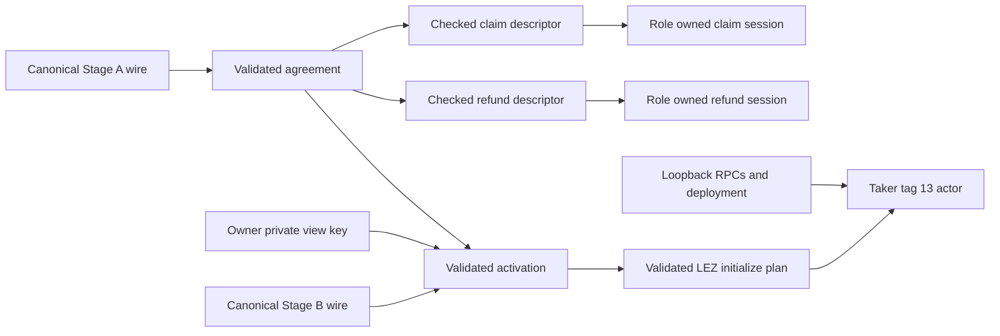
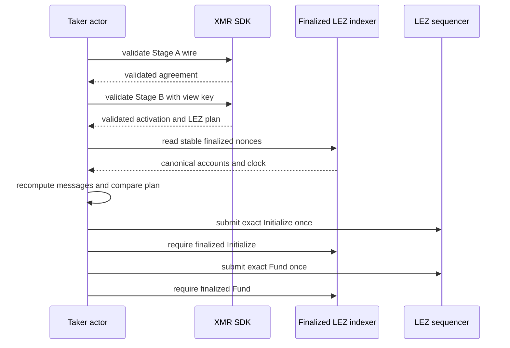

# ADR 0072: Derive XMR actor inputs from validated stage material

Status: Accepted as an M4 composition rule; public session descriptors are
implemented and actual role-process execution remains pending.

Date: 2026-07-20

## Context

The two-stage XMR agreement already commits the participant identities, DLEQ
proofs, aggregate signing keys, exact future LEZ messages, windows, shared
Monero address, withheld claim partial, and activation commitment. Accepting
those values again as independent CLI strings would create a second, weaker
protocol schema and allow fields from different swaps to be cross-wired.

Role processes also need exact claim/refund adaptor contexts. Their session IDs
use a private SDK domain and the validated Stage-A commitment; actors must not
copy that cryptographic derivation.

## Decision

All XMR lifecycle actors derive protocol inputs from canonical stage material:

1. decode Stage A only with `XmrAgreementV1::from_wire`;
2. decode Stage B only with `XmrActivatedAgreementV1::from_wire` and the
   actor-owned private Monero view key;
3. derive tag-13 terms only from `lez_initialize_plan`; and
4. derive claim/refund contexts only from descriptors minted by the validated
   `XmrAgreementV1`.

Node URLs, chain/deployment identity, run/request identity, state directory,
and the role's LEZ key remain runtime configuration. Before node I/O, the actor
must compare its role and LEZ identity with the validated plan.

`XmrAdaptorSessionDescriptorV1` has private fields. Its checked `context`
method rederives the purpose-separated ID inside the SDK, rebuilds the exact
untweaked adaptor context, and rechecks the durable binding. Descriptors can be
created only from contexts retained by an already validated agreement.

The SDK now validates each unsigned Stage-A/Stage-B body before either role
signs and attaches only correctly indexed Maker/Taker signatures. What remains
is an independent role-process packet exchange and durable material owner. It
must preserve the rule that Maker never receives the Taker claim partial before
finalized tag 14.

## Component view

## Validation and execution flow

Finality reads are observation, not submission retries. This sequence proves
ordered LEZ funding only; it is not cross-chain atomicity.

## TDD evidence

The descriptor API began with an expected compile failure for eleven missing
API items. The GREEN suite proves exact equality with retained contexts and
rejects wrong purpose, session, message, adaptor, key order, binding, and a
refund-into-claim cross-wire. The unsigned-body API separately began with eight
expected missing-type errors and proves semantic rejection before signature
attachment, wrong view-key/cross-agreement rejection, role-indexed signatures,
and byte-identical canonical wires. All nine SDK tests, strict Clippy,
warning-fatal Rustdoc, formatting, and diff checks pass.

## Consequences and remaining work

- Actors do not define a parallel agreement format or session-domain formula.
- The private view key remains owner-only and is absent from public evidence.
- Stable finalized nonces remain live inputs and must be checked before tag 13.
- Descriptors are not signing/release authority or actual-swap evidence.

Build independent role-process countersigning/material packets on the validated
API, finish the canonical-wire tag-13 actor, then compose actual finalized tags
13, 14, and 15, adaptor extraction, and the official-wallet Monero spend.
Recovery, chaos, and production/Stagenet hardening follow the happy PoC under
ADR 0027.
