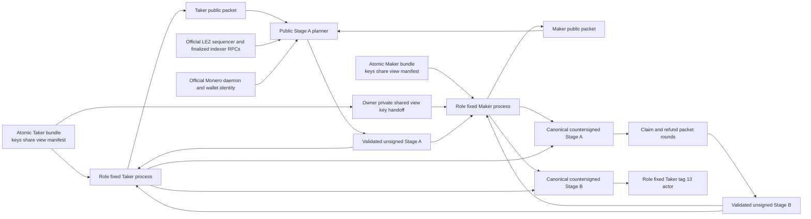
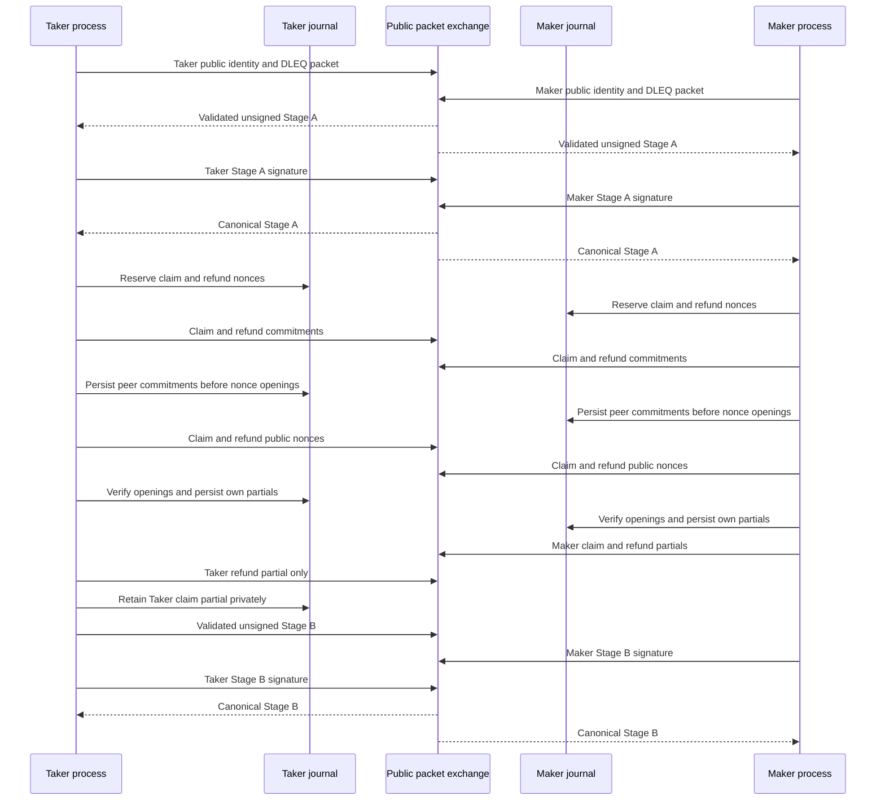

# ADR 0073: Compose XMR stage material through separate role journals

Status: Accepted; provisioning and foundation APIs are GREEN, stage composition pending.

Date: 2026-07-20

## Context

The role-fixed tag-13 actor accepts only canonical validated Stage-A and
Stage-B wires. Tests can construct those records. The role-fixed provisioning
command now lets independent Maker and Taker processes generate private roots,
DLEQ-backed shares, and public identity packets, but no user-facing process yet
completes Stage-A/Stage-B countersigning and journal rounds. Copying the
test fixture or running both private roles in one process would not prove the
privacy, nonce, or actor boundaries required by issue 112.

The repository already has the cryptographic and persistence primitives:
cross-curve DLEQ proofs, checked XMR agreement/session descriptors, the
pair-neutral adaptor signer, `SqliteAdaptorSessionJournal`, and the
`lez-adaptor-role-runner` packet transitions. A new nonce store or signing
protocol would duplicate those reviewed boundaries.

## Decision

Use one shared command binary in two role-fixed OS processes. Maker and Taker
have distinct owner-only roots, LEZ identities, agreement keys, claim/refund
keys, XMR spend shares, and SQLite adaptor journals. No command may accept both
private roots.

Provisioning requires an absent role root below an exact owner-only parent. It
stages and syncs all private files, atomically publishes the complete directory
with no replacement, syncs its parent, and publishes the pre-staged public
packet last. A private canonical manifest binds role, LEZ owner, and exact
public-packet digest. Only the canonical Monero share is stored; the role-correct
adaptor scalar is derived in memory. Private-root and public-packet publication
cannot be one cross-directory filesystem transaction, so a late public collision
or parent-sync ambiguity preserves the complete private root and fails closed.
A partially populated role root is never published.

Each role uses one long-lived journal for both claim and refund sessions. The
journal reserves a secret nonce before its commitment is exposed, atomically
consumes it when the role partial is persisted, and rejects a repeated secret
nonce fingerprint across purposes or swaps. A journal is never reset to retry
a swap.

The public planner uses both public role packets, a private shared-view-key
handoff validated independently by each role, the actual local Monero identity,
and one stable finalized LEZ view. It calls the existing Stage-A future-message
planner and SDK validators; it does not implement a second wire or session
formula.

Keep actual-node Stage-A composition in the isolated `compat/lez-v0_2-sidecar`
graph, where the official RPC clients, checked deployment, stable finalized
facts, and future-message planner already live. That graph may depend one way on
`xmr-reference-actor` to read validated public packets. The root actor must not
depend on the sidecar and pull its Logos/Risc0 graph into the root lockfile;
private signing, assembly, and locally derived runner sessions remain in the
root actor.

## Packet and signing flow

The Taker claim partial stays in the Taker journal and a Taker-private `0600`
outbox. It is never written to the shared exchange directory and is never sent
directly to Maker. Maker sends both Maker partials; Taker sends only its refund
partial. Both roles can therefore build the signed-refund presignature before
the first lock without disclosing the successful-claim secret.

After finalized tag 13 and the exact required Monero output confirmations, the
release process loads the Taker claim partial directly from the Taker journal,
rechecks its Stage-A session and Stage-B commitment, and passes it to the
existing tag-14 preparation/release boundary. A tag-14 submission necessarily
publishes bytes before finality; the attainable rule is no direct peer handoff
and no Maker use until canonical finalized tag-14 evidence.

## Atomicity and PoC boundary

- Both roles countersign Stage A, the complete signed refund presignature, and
  Stage B before tag 13. The first chain effect therefore does not precede the
  recovery material.
- The Taker claim partial is withheld until finalized LEZ funding and the exact
  unlocked Monero output satisfy the signed policy.
- Maker claims LEZ only with the aggregate tag-15 signature after finalized
  tag 14. That revealing signature lets Taker extract and point-check Maker's
  XMR share, reconstruct the shared spend key, and spend the Monero output.
- The first progressive image proves this uninterrupted local happy claim. The
  signed refund, punishment, crash resume, ambiguity, and chaos paths remain
  the next hardening slices and are not silently inferred from the happy path.

The local PoC uses dedicated per-swap LEZ accounts so unrelated transactions
cannot consume the future nonces committed by Stage A. Production must replace
that controlled ownership assumption with durable account exclusivity or nonce
leasing.

## Required implementation slices

1. **GREEN:** Add canonical checked unsigned Stage-A and Stage-B wire codecs to the XMR
   SDK plus activation/transcript comparison APIs.
2. **GREEN:** Expose an opaque Stage-A-descriptor-to-runner session constructor and a
   create-new session writer; retain the runner's existing packet schema.
3. **GREEN:** Extract the stable four-account finalized nonce snapshot and checked M4
   program identity from the tag-13 binary into the sidecar library.
4. **IN PROGRESS:** Add the role-fixed XMR reference actor commands and a process
   E2E that spawns separate Maker/Taker roots. Provisioning is GREEN through
   fresh separate process invocations and four focused tests, including one
   two-process CLI E2E; Stage-A/B signing, session export, and Stage-B journal
   assembly remain.
5. **PENDING:** Add a narrow Taker-journal loader for tag-14 preparation; do not add a
   plaintext partial store.

Fresh scalar/view-key convenience constructors are implemented in the XMR SDK,
so actors do not reproduce scalar rejection rules. Agreement signatures reuse the
existing BIP340 signing path. There is no external Logos dependency blocking
these slices.

## Consequences

- The user flow becomes reproducible without fixture secrets or merged roles.
  The first GREEN step atomically creates two owner-only, manifest-bound roots
  and canonical public packets; it deliberately makes no Stage-A/B or
  chain-effect claim.
- Interactive nonces remain durable and purpose-separated through existing
  code rather than a new store.
- Public packets can be inspected and copied; private roots and the view-key
  handoff remain owner-only.
- Same-host process evidence does not claim different-UID isolation. Cross-output
  publication ambiguity and upstream CSPRNG-state zeroization remain explicit
  PoC-to-production hardening items.
- The material process does not itself submit a chain effect.
