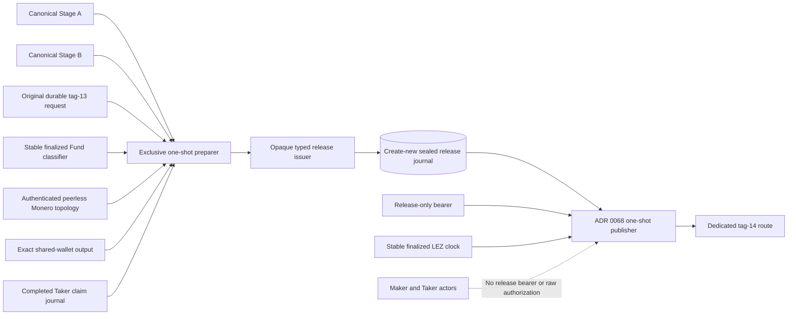
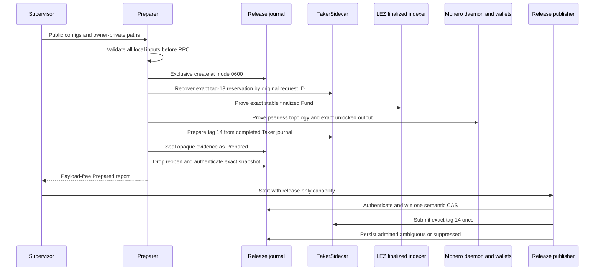

# ADR 0074: Seal XMR release only through exclusive preparation

- Status: Accepted for the M4 progressive PoC component boundary
- Date: 2026-07-21

## Context

ADRs 0064 through 0068 established a sealed release journal, opaque typed
evidence, a stable finalized clock, a dedicated tag-14 route, and a one-shot
publisher. Their integration fixture could mint the journal, but the actual M4
flow still had no process that could safely compose canonical Stage A/B, the
durable tag-13 reservation, finalized Fund, authenticated Monero topology and
output evidence, and the completed Taker claim journal.

Letting an actor construct raw release rows or pass authorization bytes to the
publisher would bypass the authority boundary. Opening an existing empty
SQLite path would also permit stale, linked, or pre-admitted state to be
relabeled as a fresh swap attempt. Preparation therefore needs its own strict
one-shot boundary before the separately privileged publication worker.

## Decision

Add `lez-v02-xmr-release-prepare` to the separately locked
`compat/lez-v0_2-xmr-release-service` package. The preparer:

1. stable-reads bounded public release and preparation configuration;
2. validates every path, immediate trusted parent, owner/mode/link invariant,
   route, run, runtime, terms, and three distinct request identities before its
   first RPC;
3. re-derives canonical Stage A/B and the exact Taker bridge binding;
4. loads the owner-private Monero view key, journal protection key, ordinary
   Taker sidecar capability, and separate daemon/target/foreign credentials;
5. creates `STATE_DIRECTORY/xmr-release.sqlite3` exclusively before any RPC;
6. calls the tag-13 prepare API with the original durable request ID and
   byte-compares the recovered exact Fund reservation;
7. proves finalized Fund, an authenticated peerless Regtest topology, the exact
   unlocked shared-wallet output, and the completed Taker claim journal;
8. prepares tag 14 without submission and consumes the opaque evidence through
   the existing public typed issuer;
9. drops and reopens the journal, authenticates the exact `Prepared` snapshot,
   and emits one payload-free JSON result.

The preparer has no `XmrReleaseClient`, release-only bearer, or publication
method. The ADR-0068 publisher receives those capabilities only after a
supervisor observes successful preparation. Preparation and publication remain
different invocations with different least-authority inputs.

`ReleaseStore::create_new` opens the state directory descriptor-relatively and
creates the fixed journal with `CREATE | EXCL | NOFOLLOW`, exact mode `0600`,
then verifies owner, regular-file type, and one-link inode identity through
SQLite initialization. Existing empty, initialized, admitted, symlinked, or
hard-linked databases are rejected. Concurrent contenders produce exactly one
winner.

## Component boundary

## Preparation flow

## Atomicity contribution

The preparer does not create a distributed transaction. It preserves the
conditional atomic-swap argument by making release authority derivable only
after all of these same-swap facts agree:

- LEZ Fund is exact, canonical, finalized, and inside the signed refund window;
- the Monero output pays the countersigned shared address and amount, is
  unlocked, has the fixed confirmation depth, and belongs to the authenticated
  isolated topology;
- the Taker claim partial comes from the completed role journal whose transcript
  and commitment are re-derived from the same Stage A/B;
- the journal is new and immutable in identity before external observations;
- publication still requires the later worker CAS and decisive finalized-clock
  sample, and any ambiguous post-CAS send remains terminal.

Tag-14 node admission is not finality. Maker adaptation remains blocked until
Maker-side canonical `DiscoverByTerms` finality, and the Taker reconstructs the
Monero spend key only after Taker-side finalized tag-15 evidence. No SQLite
transaction spans LEZ and Monero.

## Evidence

- The standalone all-target suite passes eight tests, including payload-free
  reporting, path/error redaction, private-mode checks, and create-new rejection.
- `ReleaseStore::create_new` passes the full 38-test release-authority suite
  plus one ignored process test, including symlink, hard-link, existing-state,
  and eight-contender exactly-one-winner cases.
- All targets check and format; strict no-deps Clippy, warning-fatal Rustdoc,
  advisories, bans, licenses, and sources pass under the separate lockfile.
- The CLI exposes paths only and returns a fixed redacted failure message.
- No public RPC, faucet, peer, public funds, or external finality service is
  used by these component gates. Actual-local execution remains required.

## Residuals

- The current tag-13 API is create-or-recover, not recovery-only. If the
  reservation is missing, it can consume a fresh nonce before finalized-Fund
  comparison rejects it. A recovery-only sidecar method is production work.
- The ordinary bearer used by the trusted preparer is not method-scoped by the
  server; raw bearer possession can reach the release route. Different-UID and
  network isolation are required for production.
- A failure after exclusive creation intentionally leaves a poison/observe-only
  database. There is no reset or deletion retry; status/recovery tooling remains.
- Existing endpoint construction copies credential text into ordinary strings.
  Short-lived same-host PoC process isolation is accepted; zeroizing transport
  ownership remains production hardening.
- The actual-local preparer, tag-14 publication/finality, tag-15 effect/finality,
  adaptor extraction, and reconstructed official-wallet sweep are not yet
  evidenced, so M4 is not tagged.
