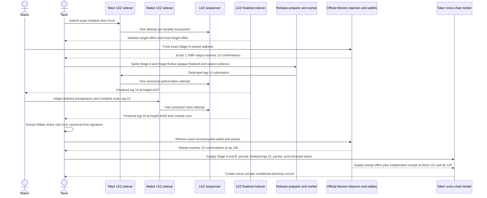

# ADR 0075: Complete the XMR claim only from finalized role evidence

- Status: Accepted for the M4 progressive working-tree PoC checkpoint
- Date: 2026-07-21

## Context

ADRs 0067, 0071, and 0074 established the dedicated tag-14 release route,
durable tag-15 completion, and exclusive release preparation. Component tests
did not determine how independent Maker and Taker processes would carry those
boundaries across an actual LEZ v0.2 chain and an official Monero wallet without
turning node admission, owner-side evidence, or a raw extracted scalar into
settlement authority.

The successful claim path needs one canonical handoff at each boundary:

- the Maker may adapt the claim only from finalized role-local tag-14 evidence;
- the Taker may extract the Maker share only from finalized role-local tag-15
  evidence;
- the reconstructed Monero spend key may enter the wallet only through a typed
  file boundary that never prints the retained or extracted scalar; and
- public evidence must prove the causal chain without containing credentials,
  capability tokens, wallet passwords, or scalar material.

## Decision

Use a result-only finalized classifier executable for both role-local chain
handoffs. It validates canonical Stage A/B terms, the role, generated ABI,
ordered accounts, signer, state, custody, candidate block, finalized tip, and
bounded scan before atomically creating one result file. The Maker accepts only
`DiscoverByTerms` tag 14. The Taker accepts only `DiscoverByTerms` tag 15.
Owner-side exact evidence and cross-role results remain invalid actor inputs.

After finalized tag 14, the Maker reference actor adapts its retained claim
presignature and creates a public final-signature packet. A dedicated tag-15
driver asks the Maker sidecar to prepare, complete, and submit the exact durable
claim. It has one canonical transaction-ID request identity and no automatic
submission retry.

After finalized tag 15, the Taker reference actor byte-compares the canonical
aggregate signature, then the role runner extracts the Maker adaptor share into
an owner-private mode-`0600` file. The typed Monero sweep executable consumes
that file plus the Taker's retained share, reconstructs and point-checks the
spend key through the SDK, restores the exact Stage-A shared wallet through the
official wallet RPC, requires the exact unlocked principal, performs one sweep,
and mines the local confirmation policy. It emits no private scalar or wallet
credential.

A Taker-only `bind-finalized-claim-sweep` action then rebuilds the same canonical
Stage A/B lifecycle and durable claim session. It byte-binds finalized tag 15,
the observed final-signature packet, transcript-verified adaptor extraction,
the reconstructed public spend key, the sweep effect, and an independent
Monero receipt/topology observation into one create-new owner-private record.
It accepts both current sweep v2 and the retained legacy sweep v1 paired with
receipt v2. The current-v2 validator proves exact fee conservation in focused
tests; legacy v1 exposes only an unreceived remainder and therefore emits
`fee_piconero: null`. The retained full CLI invocation used the legacy path.

Official Monero 0.18.5.1 can omit `connections` when the connection list is
empty. The topology decoder therefore defaults an omitted list to empty but
still independently requires `get_info` to report zero incoming and zero
outgoing peers. A nonempty list or nonzero counter remains a rejection.

## Actual local component flow

```mermaid
flowchart LR
    TakerLock["Taker LEZ Initialize and Fund finalized"] --> XmrFund["Exact Stage-A XMR output funded and confirmed"]
    XmrFund --> Preparer["Exclusive release preparer"]
    Preparer --> Worker["One-shot release worker"]
    Worker --> Tag14["Finalized tag 14 authorization"]
    Tag14 --> MakerActor["Maker role-local classifier and adaptor completion"]
    MakerActor --> Tag15["Finalized tag 15 claim"]
    Tag15 --> TakerActor["Taker role-local classifier and adaptor extraction"]
    TakerActor --> Reconstruct["Point-checked spend-key reconstruction"]
    Reconstruct --> Sweep["Official Monero wallet sweep confirmed"]
    Sweep --> Receipt["Independent Monero receipt and topology"]
    Tag15 --> Binder["Taker cross-chain binder"]
    TakerActor --> Binder
    Receipt --> Binder
    Binder --> Bound["Owner-private conditional-atomicity record"]
```

## Actual successful-claim sequence

## Atomicity contribution

This run does not create a distributed transaction. It executes the successful
claim branch of the conditional atomicity argument:

1. the Taker's scriptable LEZ lock is finalized before the Maker funds XMR;
2. tag 14 releases only the activation-bound Taker partial and only after the
   exact Monero output reaches the signed confirmation policy;
3. the Maker can claim LEZ only by finalizing tag 15 with the aggregate witness;
4. that finalized signature reveals Maker share `s_a` to the Taker; and
5. the Taker combines `s_a` with retained `s_b` and spends the exact Stage-A
   Monero output.

Thus, in the executed branch, the Maker cannot receive the LEZ custody balance
without publishing the information needed for the Taker's XMR spend, subject to
the DLEQ construction, canonical LEZ finality, exact Monero observation, role
key custody, and reorg assumptions. The binder makes that causal statement
machine-checkable for this snapshot: finalized LEZ Claim is at height 4208
under tip 4220, and the matching Monero receipt is at height 121 under stable
tip 130. The tag-16 signed-refund and tag-17
punishment branches were not executed. This ADR therefore does not claim
literal both-refund conformance, production atomicity, or an M4 completion tag.

## Evidence

Working-tree run `m4happy-40cbac3-20260721a` executed the six ordered effects
recorded in
[`m4-actual-claim-poc-20260721.json`](../evidence/m4-actual-claim-poc-20260721.json).
The packet deliberately records `pending_exact_committed_tree_replay`: the run
used later uncommitted sources on top of base commit `40cbac3`, so it is not
clean-commit milestone certification.

A reviewed owner-private binder record is mode `0600` and one link. The final
3203-byte packet has SHA-256
`896d05d3178e3ff44b6ca010d4528835f5d796dc7e1004984ed78e853c083306`.
The public packet retains no private path or scalar. Its retained input provenance is
`legacy_v1_plus_receipt_v2`: funded amount 1000000000000, evidenced receipt
998191600000, exact fee unknown (`null`), and unreceived remainder 1808400000
piconero. The current sweep-v2 validator records and verifies an exact fee
instead; it is focused-tested but was not the retained full CLI invocation.

The runtime used only run-owned literal-loopback services and deterministic
local genesis/Regtest funds. No public RPC, P2P peer, faucet, public funds, or
external finality service participated. The retained run has not yet produced a
cleanup attestation.

## Consequences and residuals

- A result-only classifier is chain evidence, not submission authority.
- The binder proves a confirmed sweep to the evidenced destination. Stage A
  does not commit that destination, so independent cryptographic Taker ownership
  is not claimed; ownership comes from the owner-private Taker-wallet boundary.
- The binder is a finalized snapshot, not a current-chain query, distributed
  cross-chain transaction, or future-reorganization guarantee.
- Extracted scalar material remains owner-private and absent even as a hash from
  public evidence.
- The two failed preparer databases are quarantined; only the fresh third state
  reached `Prepared` and `Admitted`.
- Exact committed-tree replay, scoped cleanup, and synchronized static gates are
  required before this checkpoint can be certified.
- Tag-16 refund, tag-17 punishment, native plus two custom-token parity, U9,
  D1, repeatability, chaos, information-security, production, and independent
  review remain open.
