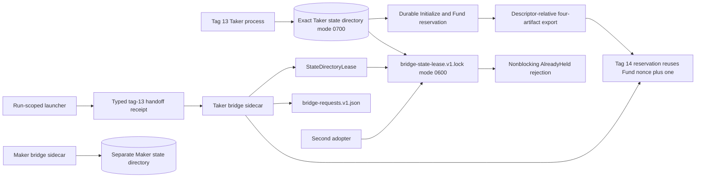
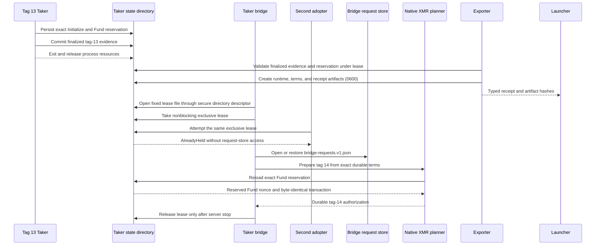

# ADR 0076: Lease exclusive ownership of XMR sidecar state

- Status: Accepted for the M4 state-ownership component checkpoint
- Date: 2026-07-21
- Decision owners: Gateway implementation team

## Context

The tag-13 Taker process durably reserves the exact native-XMR Initialize and
Fund pair in one owner-only state directory. Later tag-14 preparation must
reuse that exact reservation because its authorization nonce is the reserved
Fund nonce plus one. Copying the reservation into a new sidecar state directory
would create divergent durable authorities, while allowing two bridge
processes to open the same directory could race `bridge-requests.v1.json` and
the later reservation files.

The durable reservation store already opens a canonical owner-controlled mode-
`0700` directory without symlink traversal, retains its descriptor and
device/inode identity, and uses descriptor-relative fixed filenames. It did not
provide a process-lifetime ownership primitive for the complete directory.

Maker and Taker state cannot be shared. The tag-13 reservation is bound to the
Taker role, signer, runtime, run, terms, and exact transaction bytes. The Maker
uses a different signer and creates its later durable claim state independently.

## Decision

Provide a Linux `StateDirectoryLease` that uses the existing secure-directory
boundary and the already pinned `rustix` dependency. It opens the fixed empty
`bridge-state-lease.v1.lock` file relative to the retained directory descriptor
with `NOFOLLOW`, requires a current-owner mode-`0600` regular file with one
link, reopens and compares its device/inode identity, and takes
`NonBlockingLockExclusive` with `flock`.

The actual `lez-v02-bridge-poc` executable acquires this lease immediately
after validating arguments and before reading runtime or secret configuration,
connecting to nodes, constructing the planner, opening
`bridge-requests.v1.json`, or starting the server. It retains the lease value
until the server has stopped. A concurrent adopter receives the distinct
`AlreadyHeld` error without waiting. Closing the held descriptor on orderly
exit, error, or process death releases the kernel lock; the empty lock file
remains for the next checked process.

The Taker continuation now adopts the exact tag-13 directory rather than
copying it. The launcher requires a typed handoff receipt for adoption and
passes the original typed Taker runtime artifact to the child. The exporter
and bridge validate finalized evidence, reservation, state identity, and
artifact hashes while holding the same lease. Maker still receives a separate
state directory and lease; parent-runner wiring through funding and tag 14
remains pending.

## Component ownership

## Handoff sequence

## Consequences

- The lease source and focused component tests are GREEN. They prove the first
  holder, concurrent rejection, release and reacquisition, actual bridge-binary
  acquisition, and rejection of unsafe directory modes, path aliases, lock-file
  modes, symlinks, and hard links.
- The lock is descriptor-held and crash-releasing. Its persistent empty file is
  not evidence that a process is alive; only the kernel lock is authoritative.
- Cooperative bridge processes cannot concurrently mutate one state directory.
  This does not protect against a same-UID process that deliberately ignores
  the lease, so production process and credential isolation remain separate
  controls.
- Existing reservation durability and bridge request replay remain independent.
  The lease prevents concurrent ownership; it does not make their files one
  transaction or change ambiguous-submission recovery semantics.
- The Maker must use a separate state directory. Cross-role state adoption
  remains invalid even when no process currently holds the Taker lease.
- Launcher adoption, typed runtime/terms export, and the fail-closed bridge
  receipt gate are source/component GREEN with adversarial coverage. A fresh
  actual-local tag-13-to-tag-14 replay and parent-runner wiring remain pending.
  No milestone or full-swap atomicity claim follows from this component alone.
