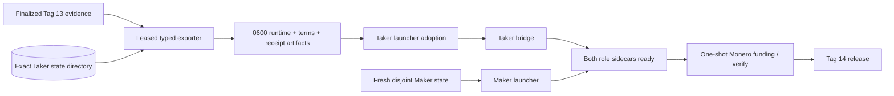
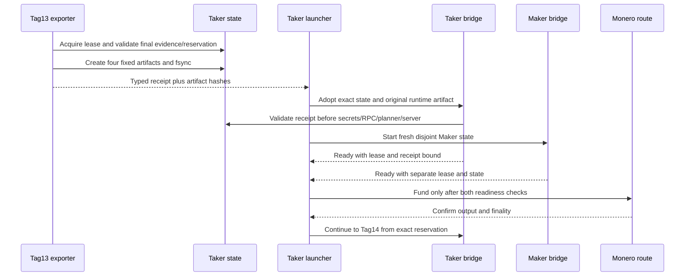

# ADR 0077: Bind Tag 13 state to the adopted role sidecar

- Status: Accepted for the M4 progressive PoC component checkpoint
- Date: 2026-07-21
- Decision owners: Gateway implementation team

## Context

Tag 13 produces Taker-owned finalized LEZ evidence and the durable native-XMR reservation. A later Taker sidecar must use those exact bytes and the same state directory. Copying state, accepting a path-only runtime, or starting a bridge without a receipt could fork authority or make partial export look complete.

## Decision

Export four owner-private mode-0600 artifacts: the Taker runtime, derived Maker runtime, canonical terms, and a typed handoff receipt. The exporter holds the secure state-directory lease while validating finalized Tag 13 evidence, the durable reservation, the finalized nonce binding, and the authenticated transfer program. It creates artifacts relative to the retained directory descriptor, binds the receipt to state device/inode and every artifact hash, and refuses collisions, aliases, partial state, or unsafe ownership.

The launcher permits adoption only for the Taker role and requires the receipt. It passes the original typed Taker runtime artifact to the child; it never copies or aliases the state directory. The bridge validates the receipt and all artifacts before loading secrets, opening RPCs, constructing a planner, or starting its server. A fresh Maker sidecar uses a disjoint state directory.

This ordering makes the handoff conditional-atomic: no effect-bearing Monero funding is allowed until the exact Taker continuation and fresh Maker observer are provisioned. It is not a distributed transaction; the lease and receipt provide fail-closed ownership and provenance, while chain finality and later recovery remain separate assumptions.

## Component flow

## Handoff sequence

## Verification and boundary

- Seven handoff adversarial tests and one bridge omission regression pass.
- Cargo check, strict Clippy, warning-fatal Rustdoc, formatting, and diff checks pass at the component checkpoint.
- The parent runner now reaches sidecar readiness and records exact cleanup identities; Monero funding, Tag 14, terminal cleanup attestation, and clean committed-tree replay remain pending.
- The receipt is owner-private; public evidence may disclose hashes and chain facts but not private paths, credentials, or scalars.
- Logos/RFP cryptographic interpretation issues GW-M4-001 through GW-M4-003 remain documented upstream production dispositions.
