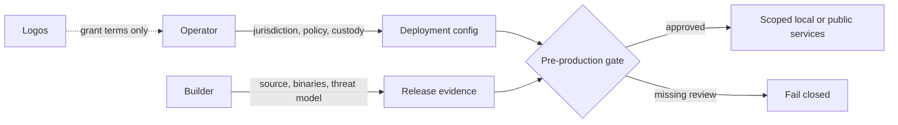

# ADR 0078: Deployment-responsibility guardrails

## Status

Accepted for the local RFP implementation; production legal review remains an
operator responsibility.

## Decision

The implementation treats the builder and operator as distinct actors even
when one organisation performs both roles. The builder supplies source,
artifacts, and documented security properties. The operator chooses the
jurisdiction, configuration, counterparties, custody model, monitoring, and
production controls. Logos is neither the operator nor a compliance auditor
unless a later written agreement explicitly says otherwise.

The software therefore provides guardrails and evidence hooks, not a claim of
legal compliance: explicit deployment configuration, role separation, scoped
credentials, audit evidence, emergency limits, and a pre-production checklist.
The operator must perform the applicable legal, regulatory, licensing,
sanctions, privacy, and contractual assessment before enabling production.

## Actor and control flow

## Guardrails

- No production mode without an operator-owned deployment and compliance
  checklist.
- Credentials and signing keys remain role-scoped and owner-private.
- Public endpoints, faucets, and external finality services are explicit
  configuration rather than silent fallbacks.
- Evidence records identify the builder artifact, operator configuration, and
  network scope so a local PoC cannot be mistaken for public certification.
- The checklist records unresolved upstream Logos dependencies separately from
  operator-owned legal obligations.

## Consequences

This reduces accidental role conflation and makes the production boundary
auditable. It does not determine which laws apply or substitute for counsel;
those decisions remain with the deploying operator.
