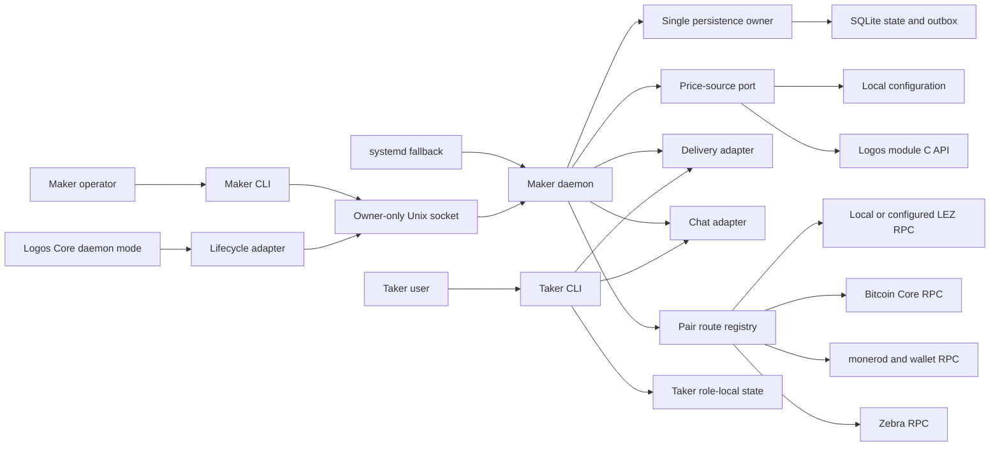
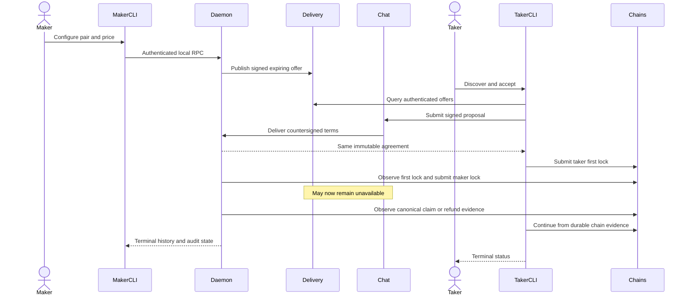
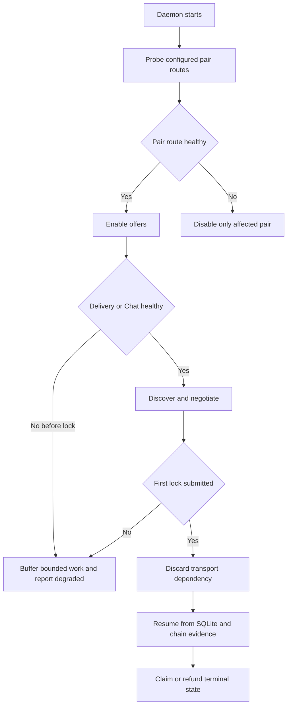

# ADR 0079: Enter M5 through the owner-local application plane

Status: Accepted for implementation — 2026-07-23

## Context

M2 through M4 established real local chain corridors and substantial durable
pair machinery, but the executable application shell is still a prototype. The
accepted M5 proposal requires a maker daemon, maker and taker CLIs, persistent
coordination, two pricing modes, Delivery/Chat outage behavior, a systemd
fallback, a Logos Core lifecycle seam, and coordinator fuzzing.

The application plane must represent how operators and takers actually use the
suite. A test that invokes a protocol object in-process is valuable component
evidence, but it cannot stand in for a CLI/daemon end-to-end flow.

## Decision

Keep the pair SDKs and chain adapters behind typed ports, keep the daemon as the
only writer of maker state, and expose versioned JSON-RPC through an
owner-restricted Unix-domain socket. Reuse `jsonrpsee`'s Tower service and
Hyper's Unix-stream transport rather than implementing a JSON-RPC parser.

Socket access is a necessary local authorization boundary, not the only
fund-moving control. The socket lives in a mode-0700 runtime directory, is mode
0600, and is owned by the maker account. Mutations carry stable request IDs and
use durable intent/outbox records. Secrets never enter process arguments,
readiness files, logs, history views, or evidence packets.

Delivery carries authenticated expiring offers and Chat carries both-role
signed negotiation only. Neither is chain truth, and neither is admitted as an
input to a post-lock claim or refund transition.

Atomicity is inherited from the reviewed per-pair protocol ordering, not created
by the daemon or transports. The application plane preserves it by requiring
taker-first funding, persisting exact intents before effects, allowing at most
one effect owner per step, deriving post-lock progress only from canonical chain
evidence, and retaining each pair's ordered claim/refund deadlines. A daemon
crash can delay observation but cannot authorize a different transition or make
Delivery/Chat necessary again.

## Failure and degraded modes

Unavailable chains disable only their configured pairs. Before lock,
Delivery/Chat failures are bounded, visible, and retryable without creating a
swap effect. After lock, the coordinator does not call either transport and
continues or recovers solely through persisted state and chain evidence.

The local pricing source reads validated durable configuration. The Logos price
adapter calls a versioned C ABI through a bounded wrapper, copies returned data
before the call ends, validates pair/currency/timestamp/value, and rejects
panic, stale, non-finite, negative, oversized, or unavailable responses. The
plugin cannot access chain signing authority or the maker database.

## Deployment ownership

The standalone path uses one hardened systemd unit with `RuntimeDirectory`,
`StateDirectory`, `LoadCredential`, `NoNewPrivileges`, `PrivateTmp`, and
`ProtectSystem=strict`. The Logos Core adapter owns only start, endpoint,
health, and graceful-stop lifecycle; it invokes the same daemon binary and
cannot open SQLite or wallet keys.

Logos Core daemon mode is not yet published upstream. Its tested adapter
contract remains a production blocker owned by Logos, while the standalone
path is an executable M5 requirement and may not be simulated away.

## Evidence consequences

M5 PoC evidence must be generated by distinct maker and taker binaries against
the pinned local devnets, identify every RPC and role, prove transport removal
after lock, survive daemon restart, reach terminal chain state, and clean only
run-owned resources. Component tests, simulated chain ports, or an in-process
coordinator do not independently satisfy that PoC gate.

After the PoC works, QA adds RED-GREEN-REFACTOR coverage for request replay,
crash boundaries, concurrent swaps, stale pricing, chain degradation, and
transport loss. Chaos, information-security, and production-readiness phases
remain separately measurable under ADR 0027.
