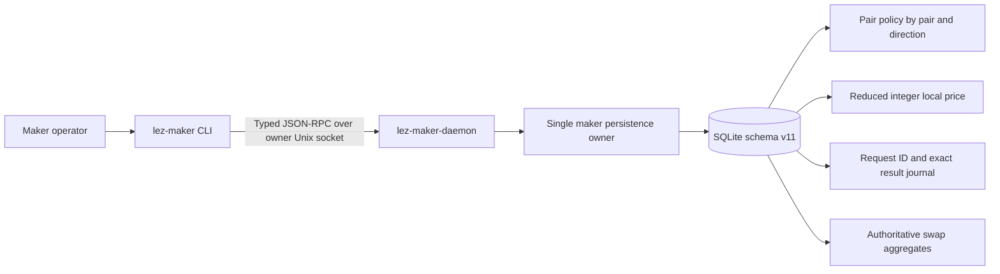
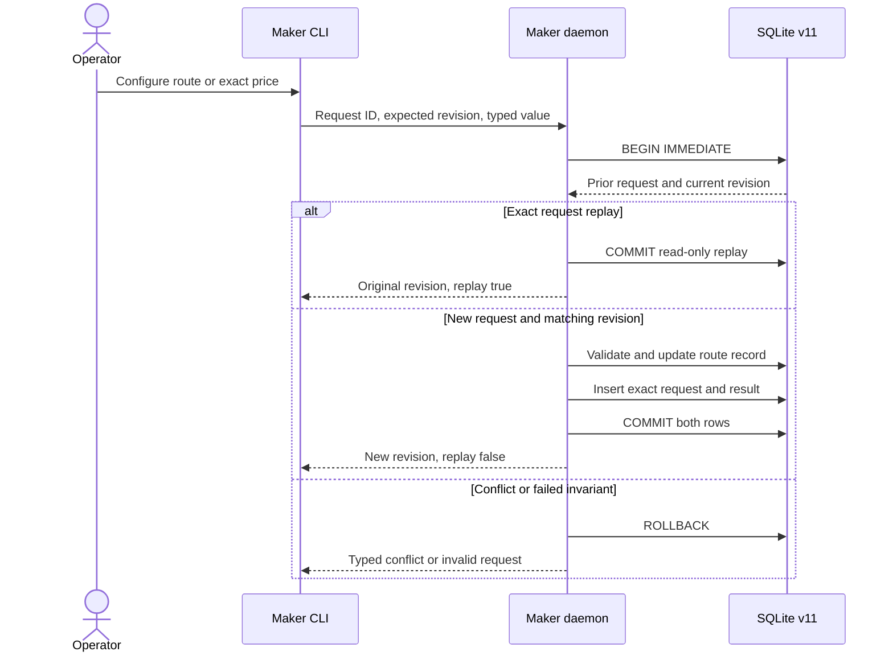

# ADR 0080: Persist maker configuration in schema v11

Status: Accepted and component GREEN — 2026-07-24

## Context

The M5 daemon must retain pair policy, price selection, exact local prices, and
operator history across process failure. Ephemeral command flags would make an
offer change after restart, while a second application database would create a
second writer and split configuration from the authoritative swap state.

## Decision

Extend the existing owner-private `SqliteSwapStore` from schema v10 to v11. The
daemon remains the only maker-state process owner and one mutex serializes its
current blocking RPC mutations. Schema v11 adds route-keyed pair policies,
route-keyed exact local prices, and an append-only mutation result journal. It
retains the existing `swaps` table as authoritative coordinator state.

Pair and price mutations carry the repository's existing bounded `RequestId`
and an expected route-local revision. A missing record is represented by an
expected revision of `None`. Reusing the exact request ID and payload returns
the original revision; reusing it with changed content fails. A different
request with a stale revision also fails.

Local prices are reduced positive integer ratios in chain atomic units. Both
lots must fit SQLite's signed integer range even though the semantic API uses
`u64`. Floating point never enters storage or the RPC contract. An enabled
local-price route must already have a durable price, and a local price cannot be
installed before its pair policy or against a non-local source.

This transaction makes configuration atomic: a crash exposes either the old
route and no request result, or the new route and its replay result. It does not
make a cross-chain swap atomic. Chain atomicity still comes from the reviewed
pair protocol, exact effect journals, role ordering, and canonical evidence.

## Migration and compatibility

Schema v10 databases migrate in one immediate transaction without rewriting
coordinator JSON. The historical plaintext-claim scrub remains gated on input
versions below 10; incrementing the global schema version must not rerun that
legacy migration against every valid v10 database. Future versions continue to
fail closed.

The new maker methods are additive. Pair policies select either `local` or
`logos_c_api`; only the local implementation is active in this checkpoint. The
bounded Logos C-API adapter, expiring signed offers, and offer history remain
separate M5 work and cannot be inferred from this schema.

## Evidence

Four focused store tests prove v10 byte preservation, restart persistence,
canonical ratios, unsupported XMR direction rejection, exact replay,
request-ID conflict, stale CAS, and rollback of both row and request identity.
The real daemon/CLI process journey configures and activates a ZEC route, lists
its price and policy, creates swaps, kills and restarts the daemon, and recovers
the same configuration and swap history through the owner-local socket.
