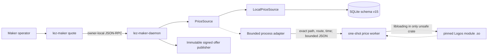
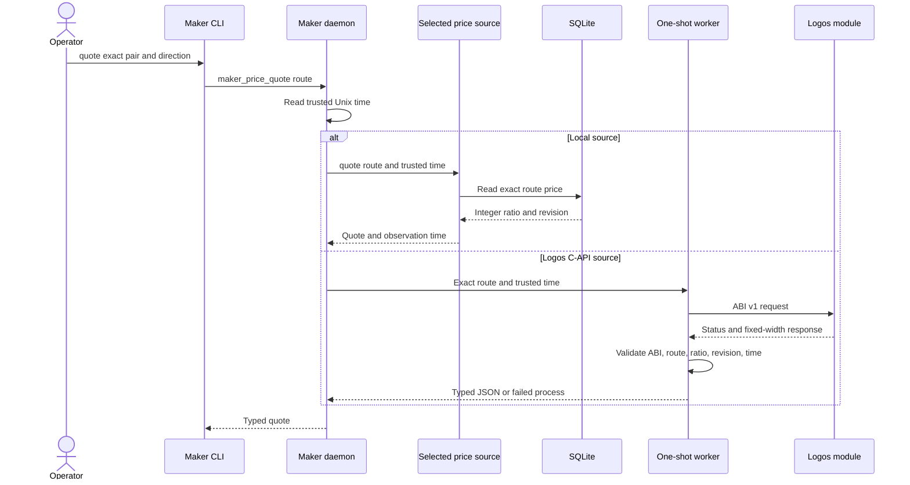

# ADR 0081: Read maker prices through a pluggable source boundary

Status: Accepted; local/process adapters and durable quote binding GREEN — 2026-07-28

## Context

M5 requires both operator-configured prices and a Logos-module C-API price
source. Offer publication must consume one validated contract instead of
depending directly on SQLite or a foreign ABI.

## Decision

The maker daemon owns a synchronous `PriceSource` boundary. Its local adapter
reads the exact route from the already-locked authoritative SQLite owner and
returns a reduced integer ratio, the source record revision, and daemon-trusted
observation time. It never substitutes another pair or direction.



The checked-in provisional ABI v1 uses only fixed-width `repr(C)` values, an
explicit version symbol, exact integer ratios, a nonzero source revision and
observation time, route echo, and reserved-zero fields. A one-shot worker loads
the module through `libloading`, copies the response, validates structure,
route, units, revision, bounds and freshness, and emits bounded typed JSON. The
ABI receives no database handle, wallet key, signing key, socket, or fund-moving
authority. Native abort is process-contained. The parent now enforces owner-only
real-file paths, single links, non-writable artifacts, a pinned module SHA-256,
pre/post-call revalidation, a five-second hard maximum, exact-child kill/reap,
an empty environment, null input/diagnostics, and a 4 KiB output ceiling.



```mermaid
sequenceDiagram
    actor Operator
    participant Daemon as Maker daemon
    participant DB as SQLite schema v15
    participant Worker as Bounded price worker
    participant Delivery as Delivery publisher

    Operator->>Daemon: publish offer with request ID
    Daemon->>DB: preflight request ID, route and policy
    alt Exact committed replay
        DB-->>Daemon: prior commit; do not call worker
    else Fresh Logos publication
        DB-->>Daemon: source kind and policy revision
        Daemon->>Worker: fetch exact quote outside DB lock
        Worker-->>Daemon: ratio, module revision and observed time
        Daemon->>DB: BEGIN IMMEDIATE and publish
        DB->>DB: recheck policy revision and source
        DB->>DB: reject module-revision rollback or equivocation
        DB->>DB: write high-water, offer and replay result
        DB-->>Daemon: COMMIT
        Daemon->>Delivery: sign and publish exact offer snapshot
    end
    Daemon-->>Operator: committed or replayed result
```

Local reads use the already-held store mutex. The daemon drops that mutex before
invoking the bounded external process, then reacquires it only for the final
policy-CAS transaction; the typed trait itself does not require `Sync`
because `rusqlite::Connection` is not `Sync`.

## Atomicity and nonclaims

Process isolation preserves daemon memory/state atomicity when a foreign module
aborts, hangs, or returns malformed data: no quote or store mutation is
produced. Pre/post artifact hashing detects ordinary mutation, but the same-UID
boundary is crash containment rather than an OS security sandbox; a malicious
same-UID replace-and-restore race remains production hardening.

The external observation is not a distributed transaction. It becomes
authoritative for one offer only at the SQLite linearization point. One
`BEGIN IMMEDIATE` revalidates the exact enabled policy revision/source and
freshness, advances a `(route, module SHA-256)` high-water record, inserts the
immutable offer snapshot, and records request replay; every write commits or
rolls back together. Lower revisions, an older observation under a newer
revision, or different data under the same revision fail closed. A module SHA
change creates an explicit new source epoch.

Delivery publication occurs only after commit and signs the full immutable
snapshot. A crash between SQLite and Delivery leaves a durable offer that
reconciliation can republish; it never leaves a signed advertisement without
durable authority. Cross-chain atomicity remains the pair protocol's concern.

## Evidence

Unit tests prove exact-route lookup, exact integer preservation, revision
reporting, trusted-time propagation, and fail-closed missing-route behavior.
The black-box operator journey configures a 5:2 ZEC route, kills and restarts
the daemon, and obtains the same revision-1 quote through the real CLI and Unix
socket.

Four actual-C process tests compile versioned shared-library fixtures and prove
one exact successful quote, typed missing/unavailable results, ABI and symbol
mismatch rejection, route/ratio/revision/time/reserved-field rejection, and
native-abort containment. All-target tests, strict Clippy and warning-fatal
Rustdoc pass for the boundary crate.

Four parent-process tests additionally prove exact domain conversion, typed
unavailability without substitution, abort and hang containment, exact timeout
reap, oversized output rejection, and mutation/mode/hard-link/hash rejection.

Schema-v15 store tests prove request replay before any source
effect, policy-revision revalidation, per-module revision anti-rollback,
same-revision equivocation rejection, bounded freshness, and exact signed-offer
snapshot fields. The complete swap-store all-target suite and strict Clippy are
GREEN.

A real-process daemon/CLI/Delivery test configures only a Logos C-API route,
quotes exact 5:2 revision-7 data, publishes it into a module-identity-bound
signed offer, and discovers it through a separate key-pinned taker process. It
then corrupts the module and deletes Delivery files: the exact request replays
and republishes without a source call, while a new request fails and produces
no offer. Restoring the module and restarting the daemon reconciles the same
durable signed offer before readiness. This exercises real user processes and
uses no chain RPC, node, Docker, faucet, public feed, or external network.

Both local and provisional Logos-module adapters are now application-path
GREEN. LOGOS-021 still prevents eventual-upstream ABI compatibility claims;
production sandboxing and the final upstream module remain hardening/release
work, not a local M5 functional blocker.
