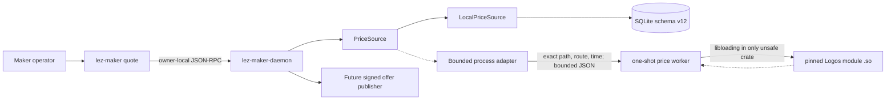
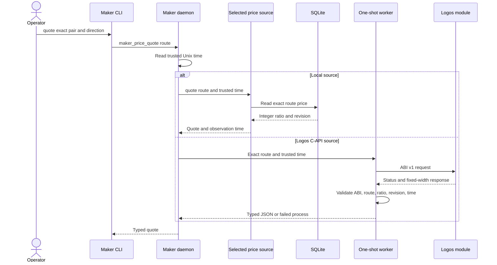

# ADR 0081: Read maker prices through a pluggable source boundary

Status: Accepted; local adapter and isolated C-API worker GREEN — 2026-07-28

## Context

M5 requires both operator-configured prices and a Logos-module C-API price
source. Offer publication must consume one validated contract instead of
depending directly on SQLite or a foreign ABI.

## Decision

The maker daemon owns a synchronous `PriceSource` boundary. Its local adapter
reads the exact route from the already-locked authoritative SQLite owner and
returns a reduced integer ratio, the source record revision, and daemon-trusted
observation time. It never substitutes another pair or direction.

The checked-in provisional ABI v1 uses only fixed-width `repr(C)` values, an
explicit version symbol, exact integer ratios, a nonzero source revision and
observation time, route echo, and reserved-zero fields. A one-shot worker loads
the module through `libloading`, copies the response, validates structure,
route, units, revision, bounds and freshness, and emits bounded typed JSON. The
ABI receives no database handle, wallet key, signing key, socket, or fund-moving
authority. Native abort is process-contained; the parent process adapter must
still add timeout, kill/reap, artifact pinning and output bounds.

The current daemon serializes this bounded read with its store mutex. The trait
does not require `Sync` because `rusqlite::Connection` is not `Sync`; a future
dedicated persistence actor may move the boundary without changing callers.

## Atomicity and nonclaims

Process isolation preserves daemon memory/state atomicity when a foreign module
aborts or returns malformed data: no quote or store mutation is produced. It is
crash containment, not a distributed transaction or a same-UID security
sandbox.

The quote is one SQLite snapshot read and identifies its source revision, so an
offer publisher can bind the exact price record it observed. This does not
atomically bind a quote to a future offer or chain effect. Offer publication
must persist its own immutable price and policy revisions in one transaction,
and cross-chain atomicity remains the responsibility of the pair protocol.

## Evidence

Unit tests prove exact-route lookup, exact integer preservation, revision
reporting, trusted-time propagation, and fail-closed missing-route behavior.
The black-box operator journey configures a 5:2 ZEC route, kills and restarts
the daemon, and obtains the same revision-1 quote through the real CLI and Unix
socket.

Four actual-C process tests compile versioned shared-library fixtures and prove
one exact successful quote, typed missing/unavailable results, ABI and symbol
mismatch rejection, route/ratio/revision/time/reserved-field rejection, and
native-abort containment. All-target tests, strict Clippy and warning-fatal
Rustdoc pass for the boundary crate.

The local implementation is one complete M5 adapter. The native worker is a
GREEN sub-slice of the second adapter; parent timeout/artifact/output controls,
daemon/store wiring, revision anti-rollback, and signed-offer binding remain
open. LOGOS-021 still prevents claims about an eventual upstream module's ABI.
