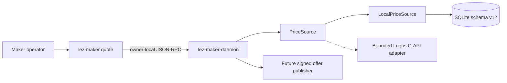
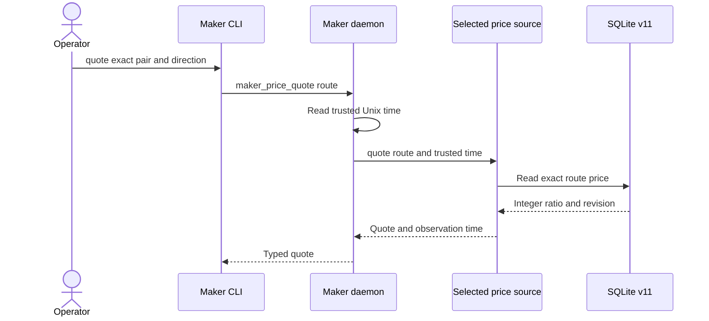

# ADR 0081: Read maker prices through a pluggable source boundary

Status: Accepted and local adapter GREEN — 2026-07-24

## Context

M5 requires both operator-configured prices and a Logos-module C-API price
source. Offer publication must consume one validated contract instead of
depending directly on SQLite or a foreign ABI.

## Decision

The maker daemon owns a synchronous `PriceSource` boundary. Its local adapter
reads the exact route from the already-locked authoritative SQLite owner and
returns a reduced integer ratio, the source record revision, and daemon-trusted
observation time. It never substitutes another pair or direction.

The Logos adapter will implement the same boundary. It must copy foreign-owned
values before returning, validate route, units, timestamp, bounds, and
freshness, and convert failures into structured unavailable or invalid-source
errors. The ABI receives no database handle, wallet key, or fund-moving
authority.

The current daemon serializes this bounded read with its store mutex. The trait
does not require `Sync` because `rusqlite::Connection` is not `Sync`; a future
dedicated persistence actor may move the boundary without changing callers.

## Atomicity and nonclaims

The quote is one SQLite snapshot read and identifies its source revision, so an
offer publisher can bind the exact price record it observed. This does not
atomically bind a quote to a future offer or chain effect. Offer publication
must persist its own immutable price and policy revisions in one transaction,
and cross-chain atomicity remains the responsibility of the pair protocol.

## Evidence

Unit tests prove exact-route lookup, exact integer preservation, revision
reporting, trusted-time propagation, and fail-closed missing-route behavior.
The black-box operator journey configures a 5:2 ZEC route, kills and restarts
the daemon, and obtains the same revision-1 quote through the real CLI and Unix
socket.

The local implementation is one of the two required M5 adapters. The bounded
Logos C-API implementation, stale/unavailable tests, and offer binding remain
open and are not claimed by this decision.
