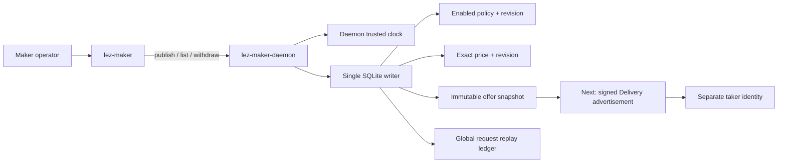
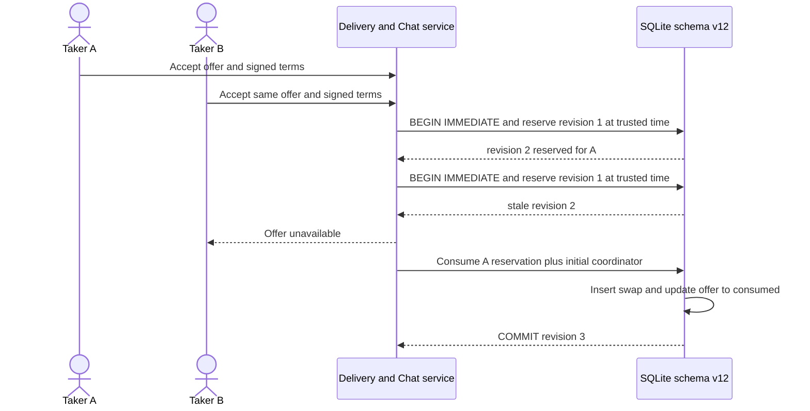

# ADR 0082: Persist expiring maker offers and one-winner acceptance

Status: Accepted and component GREEN — 2026-07-24

## Context

M5 discovery needs offers that remain exact across daemon restart, disappear at
a bounded deadline, and cannot be accepted by two takers. An expiry worker plus
an independent reservation write would leave a time-of-check/time-of-use race.
Persisting only pointers to mutable policy and price rows would also let an old
advertisement silently change meaning.

## Decision

Schema v12 adds durable maker offers and consolidates all maker configuration
and offer mutation request IDs into one global replay ledger. The v11 migration
copies legacy pair/price mutation results transactionally before removing the
old constrained ledger.

Each offer snapshots the complete enabled pair policy, its revision, the exact
reduced-integer local price, its source revision, trusted observation and
creation times, and the exclusive expiry time. Later configuration changes do
not alter published terms.

The validity interval is half-open: `[created_at, expires_at)`. Discovery reads
only stored `active` rows whose expiry is greater than trusted current time. It
does not wait for a cleanup worker. Owner history projects an unreserved active
row as `expired` once the boundary is reached and retains all terminal rows.

Reserve is the acceptance linearization point. It runs in `BEGIN IMMEDIATE`,
checks exact expected revision and `now < expires_at`, and moves only `active`
to `reserved`. A reserved offer cannot be withdrawn. Passing time does not
silently revoke terms already accepted by the winning negotiation.

Consume requires that exact reservation and an initial coordinator whose pair,
direction, and `Offered` phase match the immutable offer. It inserts the real
coordinator and changes `reserved` to `consumed` in the same transaction. The
future Chat adapter must additionally bind its countersigned agreement before
calling this operation; no owner-local consume RPC is exposed.

## Atomicity argument

- Publish snapshots policy, price, revisions, times, offer row, and request
  result in one immediate transaction.
- Reserve compares state, exact revision, and trusted time inside one writer
  transaction, so reserve/reserve and reserve/withdraw have one winner.
- Consume inserts the initial coordinator and transitions the winning offer in
  one transaction; neither can become visible alone.
- Exact request replay is checked before current state and returns the original
  revision even after later transitions. Changed operation or payload under the
  same globally unique request ID conflicts.
- Any failed validation or injected database failure consumes neither request
  ID nor offer revision.

This is application-state atomicity, not a cross-chain atomic commit. The
accepted pair protocol remains responsible for eventual both-claim or
both-refund outcomes. The current store operation also does not prove signed
Delivery publication or countersigned Chat negotiation; those are the next M5
composition slice.

## Operator and transport ownership

The owner-local socket exposes publish, complete history, and active-offer
withdrawal. Reservation and consumption are deliberately absent from that
surface: they belong to the authenticated taker-facing Delivery/Chat service.
The run-local adapter will sign the exact serialized snapshot and carry no
wallet or chain-effect authority.

## Evidence

Five focused tests prove exact snapshot/restart behavior, price immutability,
half-open expiry, one-winner reservation, replay after later transitions,
failed-transition rollback, global request-ID uniqueness, v11 ledger migration,
and atomic consumed-coordinator insertion. The real daemon/CLI journey publishes
and replays an offer, kills and restarts the daemon, verifies the snapshot, and
withdraws it through the owner-local socket.

Delivery/Chat signing, authenticated taker identity, exact negotiated amount,
and the actual local LEZ/ZEC application swap remain open and are not claimed.
