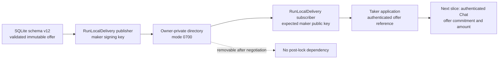
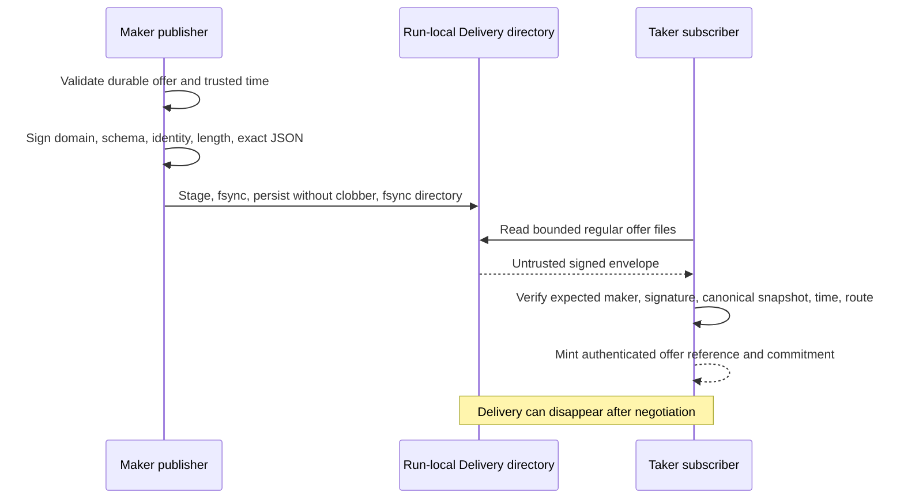

# ADR 0083: Authenticate bounded run-local Delivery offers

Status: Accepted and component GREEN — 2026-07-24

## Context

The first M5 application image needs a reproducible discovery transport before
the upstream Logos Delivery integration is available. A plain local mailbox is
insufficient: a taker must reject forged, modified, malformed, future, and
expired offers and must know which configured maker signed the exact immutable
snapshot. The transport must remain removable and must not become a source of
protocol or chain truth.

## Decision

Implement `RunLocalDelivery` as a filesystem-backed implementation of the
accepted `OfferDiscovery` port. The maker publisher owns a secp256k1 secret; the
taker subscriber receives only the expected compressed public identity. Each
advertisement signs a fixed-domain SHA-256 digest over schema version, maker
identity, byte length, and canonical offer JSON. The returned reference retains
the exact signed envelope and exposes its commitment for later Chat transcript
binding.

The run-local boundary deliberately uses a reputable, already pinned
`secp256k1` implementation rather than new cryptography. It caps one envelope
at 65,536 bytes and one discovery scan at 1,024 advertisements. It refuses a
symlinked, non-directory, foreign-owned, or group/world-accessible root. Files
are staged with `tempfile`, flushed, installed without clobbering an existing
offer ID, and followed by a directory sync.

Discovery accepts only regular `*.offer.json` files. It rejects unknown JSON
fields, unsupported schemas, the wrong maker key, invalid or non-low-S compact
ECDSA signatures, non-canonical offer JSON, and snapshots that fail the store's
public invariant validator. An offer is visible only when the taker's trusted
time is inside the half-open interval `[created_at, expires_at)` and its route
matches the optional exact query.

## Atomicity and trust argument

- The authoritative offer lifecycle remains the schema-v12 transaction from
  ADR 0082; Delivery cannot reserve, consume, withdraw, or create a swap.
- A destination filename is immutable. Staging plus `persist_noclobber` means a
  reader sees no deliberate partial publication and an existing offer ID is not
  silently replaced.
- The signature covers the exact policy, price, revisions, identity, and expiry
  bytes. Mutation changes the digest and fails before an authenticated reference
  exists.
- Expiry is re-evaluated at the subscriber's trusted time, so a retained file is
  not equivalent to a live offer.
- This is authenticated discovery, not a distributed transaction. Chat must
  still reserve one winner in SQLite and bind the same offer commitment and
  exact negotiated amount into the pair SDK's countersigned agreement before
  any first lock.

## Consequences

The adapter provides an executable, deterministic local substitute for the
currently unavailable upstream Delivery runtime while preserving the accepted
port. Switching to a public adapter is a dependency/configuration change at the
application boundary, not a protocol-state rewrite.

The mailbox assumes both local roles run under the same owner for this isolated
PoC. Different-UID isolation and the exact Logos Delivery wire/runtime adapter
remain production work. The maker daemon and taker CLI are not wired to this
component yet, and Chat negotiation and application-level LEZ/ZEC completion
remain open.

## Evidence

Three focused black-box tests prove:

- a maker publishes and a key-pinned taker discovers the byte-identical offer;
- the exclusive expiry boundary removes it and a subscriber cannot publish;
- the wrong maker identity and byte mutation fail authentication; and
- duplicate publication cannot replace an offer while an insecure directory is
  rejected.

The changed crates pass formatting, strict all-target Clippy, warning-fatal
Rustdoc, and the focused adapter suite offline.
