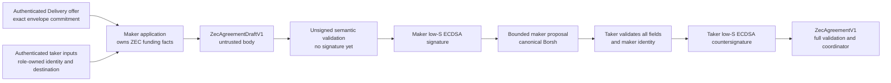
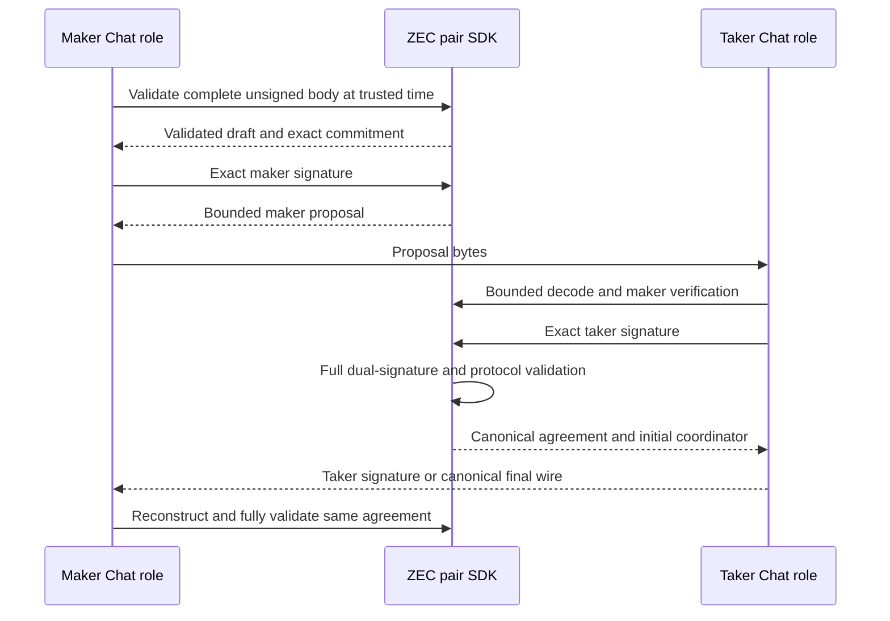

# ADR 0084: Negotiate ZEC with maker-first signed proposals

Status: Accepted and SDK component GREEN — 2026-07-24

## Context

The M5 Chat path must produce the same bounded dual-signed ZEC agreement that
the pair SDK executes. A parallel application terms schema would risk drift.
The selected first application corridor is `TakerSellsLez`, so the maker funds
ZEC and owns the funding-input commitment, change policy, and maker-side
destinations. A taker-built complete body would give the wrong role authority
over those executable fields.

## Decision

Use a maker-first type-state handshake over the existing canonical agreement:

1. the maker constructs an untrusted `ZecAgreementBodyV1` from authenticated
   role inputs and its role-owned runtime facts;
2. `ZecAgreementDraftV1::validate_at` checks every unsigned identity, profile,
   amount, binding, deployment, destination, deadline, and coordinator invariant
   before any maker signature is accepted;
3. the maker signs the existing domain-separated body commitment and the SDK
   verifies that exact low-S signature before minting a bounded
   `ZecMakerAgreementProposalV1`;
4. the taker bounded-decodes and revalidates the maker proposal, then signs the
   same commitment; and
5. `complete_at` invokes the existing full `ZecAgreementV1::validate_at`, so the
   final record has no weaker path than a directly received agreement.



The proposal reuses the exact ZEC agreement body, commitment domain, role keys,
compact ECDSA verifier, bounded reader, and 16 KiB maximum. It has no generic
deserializer or public fields. Full agreement bytes presented as a proposal
contain trailing data and fail closed; malformed, oversized, wrong-key,
high-S, expired, altered, and trailing proposal bytes also fail closed.

The signed negotiation transcript now exposes read-only session, Delivery offer
commitment, and exclusive expiry getters. The validated agreement exposes its
application ID, exact ZEC and LEZ principals, and transcript so the application
layer can cross-check them against the offer before durable acceptance.

The offer owns the only price conversion helper. It enforces inclusive foreign
amount bounds and computes:

```text
lez_atomic_units = foreign_atomic_units * lez_units_per_lot / foreign_units_per_lot
```

in `u128`; a non-integral result is rejected and no rounding occurs.



## Atomicity and trust argument

- This ADR proves cryptographic/semantic agreement construction, not durable
  acceptance atomicity.
- Neither signature is accepted before the signer-independent body invariants
  pass. Each signature covers every body field through the existing commitment.
- The maker proposes role-owned ZEC funding facts; the taker remains free to
  reject them and cannot be made to sign through this API.
- The final agreement derives the initial coordinator; application code must
  persist that exact agreement and coordinator with offer consumption in one
  transaction before the first lock.
- The future Chat adapter must additionally bind the proposal transcript to the
  exact `AuthenticatedOfferRefV1::commitment`, route, no-rounding price result,
  both application identities, and offer expiry. Reservation alone is not final
  acceptance.

## Consequences

`NegotiationChannel` does not change: its concrete ZEC adapter can hide the two
rounds and return the same untrusted complete wire already consumed by
`ZecPairSdk::negotiate_at`. No secret key enters the SDK API; callers supply
compact signatures from their existing custody boundary.

The run-local Chat service, durable staged proposal/final agreement, atomic
offer consumption, daemon/taker process wiring, restart replay, and actual
LEZ/ZEC corridor remain open and are not claimed by this component checkpoint.

## Evidence

The 19-case agreement suite now includes maker-first validation/signing,
byte-stable bounded proposal decode, wrong/high-S maker rejection, wrong taker
rejection, mutation rejection, exact countersigning, and final amount/transcript
accessors. The five offer tests include bounds and no-rounding conversion. Both
changed crates pass strict all-target Clippy and warning-fatal Rustdoc.
