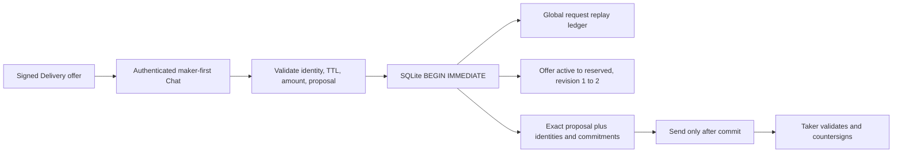

# ADR 0085: Stage ZEC Chat proposals before transport

Status: Accepted and component GREEN on 2026-07-24

## Context

The maker-first proposal from ADR 0084 must not be sent and then reconstructed
from process memory. A crash after reserving an offer but before retaining the
exact signed bytes could strand the only winning reservation or allow a retry
to drift. Concurrent takers must not both believe they won the same offer.

## Decision

Schema v13 adds one durable `maker_zec_negotiations` row per offer. One
`BEGIN IMMEDIATE` transaction checks the active offer, exclusive TTL boundary,
route, exact integer quote, expected revision, and global request identity;
then it stores the exact bounded maker proposal and moves the offer from
revision 1 `active` to revision 2 `reserved`.

The authenticated Chat session is derived as SHA-256 over a fixed domain and
the bounded durable reservation ID. Both peers can calculate it before signing,
and final acceptance can prove the signed transcript belongs to the winning
reservation after restart.



```mermaid
sequenceDiagram
    participant T as Taker process
    participant M as Maker Chat process
    participant D as SQLite schema v13

    T->>M: Authenticated selection and amount
    M->>M: Validate Delivery commitment and build signed proposal
    M->>D: BEGIN IMMEDIATE and stage request
    D->>D: Check TTL, route, exact quote, revision, request replay
    D->>D: Insert exact proposal and reserve one winner
    D-->>M: Commit revision 2
    M-->>T: Exact durable proposal bytes
    T->>T: Validate and countersign exact commitment
    Note over M,D: Crash before commit sends nothing; crash after commit replays exact bytes
```

The stage request binds the offer ID, expected revision, reservation, Delivery
commitment, both authenticated Chat identities, exact ZEC and LEZ amounts,
trusted reservation time, agreement commitment, and SHA-256 of the exact
proposal bytes. Reusing the request ID with any changed field fails closed.

The v13 migration rebuilds the global request ledger transactionally when its
older SQL constraint does not admit negotiation operations. It copies every
prior sequence and request identity before dropping the old table.

## Atomicity argument

- SQLite serializes competing writers at `BEGIN IMMEDIATE`; only the writer
  observing revision 1 and `active` can update exactly one row.
- Proposal insertion, reservation CAS, and request-result persistence share one
  transaction. A constraint, process crash, or failed CAS rolls all three back.
- The proposal is durable before transport returns it, so retries never need to
  regenerate a signature or guess peer-selected terms.
- Exact same request replays its prior revision without a write. Same request
  with changed proposal bytes or metadata is rejected.
- The TTL is half-open: `now < expires_at` is required at the linearization
  point. Final countersignature acceptance must independently occur before the
  same signed expiry.

## Consequences

This checkpoint proves durable one-winner proposal staging and restart replay;
it does not yet certify the M5 Chat process flow. Final countersigned agreement,
initial coordinator, immutable ZEC binding, protected maker claim material, and
offer consumption must be committed in one second transaction before either
actor can submit a first lock. Delivery and Chat remain removable after that
commit.

The component uses only owner-private SQLite and deterministic in-process test
values. It uses no chain RPC, node, Docker container, faucet, public funds, DNS,
or Logos service, so this proof has no external-resource flakiness.
