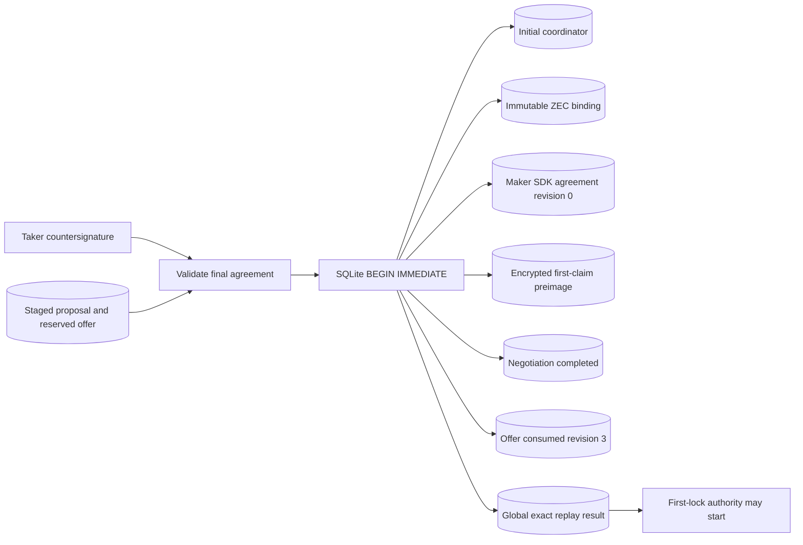
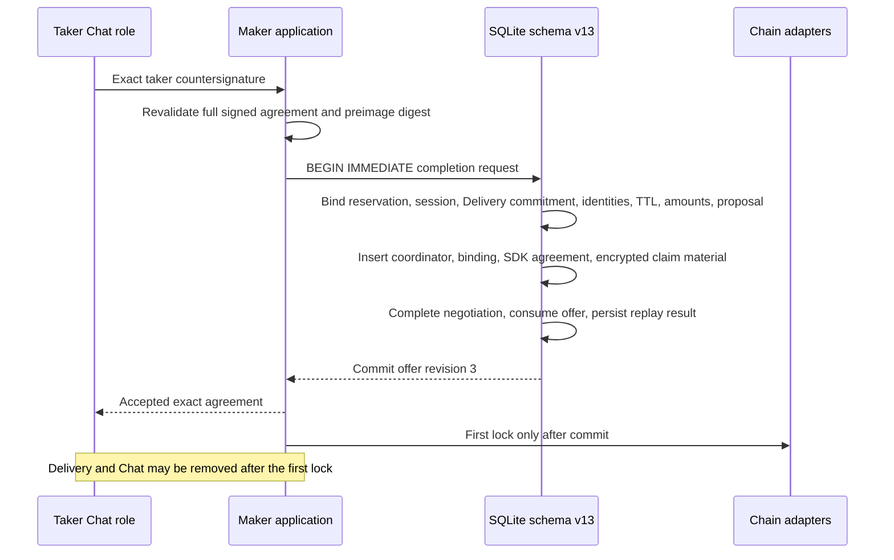

# ADR 0086: Atomically accept ZEC Chat before first lock

Status: Accepted and component GREEN on 2026-07-24

## Context

ADR 0085 makes the maker proposal durable before transport, but a taker
countersignature still has to create every piece of post-negotiation authority.
Separate writes would permit a crash to consume an offer without a resumable
swap, retain a coordinator without protected claim material, or expose first
lock authority before the signed Delivery/Chat binding was durable.

## Decision

The maker's claim-capable schema-v13 store provides one completion operation.
It accepts only a fully validated maker-local revision-zero ZEC agreement and
derives the coordinator and immutable ZEC binding from that agreement rather
than accepting substitutable caller values.

The transaction checks all of these links before writing:

- local role is Maker, agreement revision is zero, direction is
  `TakerSellsLez`, and Maker is the first LEZ claimant;
- SHA-256 of the locally held preimage equals the agreement's signed digest;
- offer and negotiation are the exact revision-two winning reservation;
- acceptance occurs at or after reservation and strictly before the shared
  offer/transcript expiry;
- the retained maker proposal is bounded, valid at reservation time, and has
  the same agreement commitment as the final dual-signed agreement;
- signed session ID is the domain-separated derivation of the reservation ID;
- signed Delivery commitment, maker/taker compressed keys, ZEC amount, LEZ
  amount, route, and exact no-rounding offer quote equal durable staging state;
  and
- the application swap ID equals the agreement-derived coordinator ID.

The older generic offer-consume method now refuses every offer with a staged
ZEC negotiation. It cannot bypass final agreement, claim-material, or binding
creation.

## Atomicity argument

SQLite commits or rolls back the coordinator, binding, SDK agreement, protected
claim envelope, negotiation state, offer state/revision, and replay ledger as a
single unit. The black-box test installs a trigger that aborts the final replay
insert; every preceding row remains absent and the offer remains revision-two
Reserved with the proposal unchanged. Removing the trigger and repeating the
same request commits once. An exact lost-response retry returns revision three
without writing, while changed acceptance time under the same request ID fails.

No cross-chain database transaction is claimed. Atomicity here is the complete
local handoff from removable negotiation transports to durable protocol
authority. Cross-chain atomicity continues to come from the dual-signed hash
lock and ordered refund deadlines: neither party can take both assets, and each
retains a timeout recovery path under the assumptions documented for ZEC.

## Consequences

The maker can restart after final Chat acceptance with the exact agreement,
initial coordinator, immutable chain binding, and encrypted first-claim secret.
The claim key is externally supplied and never stored; the test scans SQLite
and WAL for the raw preimage.

This is a deterministic local component proof using owner-private files only.
It calls no RPC, node, Docker container, faucet, DNS, public price source,
public funds, Logos Delivery, or Logos Chat. Independent maker/taker process
wiring and the actual LEZ/ZEC local-devnet application journey remain before
the M5 PoC gate.
