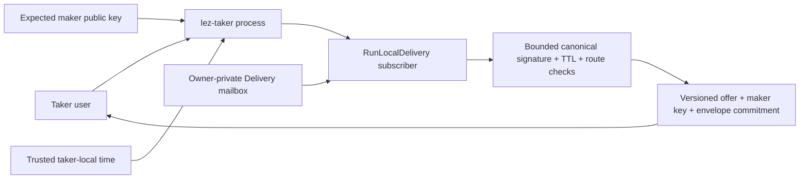
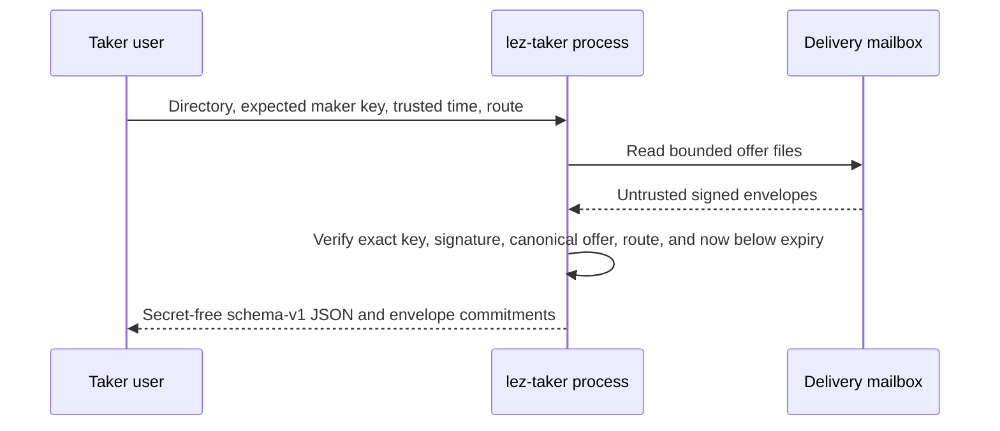

# ADR 0087: Key-pin Delivery in a separate taker CLI

Status: Accepted and process component GREEN on 2026-07-24

## Context

The run-local Delivery adapter was tested through separate publisher and
subscriber objects, but M5 requires the user-facing taker to be an independent
process with its own trust inputs. It must not learn the expected maker identity
from the untrusted mailbox it is authenticating.

## Decision

Add `lez-taker` as a real binary. Its first progressive command opens an
owner-private Delivery directory in discovery-only mode, accepts the expected
compressed secp256k1 maker key from the taker, applies a trusted local Unix time
and optional exact pair/direction filter, and prints secret-free versioned JSON.
It delegates all file bounds, canonical decoding, low-S signature validation,
key pinning, immutable offer validation, and half-open expiry to
`RunLocalDelivery`.

`--direction` requires `--pair`; omitting both discovers every supported live
route. The explicit time argument keeps evidence reproducible and makes clear
which actor owns expiry judgment. The output retains the signed-envelope
SHA-256 commitment needed by the later Chat transcript without exposing raw
private material.

## Consequences

This is the first real taker application process, not the complete M5 taker
surface. Initiation/countersigning, durable taker acceptance, status, claim, and
refund commands remain and will reuse the existing ZEC actor/SDK boundaries.
The process test launches the built binary, discovers exactly one key-pinned
ZEC `TakerSellsLez` offer, checks the envelope commitment, and proves it vanishes
at the exclusive expiry boundary.

The process and its test use only a private temporary directory. They use no
RPC, chain node, Docker container, faucet, public funds, DNS, Logos service, or
public price source, so external runtime flakiness is absent.
