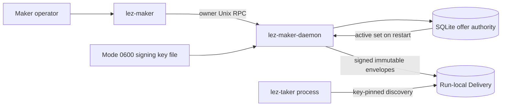
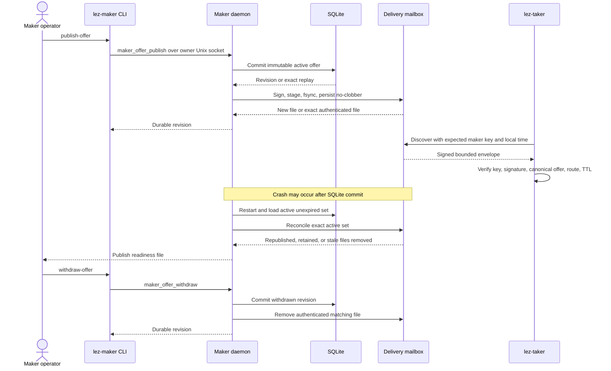

# ADR 0088: Reconcile daemon Delivery from durable offers

Status: Accepted and process component GREEN (2026-07-24)

## Context

ADR 0087 proved that a separate taker process can authenticate and filter a
run-local Delivery offer, but its publisher was still a test object. The M5
application PoC requires the long-running maker daemon to own publication.
SQLite and the filesystem mailbox cannot share one transaction, so crashes
between the durable offer mutation and mailbox update also need an explicit
authority and recovery rule.

## Decision

SQLite remains the sole offer-lifecycle authority. When Delivery is configured,
`lez-maker-daemon` loads a signing key only from an effective-user-owned,
single-link regular file with mode `0600`; the paired Delivery directory must be
an effective-user-owned real directory with mode `0700`. No key is accepted on
the command line or through owner RPC.

Publishing commits the validated immutable offer to SQLite first, then stages,
syncs, and no-clobber-persists its signed Delivery envelope. Exact owner RPC
replay verifies an existing envelope instead of replacing it. Withdrawal commits
the offer state first and then removes only the authenticated matching file.

Before readiness on every restart, the daemon reconciles the mailbox to
SQLite's exact active, unexpired set: missing active offers are republished,
byte-equivalent files are retained, and authenticated stale files are removed.
Malformed, wrong-key, conflicting, oversized, or insecure entries fail startup
closed. Readiness is published only after database open, key validation,
Delivery open, and reconciliation all succeed.

## Components

## Publication, crash recovery, and withdrawal flow

## Atomicity argument

This decision does not claim a cross-resource SQLite/filesystem transaction.
Instead it makes the durable database transition authoritative and the
Delivery mailbox a reconstructible projection:

- a crash before the SQLite commit leaves neither durable authority nor a
  daemon-produced advertisement;
- a crash after publish commit but before mailbox persistence is repaired by
  exact RPC replay or startup reconciliation;
- a crash after withdrawal commit but before deletion can expose a stale signed
  envelope only until the daemon restarts, at which point reconciliation removes
  it before readiness;
- Delivery cannot reserve or consume the offer, and the later Chat transaction
  checks current durable state and half-open expiry, so a stale envelope cannot
  create lock authority; and
- conflicting or unauthenticated files stop the daemon rather than selecting
  ambiguous terms.

This is local application consistency, not cross-chain swap atomicity. Swap
atomicity still comes from the countersigned agreement, role-correct secrets,
ordered locks, timelocks, and chain-only claim/refund branches described in ADR
0086 and the pair-specific sequence diagrams.

## Consequences and limits

The real maker and taker binaries now compose through authenticated Delivery,
and normal publish/replay/restart/withdraw behavior is black-box GREEN. The
mailbox is deliberately removable and contains no chain truth or claim secret.

The adapter remains a same-owner, run-local PoC transport. Cooperative same-UID
processes are assumed; production different-UID isolation and the exact Logos
Delivery service/wire are still required. Chat process wiring, final-wire actor
configuration, and an actual LEZ/Zebra lifecycle are the next PoC slices. No
chain RPC, Docker service, faucet, DNS, public endpoint, or public funds are used
by this checkpoint.
