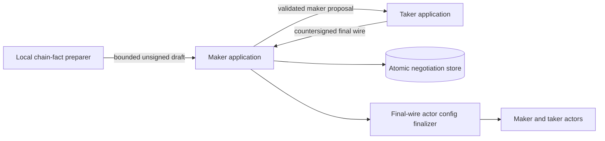
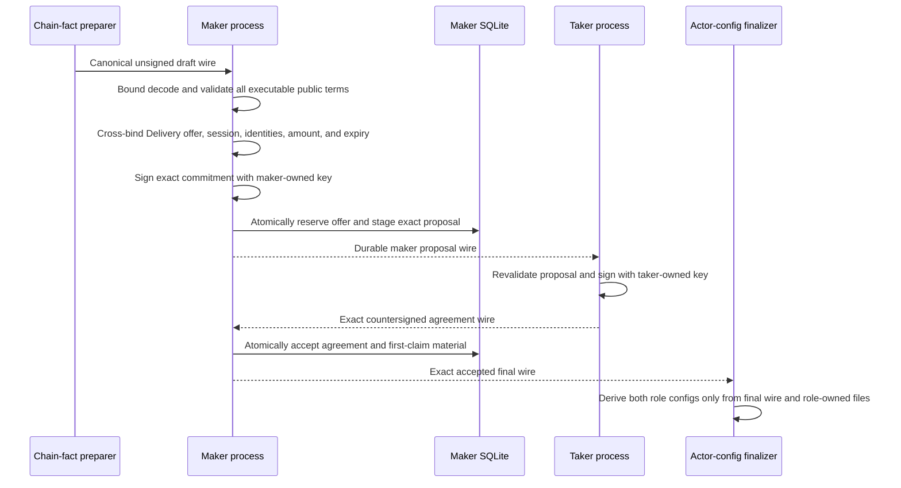

# ADR 0089: Pass unsigned ZEC drafts before role signing

Status: Accepted and SDK component GREEN (2026-07-24)

## Context

The deterministic LEZ/Zebra provisioner currently constructs public chain facts,
generates both role credentials, and signs both sides in one process. That is a
valid M2 fixture but cannot prove the M5 maker-first user flow. The chain-fact
preparer must hand executable terms to the maker without receiving maker or
taker signing authority.

## Decision

Add a canonical bounded wire for `ZecAgreementDraftV1`. It contains only the
concrete schema prefix and unsigned agreement body. Decoding preflights the
application-ID allocation and total size, uses the existing bounded field
decoder, rejects trailing bytes, and runs the same complete semantic validation
required before maker signing.

The validated draft exposes only public facts needed for application
cross-binding: the exact body, maker and taker compressed public keys, canonical
commitment, and Zcash principal. Private keys, claim preimages, recovery keys,
and signatures are absent.

## Components

## Signing flow

## Authority and atomicity

The unsigned draft is not an authorization and cannot reserve an offer, create
a coordinator, or submit a chain effect. The maker signs only after bounded
semantic validation and application-level offer cross-binding. The proposal is
sent only after the existing SQLite stage transaction commits; first-lock
authority appears only after the existing atomic final-acceptance transaction
commits the countersigned wire and encrypted local claim material.

This handoff therefore removes the provisioner's dual-signing authority without
inventing a distributed transaction. Cross-chain atomicity remains conditional
on the final agreement's ordered locks, role-correct disclosure, and refund
timelocks; the unsigned wire changes none of those rules.

## Consequences

The exact body can now cross a process boundary without JSON field duplication
or unsafe allocation. The full SDK suite, strict Clippy, and warning-fatal
Rustdoc are GREEN. The local preparer split, maker Chat endpoint, taker
countersign command, final-wire actor config finalizer, and actual corridor run
remain the next M5 PoC work. This component uses no chain RPC, Docker, faucet,
public endpoint, or external network.
