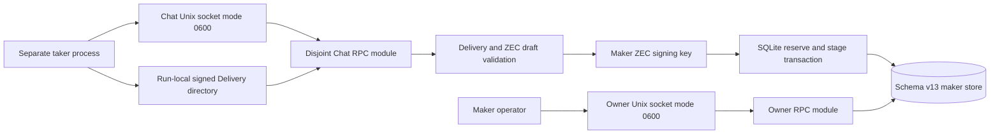
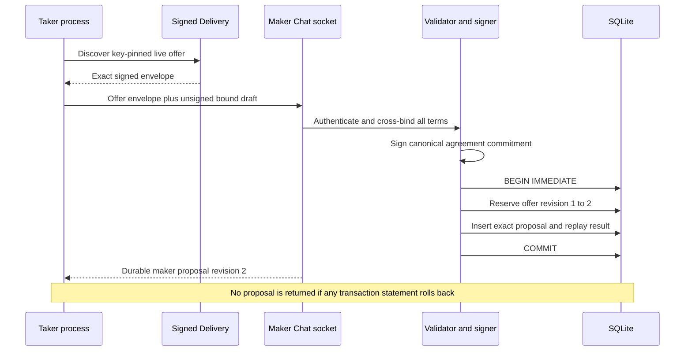

# ADR 0090: Isolate Chat and stage before response

- Status: Accepted; maker-proposal process slice GREEN
- Date: 2026-07-24
- Milestone: M5 progressive local-functional PoC

## Context

The maker daemon already owns authenticated Delivery publication, while the
store can atomically reserve an offer and stage an exact maker-first ZEC
proposal. Exposing that transaction through the owner-control socket would mix
an untrusted taker boundary with operator authority. Returning a signature
before the reservation commits would also let a taker hold an executable maker
proposal that the restarted daemon does not remember.

The Logos Chat runtime is not available as an evidenced upstream component.
The local PoC therefore needs a replaceable transport adapter that preserves the
protocol and durability boundaries without claiming upstream wire parity.

## Decision

Run the taker-facing Chat JSON-RPC module on a second no-clobber, owner-owned,
mode-0600 Unix socket. The owner socket never registers Chat methods and the
Chat socket never registers owner-control methods. A Delivery-enabled daemon
must configure both sockets.

The first Chat method accepts only a bounded unsigned ZEC agreement draft plus
the exact signed Delivery envelope, offer and reservation identities, expected
offer revision, exact ZEC amount, and a globally replayable request identity.
Before signing, the daemon authenticates and revalidates the Delivery envelope,
then cross-binds:

- live offer ID, route, direction, expiry, amount range, and exact integer quote;
- Delivery publisher, maker ZEC agreement key, and maker proposal signer;
- taker ZEC agreement key;
- reservation-derived Chat session;
- signed Delivery-envelope commitment; and
- canonical agreement body, refund profile, deployment identity, and expiry.

The maker signs only the canonical body commitment. The resulting proposal is
stored in the same SQLite transaction that reserves the one winning offer. The
RPC response is constructed only after that transaction commits. An exact timely lost-response retry returns the byte-identical durable proposal; a competing or
changed request conflicts.

## Components and trust boundaries

Delivery and both sockets are replaceable off-chain adapters. SQLite is the
durable authority. Neither off-chain adapter supplies chain truth, recovery
secrets, or post-lock authorization.

## Proposal sequence and atomicity

Atomicity at this boundary means the externally visible maker signature and the
durable one-winner reservation cannot diverge. SQLite serializes the revision
compare-and-swap, negotiation insert, request-journal result, and commit. It
does not make Delivery or Unix-socket transmission transactional: a response
may be lost after commit, which is why the same request identity replays the
exact stored bytes.

## Evidence

`zec_chat_process` launches the real daemon with separate owner and Chat
sockets, configures and publishes through owner RPC, discovers the exact signed
offer as a separate taker role, submits a wall-clock-valid unsigned draft over
Chat, validates the returned maker signature, exact-replays it, kills the
daemon, and reopens SQLite to recover the byte-identical proposal. It also
proves that each socket rejects the other socket's methods.

The test uses deterministic public facts and keys, a private temporary
directory, SQLite, and Unix sockets. It uses no chain node, chain RPC, Docker,
faucet, public funds, DNS, public price source, or Logos service. It proves the
proposal/staging process boundary, not chain funding or a completed swap.

## Consequences and remaining work

- The run-local same-UID socket is suitable for the reproducible PoC but is not
  claimed as the final Logos Chat adapter or a multi-tenant network boundary.
- The exact maker key now authenticates Delivery and signs the ZEC proposal,
  preventing identity substitution between discovery and negotiation.
- ADR 0091 completes countersigning and atomic final acceptance through the
  process boundary. The actual taker CLI, role-local final configuration, and
  LEZ/ZEC corridor remain the next vertical slice.
- Post-PoC QA must add bounded malformed-input, outage, concurrent-reservation,
  kill-point, resource-exhaustion, and credential-isolation matrices.
