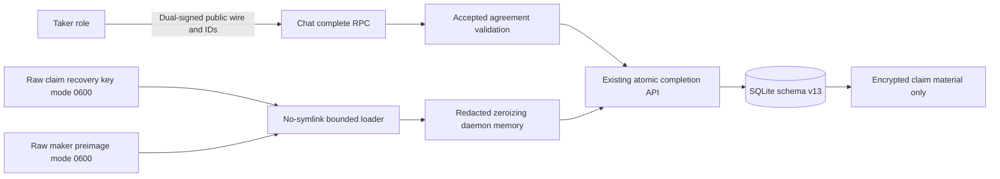
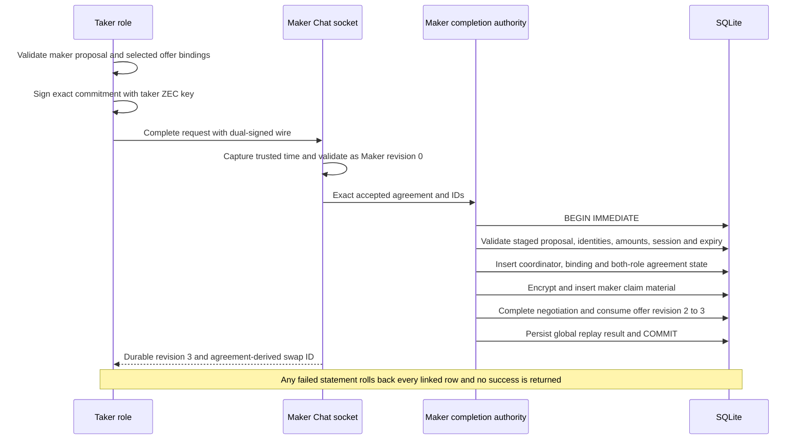

# ADR 0091: Complete Chat with daemon-owned authority

- Status: Accepted; final-acceptance process slice GREEN
- Date: 2026-07-24
- Milestone: M5 progressive local-functional PoC

## Context

ADR 0090 makes the maker proposal durable before it crosses Chat. The next
boundary must accept the taker's countersignature without sending the maker's
claim preimage or claim-encryption key through an RPC, CLI argument, serialized
DTO, or debug output. A second completion implementation would also risk
diverging from the already tested schema-v13 atomic transaction.

## Decision

Reuse `SqliteZecRecoveryStore::complete_maker_zec_negotiation` as the only final
acceptance linearization point. The Chat request carries only its schema,
request/offer/reservation identities, expected reserved revision, and the exact
bounded dual-signed agreement wire. The maker captures acceptance time from its
own clock and validates the wire as the Maker at durable revision zero.

The daemon opens the role-fixed recovery store and retains the maker-owned
preimage in redacted, zeroizing process memory. Claim-recovery and preimage
files use the reference actor's existing raw 32-byte format. Files are opened
with no-symlink resolution and no-follow/CLOEXEC flags; descriptor metadata is
checked before and after bounded reading for regular type, effective UID, mode
0600, one link, stable device/inode/length, and exact nonzero length. Delivery
continues to use its existing hex key format.

Trusted acceptance/reservation timestamps are durable facts, not semantic
caller payload. They are excluded from replay fingerprints so an exact retry
after the daemon clock advances returns the original committed result rather
than conflicting. First-time validation still uses the current trusted time and
fails at the agreement's exclusive expiry.

## Components and secret flow

The taker never receives maker recovery authority. The RPC never accepts a
preimage, claim key, coordinator, chain binding, or actor state from the caller;
all durable linked state is derived from the validated agreement and daemon-
owned authority.

## Countersign and completion sequence

This transaction does not make the Chat response atomic with transport. A
response may be lost after commit; the same semantic request returns the stored
revision/result without rewriting acceptance time or protected material.

## Evidence

The separate-process `zec_chat_process` test now performs Delivery discovery,
maker proposal, delayed exact proposal replay, taker countersigning, atomic Chat
completion, delayed exact completion replay, forced daemon termination, and
SQLite reopen. It recovers a Completed negotiation with the exact final wire and
swap ID and rejects the raw preimage in SQLite bytes. The deeper store test
forces transaction rollback and verifies every linked row plus encrypted claim
recovery and plaintext absence across SQLite/WAL.

The process test uses no node, RPC, Docker, faucet, public funds, DNS, public
price/finality source, or Logos service. It proves negotiation completion and
the pre-lock durable handoff, not actor configuration, chain funding, claim, or
a completed cross-chain swap.

## Consequences and remaining work

- No new completion transaction or raw secret getter is introduced.
- The first PoC accepts explicit secret-file paths; the corridor composition
  must converge these with the reference actor's provisioning manifest and use
  the provisioned maker ZEC key for both Delivery and agreement signing.
- The actual `lez-taker` command now owns proposal validation, countersigning,
  completion, deterministic retry, and no-clobber final-wire persistence under
  ADR 0092.
- Exact final-wire actor configuration and the actual LEZ/ZEC application
  corridor remain the next vertical slice.
