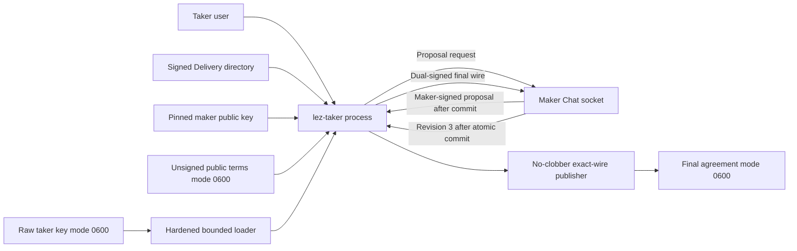
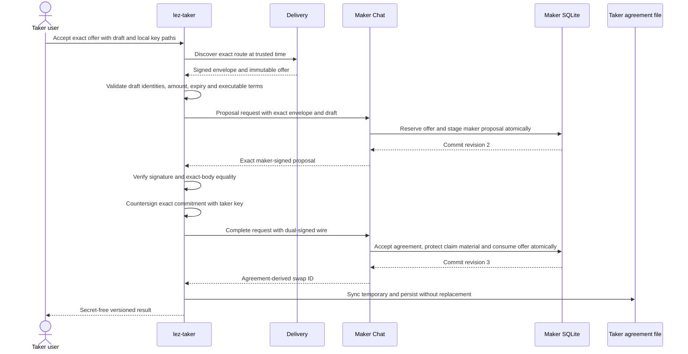

# ADR 0092: Let the taker own validation and countersigning

- Status: Accepted; real taker-process acceptance slice GREEN
- Date: 2026-07-24
- Milestone: M5 progressive local-functional PoC

## Context

ADRs 0090 and 0091 prove both maker-side Chat mutations, but their first
process proof still performed the taker operations inside the Rust test. That
does not emulate how a user accepts an offer and leaves ambiguity about which
process reads the taker key, validates changed terms, and persists the result.

## Decision

Extend the real `lez-taker` binary with one explicit ZEC acceptance mode while
preserving its discovery-only invocation. The taker receives a pinned maker
public key, exact offer and reservation IDs, selected amount, owner-private
unsigned draft, raw owner-private taker key, Chat socket, and a new agreement
output path.

The CLI independently authenticates Delivery, selects the exact live
`Zcash/TakerSellsLez` offer, validates the unsigned draft at its trusted local
time, and proves that the draft identities match the local taker key and pinned
maker. It sends the authenticated envelope and draft to Chat, then validates
the returned maker signature and byte-exact body before signing. The taker
never accepts a maker-changed amount, identity, transcript, chain binding,
deadline, destination, or executable policy.

Mutation request IDs are deterministic hashes of the reservation plus a
domain-separated stage label. Retrying the same user command therefore reaches
the maker's existing exact-replay records. After durable maker completion, the
CLI publishes the final wire through a mode-0600 temporary file and
`persist_noclobber`, syncs the file and directory, and accepts an existing file
only when its bounded, descriptor-revalidated bytes are identical.

The daemon and taker share one hardened private-file implementation. It opens
without following symlinks, checks effective ownership, mode 0600, one link,
regular type and bounds, and rechecks device, inode and length after reading.
No secret appears in the versioned JSON output.

## Components and authority

The maker never receives the taker secret key. The taker never receives maker
claim or recovery authority. Delivery and Chat carry only authenticated public
terms, signatures, and bounded identifiers.

## User acceptance sequence

## Atomicity argument

This flow does not claim a distributed transaction across the taker file and
maker database. Its safety comes from ordering and replay:

1. the maker proposal is not returned before reservation and proposal bytes
   commit together;
2. the final completion response is not returned before agreement,
   coordinator, binding, encrypted maker claim material, offer consumption,
   and replay result commit together;
3. the taker writes only the exact dual-signed wire it locally validated;
4. if the process dies after maker commit but before local publication, the
   same deterministic request exact-replays and safely republishes; and
5. an existing different output is never overwritten.

Thus a crash can leave a recoverable missing taker file, not a conflicting
accepted agreement or a partially consumed maker offer. Cross-chain atomicity
still begins only after both role actors activate these terms and execute the
reviewed HTLC lifecycle; this pre-lock decision does not itself move funds.

## Evidence and limitations

The `zec_chat_process` test now launches the actual maker daemon and actual
`lez-taker` binary. The CLI authenticates the offer, reads its own raw key,
validates and countersigns, receives revision 3, persists the final wire, then
repeats the identical command after crossing a wall-clock second. All three
replay indicators become true. Forced daemon termination and SQLite reopen
retain the exact agreement and protected maker authority.

The process test uses no node, chain RPC, Docker, faucet, public funds, DNS,
public finality source, or Logos service. It proves the application negotiation
boundary, not actor activation or a cross-chain effect. The unsigned
chain-fact preparer, final actor-config rebinding, actual local LEZ/ZEC corridor,
status/claim/refund taker commands, and outage cutover remain.
