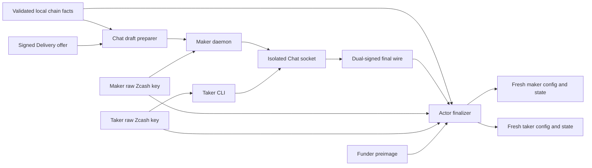
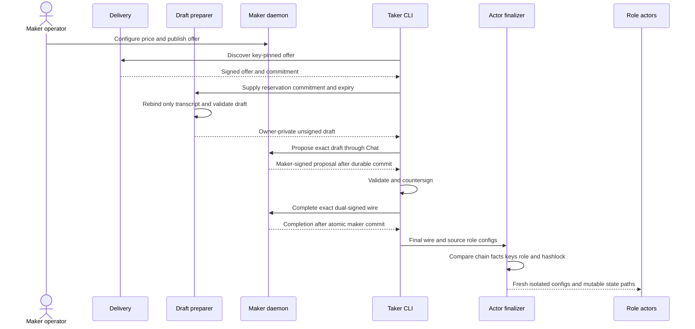

# ADR 0093: Rebind Chat agreements into fresh actors

- Status: Accepted; actor-handoff component GREEN
- Date: 2026-07-24
- Milestone: M5 progressive local-functional PoC

## Context

ADR 0092 ends with an exact countersigned agreement produced by the real maker
daemon and taker CLI. The proven M2 corridor starts from two role-isolated
actor configurations containing validated chain facts and private authority.
Rebuilding those facts in the application process would duplicate the agreement
builder and risk drift; reusing the old signatures would bypass Delivery and
Chat.

## Decision

Treat the freshly provisioned local agreement as a validated chain-fact
template only. A preparation command replaces only its negotiation transcript
with the exact Delivery envelope commitment, Chat reservation-derived session
ID, and offer expiry. It drops both old signatures and emits a bounded unsigned
draft. The maker and taker remain the only processes that sign it.

After Chat completion, a finalization command validates the final wire for both
roles at the same trusted acceptance time. It reconstructs the expected body
by replacing only the template transcript and requires exact body equality.
It derives each public key from the role's private Zcash key, verifies the
configured funder role, and hashes the funder's preimage against the agreement.

Only after every check passes does finalization create a new output root, copy
the exact final wire, and encode maker and taker configs with fresh actor and
bridge-journal paths. Existing authority files are referenced in place rather
than copied or printed. Both configs must securely reload, validate as an
isolated pair, and load activation material before success is reported.

The maker daemon accepts the same owner-private raw 32-byte Zcash key used by
the actor, as well as the earlier hexadecimal form. This avoids a duplicated
secret file while preserving backward compatibility.

## Components and authority

The preparer holds no signing or claim authority. Chat never receives recovery
keys or the preimage. The finalizer reads authority only to prove agreement
binding and returns paths and hashes without secret bytes.

## Handoff sequence

## Atomicity argument

This handoff does not claim one transaction across Delivery, Chat, two files,
and two actor databases. Safety comes from immutable terms, ordering, replay,
and fail-closed publication:

1. the draft changes only the authenticated pre-lock transcript of a validated
   agreement;
2. maker and taker signatures cover the entire rebound body;
3. Chat completion commits the agreement and maker recovery state before return;
4. the taker publishes only its exact validated wire without replacement;
5. finalization performs every comparison before creating output and hash-pins
   both configs to that wire; and
6. fresh state paths prevent inherited mutable lifecycle history.

A crash while emitting the actor tree can leave an incomplete private root,
but that root cannot be reused and success is reported only after both actors
reload. The safe response is scoped deletion of that run-owned pre-effect root
and a fresh reservation. No chain effect is authorized by this handoff alone.

Cross-chain atomicity remains the Zcash BIP-199 and LEZ hashlock/refund protocol
proved by M2. This decision preserves its chain facts and authority while
changing who negotiated and signed them; the M5 corridor must still prove
activation, first lock, transport removal, and terminal state.

## Evidence and limitations

The real `zec_chat_process` proves the daemon consumes the actor's raw key
format and a separate taker completes and replays Chat. The draft and finalizer
binaries pass warning-fatal Clippy, and the reference-actor suite is GREEN.
This checkpoint uses no chain RPC, Docker, faucet, public funds, or network.

Actual corridor composition is next. Reusing provisioned authority paths is
acceptable for the isolated PoC but is not production key rotation or
multi-user custody. Atomic directory publication, post-lock adapter removal,
terminal daemon restart, packaging, and hardened negative cases remain.
