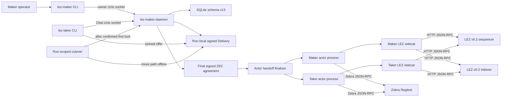
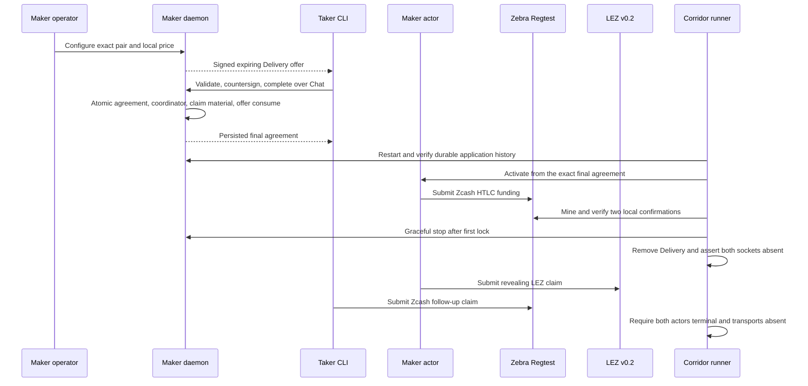

# ADR 0094: Compose M5 ZEC and cut negotiation after the first lock

- Status: Accepted for implementation; actual-node evidence pending
- Date: 2026-07-24
- Milestone: M5 progressive local-functional PoC

## Context

The stable M2 `TakerSellsLez` corridor already proves the two signed chain legs
against isolated LEZ v0.2 and Zebra Regtest nodes. M5 adds the user-facing
maker daemon, maker CLI, signed Delivery discovery, separate taker CLI, Chat
negotiation, and durable application history. A valid application PoC must use
those processes to create the exact agreement the actors execute. It must also
show that Delivery and Chat are negotiation transports rather than settlement
authorities by removing them only after the first lock exists.

Removing the transports before any lock would not prove the required timing.
Keeping them until terminal state would not prove post-lock independence.

## Decision

Add an explicit `M5_APPLICATION_MODE=1` path and a thin
`run-m5-zec-application-poc.sh` entry point. Legacy M2 behavior remains the
default. The M5 path:

1. provisions source actors from fresh local chain facts;
2. starts the real maker daemon and configures/publishes through `lez-maker`;
3. discovers and accepts through the separate `lez-taker` process;
4. validates and rebinds the final agreement into fresh actor state;
5. restarts the daemon and verifies pair, price, consumed offer, and swap
   history before effects;
6. hands the exact live daemon PID, process start ticks, executable, sockets,
   and Delivery paths to the corridor runner;
7. starts independent maker and taker actor processes;
8. after the actor-submitted Zcash funding transaction receives the declared
   two local confirmations, gracefully stops the handed-off daemon and removes
   the Delivery path; and
9. requires both actors to reach terminal completion while those transports
   remain absent.

All endpoints stay explicit literal loopback. One endpoint-tuple file lock and
one monotonic 49-second provision-to-completion deadline cover negotiation,
actor activation, both chain legs, and terminal evidence.

## Components and RPCs

## Sequence and atomicity argument

This is not a distributed database transaction across two chains. Conditional
atomicity comes from the agreement-bound hashlock and timeout ordering: the
Zcash funding is confirmed before the LEZ claim reveals the preimage, and the
Zcash follow-up spend is forbidden until that reveal is observed. Both actors
validate the same final wire, identities, amounts, chain profiles, deadlines,
and preimage hash before activation. Each effect is journaled and observed
before any retry. If cooperation stops, the presigned timeout branches preserve
recovery; the happy PoC executes the claim branch, not every recovery branch.

Cutting Delivery and Chat after the first confirmed lock demonstrates that
neither transport is required to reveal, observe, claim, or reach terminal
state. A crash before cutover leaves transports available and produces no pass
receipt. A crash after cutover cannot recreate negotiation authority; actors
continue only from their isolated durable state and chain evidence.

## Consequences

- The first application composition supports only `TakerSellsLez`; BTC, XMR,
  and the reverse ZEC application direction remain M5 exit work.
- The M5 runner never owns or cleans the devnet containers. Their unique run
  manifests govern exact cleanup, preventing clashes with other Docker work.
- Runtime uses no public RPC, faucet, peer, price feed, or Logos service.
- Actual-node execution, retained evidence, replay, post-PoC fault tests, and
  final Mermaid rendering remain required before certification.
