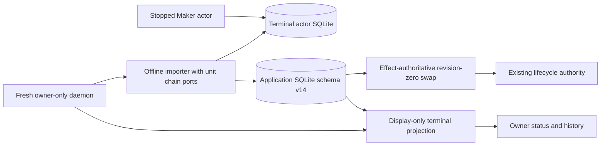
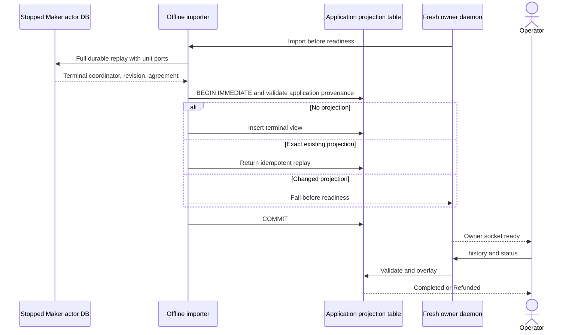

# ADR 0095: Project stopped terminal actors as operator-only views

- Status: Accepted; exact packet-bearing replay GREEN at pushed commit `6c3bbbe`
- Date: 2026-07-24
- Milestone: M5 progressive local-functional PoC

## Context

ADR 0094 proves that Delivery and Chat can disappear after the first confirmed
lock while independent Maker and Taker actors settle from their own databases.
The application database intentionally retains the agreement's revision-zero
coordinator, while each actor database owns the effect-authoritative transition
journal through terminal revision four. Consequently, restarting the owner
daemon after settlement would truthfully show the application aggregate as
`Offered` unless there is an explicit terminal read-model handoff.

Overwriting the application `swaps` row with an actor coordinator is unsafe.
It would make presentation state appear effect-authoritative without moving the
matching SDK revision and transition journals. Importing status JSON is also
insufficient because it omits the exact signed agreement and replay provenance.

## Decision

Add schema-v14 `operator_terminal_projections`. One row is insert-once and binds
the swap ID, source role and revision, terminal phase, SHA-256 of the exact
countersigned agreement, and serialized terminal coordinator. It contains no
secret, path, key, clock input, or effect authority.

A fresh daemon may import only when all four terminal-source arguments are
present. Before binding readiness it:

1. opens an existing stopped Maker actor database with the role's recovery key;
2. calls `resume_all_capable` through unit LEZ and Zcash ports;
3. requires an absorbing `Completed` or `Refunded` coordinator;
4. exact-encodes that actor's agreement;
5. opens the separate application database; and
6. uses one `BEGIN IMMEDIATE` transaction to validate the completed Chat wire,
   revision-zero application base and immutable terms before insert or exact
   replay.

Only `swap_status` and `swap_history` load the validated overlay. Ordinary
`load` and `list_swaps`, reconciliation, alerts, and every effect path continue
to use the application aggregate and recovery journals unchanged.

## Components

## Sequence and atomicity

The actor's source transition is already committed and terminal before import.
The projection insert is atomic in the target database, but there is no false
claim of one transaction across two SQLite files. A crash before target commit
leaves the prior operator view and a retry replays the immutable source. A crash
after commit exact-replays the insert. Neither case can send a chain effect,
because replay has unit ports and the projection is excluded from lifecycle
loads. This makes the operator view eventually convergent without weakening
protocol atomicity.

## Rejected alternatives

- Overwrite `swaps`: rejected because presentation would diverge from the SDK
  journal and could authorize stale lifecycle behavior.
- Import actor status JSON: rejected because it lacks signed-agreement and
  complete-history provenance.
- Restart Delivery and Chat to reconstruct state: rejected because negotiation
  transports must remain permanently removable after the first lock.
- Read the live actor database on every owner query: rejected because it couples
  presentation availability to a role-private effect store and key.

## Consequences

- Terminal import requires a stopped role database; live-actor snapshotting and
  file-level cross-database transactions are not claimed.
- A failed projection leaves protocol funds and actor history unchanged; the
  owner view can be retried from the immutable terminal source.
- Later reorg/chaos hardening must define whether a terminal operator projection
  gains a separate alert or invalidation record. This PoC uses stable local
  devnets and does not claim future-reorg finality.
- Focused schema/restart/idempotency and compile gates are GREEN. Exact packet-
  bearing replay `m5app6c3bbbe20260724a` exercised the complete import through
  fresh local devnets from pushed commit `6c3bbbe` and retained a secret-safe
  certification record; literal M5 completion remains gated.
