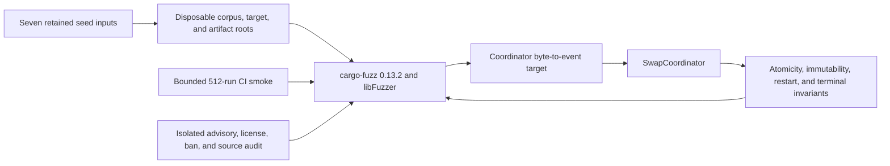
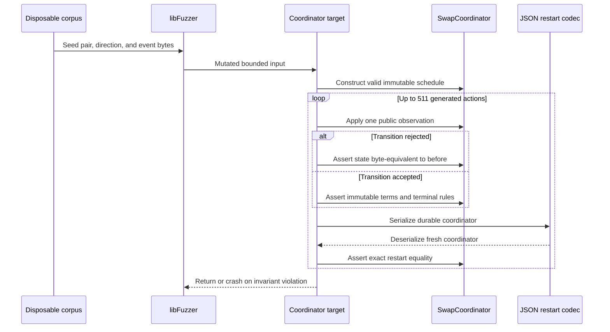

# ADR 0096: Fuzz coordinator transitions and restart boundaries

- Status: Accepted; 512-run local libFuzzer smoke GREEN
- Date: 2026-07-24
- Milestone: M5

## Context

Accepted issue #112 requires a fuzz harness against the swap-coordinator state
machine using `cargo-fuzz` or an equivalent. The existing 512-case Proptest
checks one generated Bitcoin profile, but it is not a retained mutation corpus,
does not exercise every supported pair/direction profile, and is not a literal
libFuzzer target.

The coordinator is chain-independent and consumes only recovered public facts.
That makes its pure transition boundary the correct fuzz surface: node clients,
signers, SQLite, Delivery, and Chat would add nondeterminism without increasing
state-machine coverage. Store/process fault injection remains a separate M5
hardening slice.

## Decision

Add an isolated `fuzz/` Cargo workspace with its own lockfile and cargo-deny
policy. Pin `cargo-fuzz` 0.13.2 operationally and `libfuzzer-sys` 0.4.13 in the
manifest. The latter is MIT/Apache plus the permissive LLVM NCSA license, which
is allowed only for that exact package/version in the fuzz graph.

The `coordinator` target maps arbitrary bytes to all supported profiles:

- BTC and ZEC in both product directions;
- XMR in its reviewed `TakerSellsLez` direction; and
- funding, affirmative removal/reorg, revealing/follow-up claim, deadline
  refund, XMR event-gated refund, and maker recovery observations.

After every input action it checks that rejected transitions did not mutate
state, immutable terms did not change, `Completed` retains claim evidence,
terminal states remain absorbing, and JSON persistence round-trips exactly.
Seven named seeds retain happy, refund, reorg, and conflict shapes. The smoke
runner copies them to a temporary corpus before mutation and removes its target,
corpus, and artifact roots, so CI and local smoke do not dirty the repository.

## Components

## Fuzz and restart flow

This is test atomicity, not a claim that serialization is the production
database commit. The target proves each rejected public operation is
side-effect-free in memory and each accepted state has an exact restart image.
SQLite transaction rollback, process kill, and chain-effect journaling continue
to be tested at their owning layers.

## Rejected alternatives

- Keep only Proptest: rejected because issue #112 asks for `cargo-fuzz` or an
  equivalent retained fuzz harness and bounded CI smoke.
- Fuzz raw JSON deserialization only: rejected because parser robustness does
  not exercise legal and illegal transition interleavings.
- Include live nodes or SQLite in this target: rejected because nondeterministic
  I/O reduces mutation throughput and conflates component ownership.
- Let smoke mutate the checked corpus: rejected after the first local GREEN run
  demonstrated that libFuzzer expands its supplied corpus directory.

## Consequences

- CI installs an exact cargo-fuzz release on a pinned nightly and executes 512
  mutations with a 512-byte input cap and two-second per-input timeout.
- Longer campaigns use the same target with larger run/time budgets; crashes
  must be minimized and retained as named regression seeds.
- The fuzz graph is audited independently, so its nested lockfile cannot bypass
  advisory, license, ban, or source policy.
- This closes the literal fuzz-harness output only. It does not certify the
  daemon, CLIs, concurrency, outage behavior, other application pairs, or M5.
