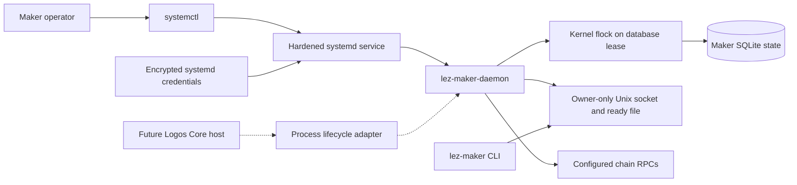
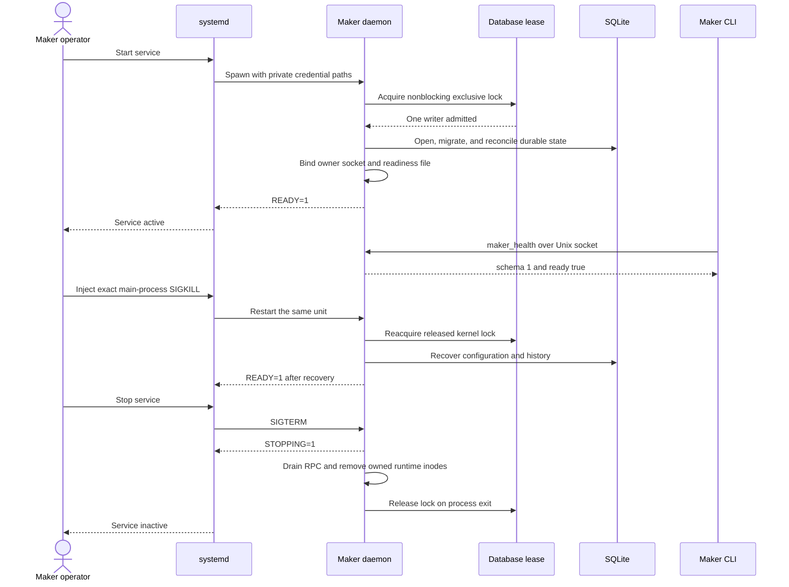

# ADR 0097: Supervise one maker daemon lifecycle

- Status: Accepted; standalone systemd and process-contract rehearsals GREEN
- Date: 2026-07-28
- Milestone: M5

## Context

Accepted issue #112 requires the Tokio maker daemon to run through Logos Core
daemon mode and to have a real standalone systemd fallback plus installation
documentation. Logos Core has not published a stable daemon lifecycle API, so
claiming a live Core integration would invent an upstream contract. The local
fallback still needs production-shaped readiness, credential, restart, and
single-writer behavior, and a future Core host must launch the same binary
without becoming swap or secret authority.

The pre-decision daemon handled interactive SIGINT but not systemd's SIGTERM,
accepted mode-0600 secrets but not systemd's mode-0400 runtime credentials, and
allowed two processes using different sockets to open the same SQLite state.
Those gaps could expose premature readiness, competing writers, or an unbounded
shutdown.

## Decision

Package `lez-maker-daemon` as a hardened `Type=notify` service. systemd owns the
mode-0700 runtime and state directories, decrypts three named credentials into
its private runtime credential directory, and starts the normal daemon binary.
The daemon acquires a nonblocking owner-only `flock` beside the database before
opening SQLite or importing a terminal projection. It publishes the owner
socket and readiness file, initializes Delivery and Chat state, sends
`READY=1`, and answers the typed read-only `maker_health` RPC.

The daemon accepts only owner-owned, single-link, bounded regular credentials
with mode 0400 or 0600. Group or world permissions remain forbidden. It handles
SIGINT and SIGTERM, sends `STOPPING=1`, drains RPC work, and removes only the
socket and readiness inodes it created. A crash leaves the persistent lease
file but releases the kernel lock; the next exact service instance reopens the
same database and recovers its durable state.

`ProcessMakerDaemon` is the narrow future-Core contract: `start`, `endpoint`,
bounded `health`, and bounded `stop`. It validates absolute paths and the real
executable before spawning, never reads credentials or opens SQLite, rejects a
duplicate start, and owns exactly one child. Stop sends SIGTERM to that child,
waits for the caller's grace period, and escalates only that unreaped child to
SIGKILL. Live Logos Core compatibility remains LOGOS-019 until an immutable
upstream surface exists.

The exact-pinned `sd-notify` 0.5.0 crate is used with default features disabled.
It is a small pure-Rust implementation under MIT OR Apache-2.0 and avoids a
fragile reimplementation of filesystem and abstract Unix notification sockets.

## Components

The dotted Core edge is a tested local contract, not evidence of a published
Logos integration. systemd and Core are mutually exclusive lifecycle owners for
one daemon generation. The maker CLI uses only the owner socket and must run as
the service user unless an audited access policy is added later.

## Start, crash recovery, and stop flow

## Atomicity and failure boundaries

The lease is mutual exclusion, not a cross-chain atomic commit. It ensures only
one daemon process can mutate one maker database at a time. Each application
transition retains its existing SQLite transaction and effect-journal rules;
the supervisor cannot bypass them. A crash before a transaction commits leaves
the prior durable state. A crash after commit lets restart reconcile that exact
state. `READY=1` is deliberately after initialization so systemd never reports
an uninitialized database as active.

SIGKILL can interrupt cleanup but cannot retain the kernel lease. systemd owns
and removes the runtime directory, while persistent state remains untouched.
For future Core hosting, a fresh generation-scoped runtime directory provides
the same stale-path isolation. No lifecycle action submits a chain effect, so
this ADR neither weakens nor independently proves swap atomicity.

## Evidence and external resources

The staged installer builds and installs all three application binaries,
checks modes, and runs `systemd-analyze verify`. The actual user-systemd
rehearsal observes notification readiness, mode-0400 runtime credentials,
owner RPC health, a durable route across SIGKILL restart, SIGTERM cleanup, and
one exact restart. The process test proves readiness, health, duplicate-start
rejection, idempotent stop, restart, invalid pre-spawn configuration, and
single-writer lease transfer.

These tests use no Docker, chain node, RPC, faucet, public funds, DNS, public
price feed, Delivery service, Chat service, or external finality. A cold Cargo
build can require the pinned registry artifacts. The transient rehearsal also
requires a working user systemd manager; that host capability is explicit and
does not affect protocol correctness.

## Consequences

- Standalone operators have a reproducible hardened service today.
- The future Core integration is constrained to lifecycle and presentation;
  keys, SQLite, RPC authorization, pricing, and protocol effects stay inside
  repository-owned boundaries.
- The persistent lock file must not be treated as evidence of a live process;
  only successful kernel-lock acquisition is authoritative.
- This closes the systemd/Core lifecycle sub-slice, not the full maker-daemon
  output or M5. Autonomous multi-pair execution and remaining CLI/outage work
  are still open.
