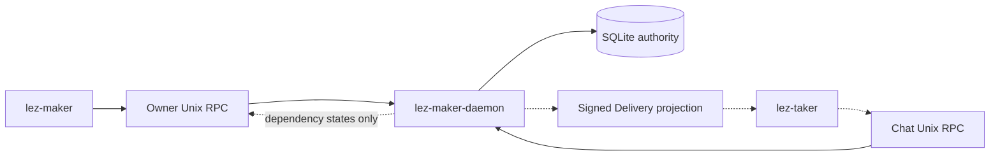
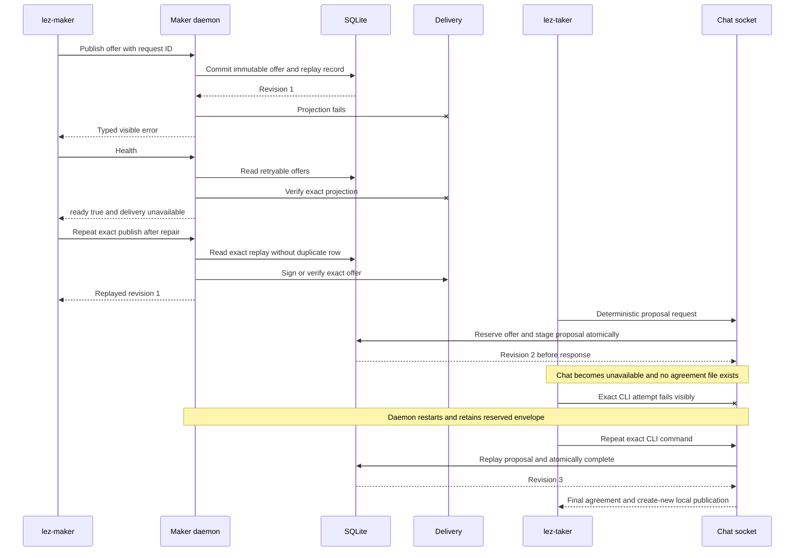

# ADR 0098: Report and recover Delivery and Chat outages

Status: Accepted; local application-path process proof GREEN

## Context

RFP R8 requires graceful behavior while Logos Delivery or Chat is unavailable.
SQLite is the application authority and both transports are removable
projections. The daemon previously returned a visible publish error after a
Delivery failure, but health could not distinguish a healthy application from
a broken projection. Startup also removed a reserved offer envelope, preventing
the winning taker from exact-replaying Chat after a daemon restart.

## Decision

Keep `maker_health` schema version 1 and its existing `ready` meaning: owner RPC
and SQLite are usable. Add `degraded`, `delivery`, and `chat` fields. Each
optional dependency is `disabled`, `available`, or `unavailable`; degradation
does not falsely mark authoritative state unready.

Delivery health is read-only. It checks the owner-only directory and requires
the exact authenticated set of unexpired active, reserved, or consumed
offers. The daemon projects active offers for first contact and retains reserved
or consumed offers for the winning taker's deterministic proposal/completion
replay until expiry. Withdrawn and expired offers are absent. Startup reconciles the same store
query before readiness.

Chat health verifies the configured path is still the daemon user's mode-0600
Unix socket. Proposal and completion request IDs remain deterministically
derived from the reservation. Proposal staging commits before response; after a
temporary Chat loss or daemon restart, the winning taker repeats the same CLI
command and receives the durable proposal before one atomic completion.

## Failure and retry sequence

## Why failures do not break atomicity

- Delivery publication occurs after the immutable SQLite offer commit. A
  transport failure cannot erase or duplicate that commit; the global request
  ledger returns the same revision before projection is retried.
- The proposal, winning reservation, and offer revision move together in one
  immediate transaction before Chat returns maker-signed bytes. A competing
  reservation or changed request conflicts.
- Chat absence after proposal staging creates no countersigned agreement, chain
  effect, or final output. Exact restart replay returns the same proposal.
- Completion commits the dual-signed agreement, offer consumption, coordinator,
  binding, protected claim authority, and replay result in one transaction
  before the taker publishes its create-new agreement file.
- After the first confirmed chain lock, existing actual-node evidence removes
  Delivery and Chat entirely; later settlement depends only on role-local state
  and chain nodes.

## Evidence and limits

`zec_chat_process` uses the real daemon, maker CLI, and taker CLI. It makes the
Delivery directory insecure, observes one durable offer and degraded health,
repairs it, and exact-replays publication. It then stages a proposal, removes
the Chat socket, proves taker failure creates no final file, restarts the daemon,
and completes exactly once by repeating the same taker command. No Docker,
chain RPC, faucet, public funds, DNS, or public service participates.

This certifies graceful behavior for the accepted run-local adapters. It does
not claim automatic background retry, different-UID isolation, or exact Logos
wire/runtime compatibility. The latter remains the owner-approved upstream
production caveat `LOGOS-020` and does not block local M5 certification.
