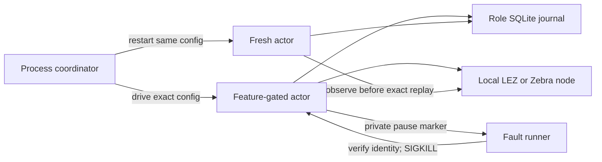
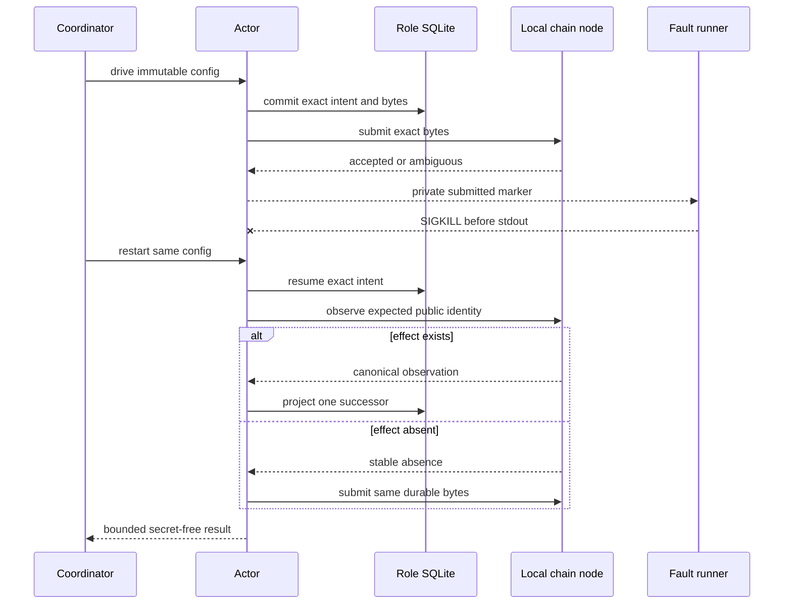

# ADR 0099: pause actors after submission only in fault tests

- Status: Accepted; feature-gated marker helper unit-GREEN and node-free
  systemd/scheduler crash fixture GREEN; real submitted ZEC-chain subprocess
  evidence pending
- Date: 2026-07-28

## Context

The one-shot ZEC actor reopens its authoritative role SQLite journal on every
`drive`. It can recover an ambiguous submission, but the application-level
coordinator must prove the exact window where an effect and durable intent
exist while the invoking process has not returned a result.

Killing before `drive` or after stdout misses that window. A normal CLI or RPC
fault switch would create a production denial-of-service surface and let
orchestration influence protocol transitions.

## Decision

The ZEC actor exposes a pause marker only with the non-default
`test-crash-hooks` feature. After `drive` returns and its secret-free JSON is
serialized, the binary may match one allowlisted submitted operation, create a
no-clobber mode-0600 marker in an owner-owned mode-0700 canonical directory,
and park before stdout.

The fault runner must bind the marker PID to the expected executable and start
time before `SIGKILL`. A subsequent invocation uses the same config and actor
database, observing or exact-replaying the durable intent rather than creating
a different effect. Default builds contain no hook branch.

## Crash sequence and atomicity

Atomicity does not depend on delivering the receipt to the coordinator. Exact
operation identity and bytes are durable before submission; after the kill, a
fresh actor observes the expected public identity before any rebroadcast.

## Consequences

- A genuine unknown-to-caller boundary is reproducible without synthetic
  transition APIs.
- Protocol state and effect authority remain in pair SDK and actor journals.
- The node-free user-systemd fixture proves daemon restart, fenced rescheduling,
  sealed execution, unchanged local-effect replay, and disjoint peer progress.
  It deliberately does not represent or certify a Zcash transaction.
- This ADR alone does not certify coordination; two real swaps, peer progress,
  exact restart, disjoint authority, and terminal reopen remain required.
