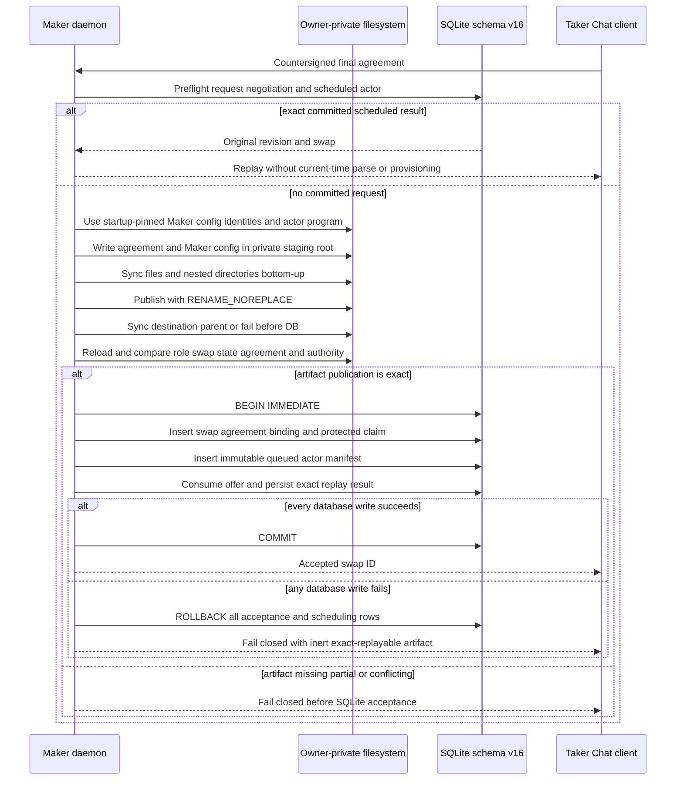
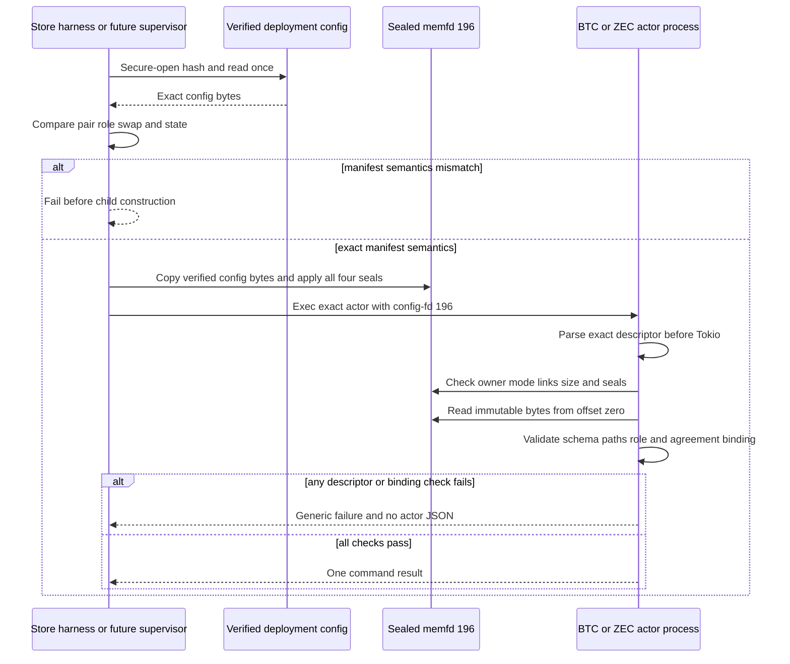
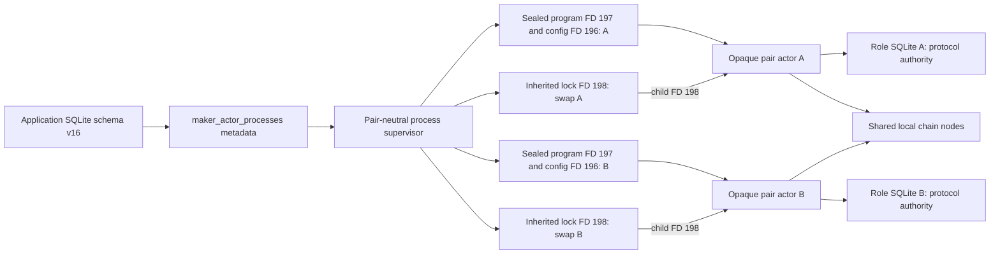
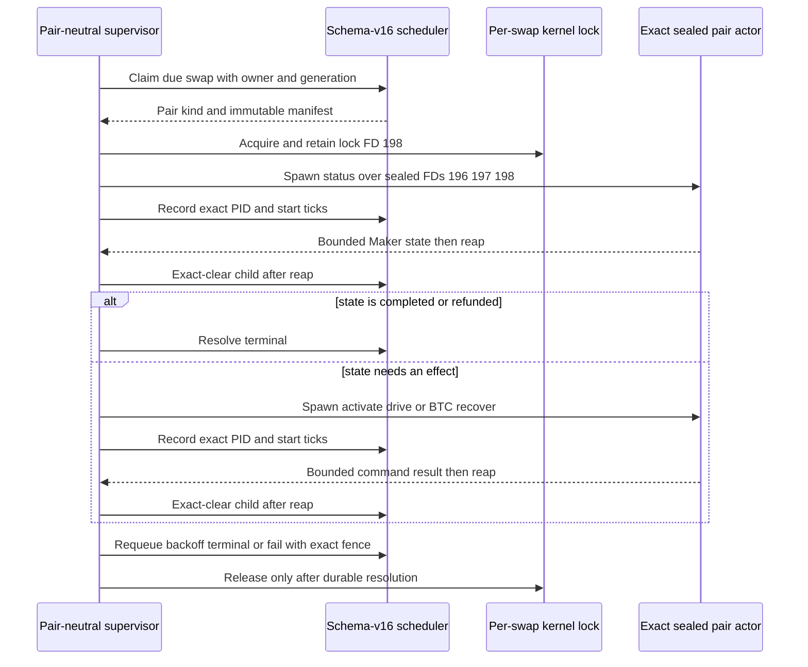
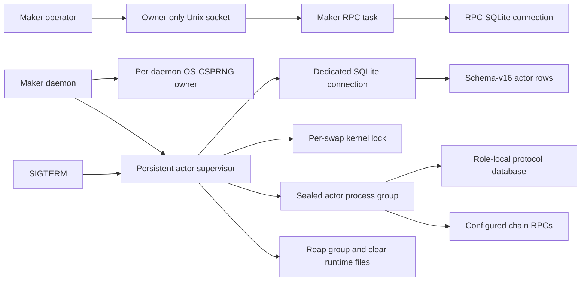
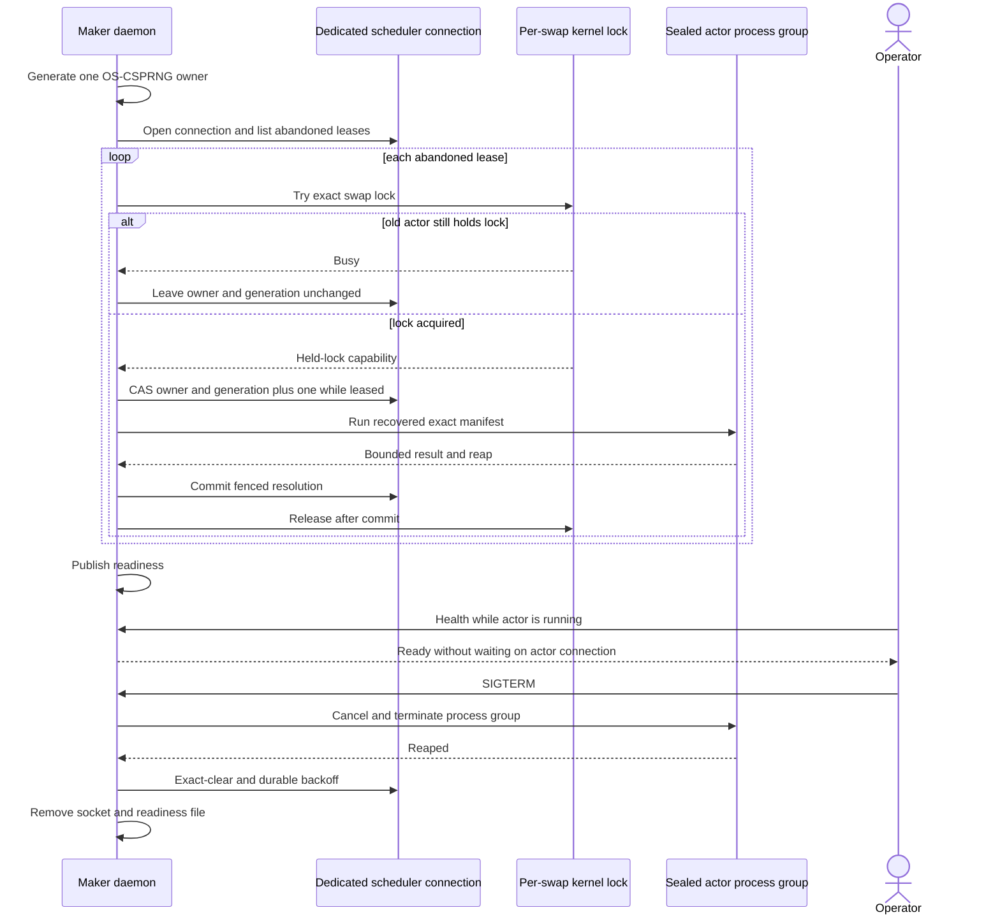
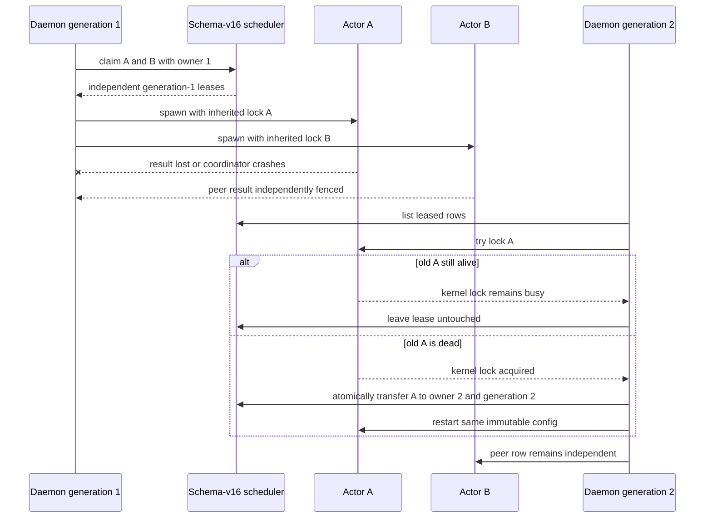

# ADR 0100: fence maker actor process leases

- Status: Accepted; schema-v16 transactional/race foundation, inherited
  held-lock recovery, physical artifact binding, atomic ZEC acceptance and
  expiry-independent replay, real BTC/ZEC sealed-config consumers, daemon-owned
  Maker-only ZEC provisioning, exact-snapshot pair comparison, and the opt-in
  persistent daemon supervisor with abandoned-lease recovery and prompt
  process-group cancellation GREEN; actual-node composition, concurrent
  disjoint live-process overlap, and systemd actor crash/restart pending
- Date: 2026-07-28

## Context

Pair actors persist protocol state, intent bytes, observations, and recovery
authority in role-local databases. Those journals answer how one known swap
resumes, but not which accepted maker swaps need workers, which daemon
generation owns an attempt, or whether a retry is queued, backed off, terminal,
or operator-blocked.

A wall-clock lease expiry is unsafe: an old daemon may die while its child
remains alive. A new daemon stealing that lease after a TTL could run two
workers for one swap. Scheduling must not become a second protocol state
machine or source of effect authority.

## Decision

Schema v16 adds `maker_actor_processes`, containing only orchestration metadata:
application swap ID, Bitcoin/Zcash actor kind, immutable config/program paths
and hashes, role-state database path, schedule state, next-attempt time, lease
owner/generation, child PID/start ticks, attempt count, and payload-free failure
class.

The table never stores an agreement, key, transaction, chain observation,
protocol phase, deadline, or effect bytes. Those remain authoritative only in
the pair actor database and SDK journals.

Standalone registration of an already-durable swap is pair-bound and uses an
immediate SQLite transaction for insert-once/exact-replay behavior under
competing connections. The ZEC acceptance API now reuses that insert inside the
existing acceptance transaction: coordinator, binding, agreement, protected
claim material, completed negotiation, consumed offer, replay record, and one
queued immutable actor manifest commit or roll back together. The manifest is
part of the exact replay identity. A changed manifest conflicts, and a missing
or drifted scheduler row on replay fails closed instead of being silently
recreated. The actor's initial due time is deliberately not replay identity;
the scheduler may already have advanced after a lost response.

An exact committed completion is historical fact, so retry does not reapply the
current agreement-validity window. Before any live parse or provisioning, the
daemon reads the request mutation and exact-compares its offer, revision,
reservation, final-wire and protected-preimage digests, completed negotiation
bytes/state/swap, and immutable actor manifest plus row. Only that complete
match returns the original revision and swap. Absence continues through normal
live validation; changed identity, legacy unscheduled completion, corruption,
or a missing/drifted actor fails closed.

The running Chat path now uses this storage primitive. At startup it loads only
an existing Maker template beneath an owner-private canonical parent, validates
all activation material, and retains the config's file identities. Later
replacement therefore fails closed. Completion validates the exact final
agreement against unchanged chain facts and Maker key/preimage authority,
derives a path from a domain-separated digest rather than the raw swap ID,
writes only a shared agreement plus Maker config and state locations, syncs
every file and containing directory, and publishes through
`RENAME_NOREPLACE`. Only an `EEXIST` rename may enter replay. Exact replay must
retain the same bytes and semantic binding, reject unsafe state/journal files,
and repeat the durability barrier; partial or changed content conflicts. Only
after this succeeds does the daemon call the atomic scheduled-acceptance API.
The legacy unscheduled method has no production caller and remains a
migration/test entry point. A database rollback may leave an inert exact bundle,
but it grants no scheduler authority and the same request can safely reuse it.

An immediate SQLite transaction claims one due row, installs a random 16-byte
owner, increments a monotonic generation, and excludes every other claimant for
that swap. Every resolution requires the exact owner and generation. Distinct
rows may be leased independently.

Stored paths are lexically normalized and distinct. The held-lock component
derives one never-unlinked `<state-db>.maker-actor.lock` beside each role state
database, requires an absolute canonical effective-UID-owned mode-0700 parent,
secure-opens the mode-0600 regular lock with `openat2`, rejects symlinks and
multiple links, and revalidates named/open device and inode identity.

The physical artifact component secure-opens config and program without
following symlinks, requires stable named/open identity, bounded regular files,
single links, trusted ownership and modes, and exact recorded SHA-256 bytes.
It copies those bytes into write-sealed Linux memfds. The child executes only
the sealed program on FD 197, reads the sealed private config on FD 196, and
retains the lock on FD 198. Replacing or mutating the deployment paths after
verification cannot change those child bytes. The state database is rebound at
command handoff as either the same owner-private mode-0600 single-link inode or
the same absent path beneath its mode-0700 parent.

The real ZEC and BTC actors each accept exactly one configuration source: a
private path or inherited FD 196. The inherited route is not a general descriptor
escape hatch. Before constructing Tokio, the actor reopens the fixed descriptor,
requires a regular anonymous effective-UID-owned mode-0600 inode with link count
zero and a 1-to-64-KiB size, requires `F_SEAL_SEAL`, `F_SEAL_SHRINK`,
`F_SEAL_GROW`, and `F_SEAL_WRITE`, reads from offset zero under that immutable
snapshot, and then applies that actor's existing strict config and binding
validation. It rejects every other descriptor number. This closes both consumer
halves of the capability handoff. BTC inherited execution requires schema 6,
while path schemas 3 through 5 remain compatible. Schema 6 requires the exact
agreement SHA-256; the actor rechecks that digest before parsing the signed
agreement and exposes the derived swap ID, role, state path, and digest for
supervisor comparison. Pair-specific maker-node adapters now compare the exact
hash-verified bytes with the leased Maker role, application swap, and role-state
path before spawn. BTC additionally requires schema 6 and revalidates the
agreement-derived swap ID. The same accepted bytes, not a reopened path, are
then sealed into FD 196.

The store remains pair-neutral: it accepts a payload-free validator callback
over the exact verified bytes. BTC and ZEC own their strict config formats and
maker-node dispatches by the manifest kind. A content digest alone is not
treated as proof of role, swap, or state semantics.

Time never releases `leased`. The daemon first acquires the per-swap exclusive
kernel lock and maps a cloned close-on-exec descriptor to child FD 198. Exact-
pinned `command-fds` 0.3.3 performs the child-only descriptor mapping without a
process-wide close-on-exec race or repository-local unsafe code; its Google
upstream and Apache-2.0 license pass the workspace dependency-policy gate. The
old parent and every inherited child must exit before another daemon can acquire
the lock. A non-cloneable held-lock value then authorizes one immediate SQLite
transaction that replaces owner and increments generation while the row remains
`leased`; no queued/unleased interval is observable. PID/start ticks remain
diagnostic, not fencing authority.

This capability assumes an effective-UID-private local filesystem with working
`flock` semantics. Different-UID service isolation and remote filesystems need
separate production validation; lock files are deliberately never unlinked.

## Bounded supervisor cycle

One bounded cycle deliberately serializes observation, effect selection, and
durable scheduling resolution for one swap. The kernel lock remains held after
each child is reaped and until the fenced scheduler transaction commits. Actor
result bytes are parsed but never stored in the application scheduler.

## Persistent daemon composition

The daemon creates one nonzero 128-bit lease owner from the operating system
CSPRNG for its lifetime. When supervision is explicitly enabled, it opens a
dedicated SQLite connection before readiness; actor execution never holds the
owner RPC connection's mutex. Startup scans abandoned leases before publishing
readiness, then the blocking supervisor loop alternates abandoned recovery and
stable due-row claims. The packaged systemd unit and transient rehearsal enable
the supervisor.

The focused daemon-process E2E uses a local sleeping actor rather than
`LocalNodes`; the node edge describes production composition, not focused-test
evidence.

## Crash and peer-isolation flow

## Atomicity argument

The scheduler decides only whether and when to invoke an opaque actor. Accepted-
swap creation and immutable ZEC actor registration share one rollback boundary,
so a committed scheduled acceptance cannot expose the missing-row handoff. The
bounded cycle holds the same per-swap kernel lock across exact sealed `status`,
the selected effect command, child reap, exact diagnostic identity clear, and
durable owner/generation-fenced resolution. Therefore another generation cannot
enter between observation/effect and scheduling resolution; PID and start ticks
are cleanup identity, never the concurrency fence. The primary key, immediate
claim, secure physical artifact binding, and inherited kernel lock prevent two
bounded cycles for one swap. The persistent daemon composes that capability
without a queued/unleased gap: only a successful kernel-lock acquisition can
authorize the immediate owner/generation-plus-one recovery CAS, and a busy lock
leaves the old lease untouched. A dedicated connection keeps long actor waits
independent from owner RPC. This proves the local-process crash-handoff
mechanism, not actual-node or systemd actor-crash composition. The actor's exact
durable intent and observe-before-rebroadcast remain the at-most-once
public-effect boundary. Different
swaps use unique rows, configs, state databases, locks, agreements, escrows,
outpoints, and deadlines.

## Consequences

- Store tests prove transactional exact registration, pair binding, stable due
  order, competing-connection same-row exclusion and distinct-row progress,
  restart enumeration, stale-fence rejection, half-open backoff, and peer
  isolation.
- Process-boundary tests prove child inheritance retains the lock after parent
  release, live-child exclusion, exact post-exit recovery, stale-recovery
  rejection, cross-swap rejection, peer immutability, unsafe-parent rejection,
  and hard-link rejection.
- Artifact tests prove the executed program and read config remain the exact
  verified bytes after both deployment paths are replaced. Wrong hashes,
  config symlinks, program hard links, unsafe state modes, and unexpected state
  creation fail closed.
- Atomic acceptance tests force a later mutation failure and observe zero swap,
  agreement, binding, claim-material, actor, and replay rows; success exposes
  exactly one queued row. Exact replay after store reopen and agreement expiry
  preserves it without current-time parsing or provisioning; changed wire,
  preimage, revision, reservation, offer, or manifest conflicts, and a deleted
  scheduler row fails closed. The real taker process proves completion-only
  retry after a three-second TTL from its private persisted agreement.
- Both real actor binary tests replace the deployment config after the sealed
  snapshot is created and still report the snapshot's role/state. Ordinary
  linked files, memfds missing `F_SEAL_WRITE`, path-plus-FD ambiguity, and any
  descriptor other than 196 fail closed. BTC additionally rejects legacy
  schemas on the FD route and a mismatched agreement digest before activation.
  These tests use only local process and kernel primitives; no RPC, node,
  Docker, faucet, or network participates.
- Bounded-cycle tests prove abandoned generation transfer without an unleased
  gap, live-old-lock non-steal with distinct-peer progress, and sealed `status`
  then `activate` requeue at the exact due time. Timeout kills the isolated
  process group and reaps before exact
  child-identity clear and durable backoff, cancellation does the same in under
  one second, and a successful leader cannot leave a stdout/lock-holding
  descendant. Oversized output is drained and fails closed, an unknown outcome
  is rejected, and terminal status resolves without spawning an effect process.
  The child-clear CAS rejects a forged owner or wrong start ticks. These tests
  use no RPC, node, Docker, faucet, DNS, or public network. The focused
  supervisor matrix is 9/9.
- One actual-daemon process E2E proves the opt-in supervisor uses a dedicated
  store connection: owner health remains responsive while a local actor is
  leased. SIGTERM cancels and reaps that process group, clears child identity,
  durably leaves the row non-leased, and removes socket/readiness files in under
  two seconds. Runtime external resources are none; the test contacts no node,
  RPC, Docker service, faucet, DNS service, network, or public funds. Cold Cargo
  compilation may use the pinned registry cache or download dependencies.
- The store actor-process matrix is 12/12, including nonzero unique sampled
  OS-CSPRNG owners and the fencing, recovery, artifact, and peer-isolation
  cases above.
- The packaged systemd unit names `memfd_create` explicitly, keeps native-only
  EPERM policy, installs the real ZEC actor, and carries the startup-pinned
  authority/root/program/digest inputs. An actual user-systemd run validates
  them before readiness and preserves configuration across SIGKILL restart.
  The unit and transient runner now enable the daemon supervisor. A real sealed
  actor crash/restart under systemd remains open.
- XMR is not advertised yet because its role process is a multi-command
  ceremony rather than the one-shot Bitcoin/Zcash actor contract.
- Literal coordinator closure still requires actual-node composition,
  concurrent disjoint live-process overlap, and a real actor crash/restart
  beneath systemd.
