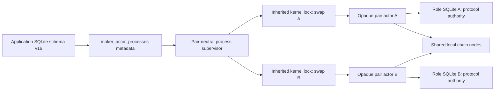
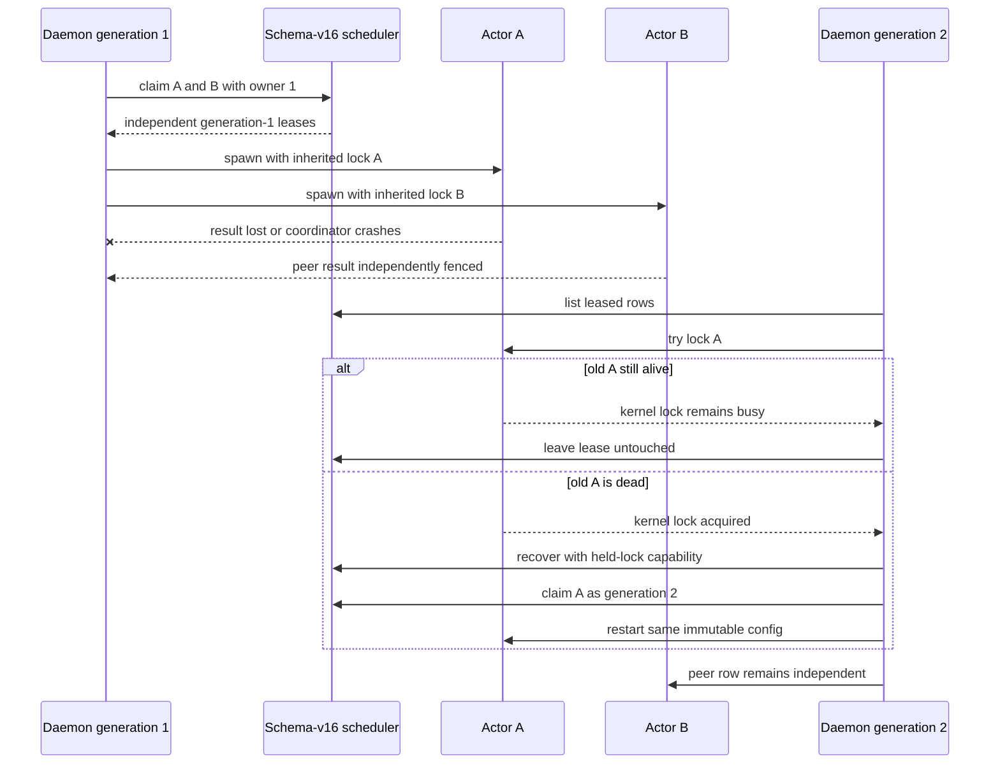

# ADR 0100: fence maker actor process leases

- Status: Accepted; schema-v16 transactional/race foundation GREEN;
  acceptance handoff, physical artifact checks, held-lock recovery, process
  supervisor, and actual-node composition pending
- Date: 2026-07-28

## Context

Pair actors persist protocol state, intent bytes, observations, and recovery
authority in role-local databases. Those journals answer how one known swap
resumes, but not which accepted maker swaps need workers, which daemon
generation owns an attempt, or whether a retry is queued, backed off, terminal,
or operator-blocked.

A wall-clock lease expiry is unsafe: an old daemon may die while its child
remains alive. A new daemon stealing that lease after a TTL could run two
workers for one swap. Scheduling must not become a second protocol state
machine or source of effect authority.

## Decision

Schema v16 adds `maker_actor_processes`, containing only orchestration metadata:
application swap ID, Bitcoin/Zcash actor kind, immutable config/program paths
and hashes, role-state database path, schedule state, next-attempt time, lease
owner/generation, child PID/start ticks, attempt count, and payload-free failure
class.

The table never stores an agreement, key, transaction, chain observation,
protocol phase, deadline, or effect bytes. Those remain authoritative only in
the pair actor database and SDK journals.

Registration of an already-durable swap is pair-bound and uses an immediate
SQLite transaction for insert-once/exact-replay behavior under competing
connections. The acceptance transaction is not yet joined to registration;
that handoff must close before the supervisor is wired.

An immediate SQLite transaction claims one due row, installs a random 16-byte
owner, increments a monotonic generation, and excludes every other claimant for
that swap. Every resolution requires the exact owner and generation. Distinct
rows may be leased independently.

Stored paths are only lexically normalized and distinct. The supervisor must
secure-open and revalidate owner, mode, link count, inode identity, and recorded
hashes at every use before physical isolation is claimed.

Time never releases `leased`, and schema v16 deliberately exposes no abandoned-
lease recovery mutation. The supervisor must first acquire a per-swap kernel
lock inherited into the old child and then present a non-forgeable held-lock
capability to the future recovery operation. PID/start ticks remain diagnostic,
not fencing authority.

## Crash and peer-isolation flow

## Atomicity argument

The scheduler decides only whether and when to invoke an opaque actor. In the
completed design, the primary key, immediate claim, owner/generation fence,
secure physical artifact binding, and inherited kernel lock prevent concurrent
workers for one swap across a daemon crash. Schema v16 alone does not make that
crash-safety claim. The actor's exact
durable intent and observe-before-rebroadcast remain the at-most-once public-
effect boundary. Different swaps use unique rows, configs, state databases,
locks, agreements, escrows, outpoints, and deadlines.

## Consequences

- Store tests prove transactional exact registration, pair binding, stable due
  order, competing-connection same-row exclusion and distinct-row progress,
  restart enumeration, stale-fence rejection, half-open backoff, peer isolation,
- XMR is not advertised yet because its role process is a multi-command
  ceremony rather than the one-shot Bitcoin/Zcash actor contract.
- Literal coordinator closure still requires the daemon supervisor, inherited
  lock, real role-process crash, and actual-node overlap evidence.
