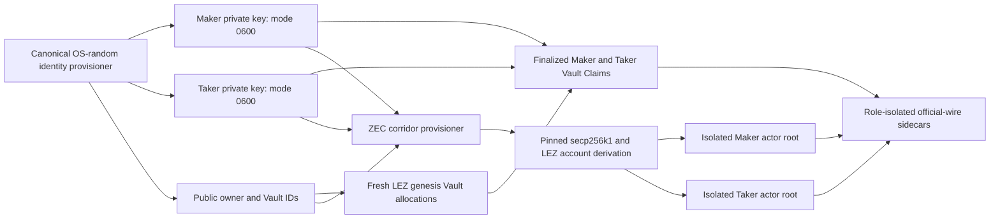
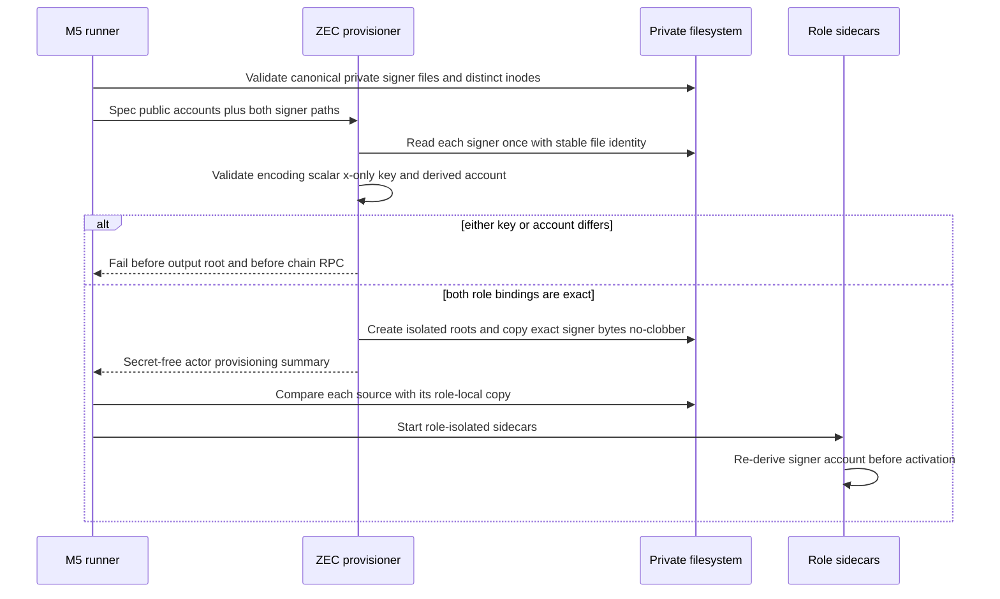

# ADR 0101: bind fresh LEZ identities into M5 actors

- Status: Accepted for the local component boundary; actual-node M5 replay pending
- Date: 2026-07-28

## Context

The canonical M4 onboarding path creates OS-random Maker and Taker LEZ keys
before a fresh genesis, supplies their public owner and Vault IDs to the local
stack, deploys the current escrow, and proves exactly one finalized Vault Claim
per role. The older ZEC corridor provisioner instead accepted only the public
deterministic `01` and `02` fixtures and wrote those keys into actor roots. It
therefore could not execute against the fresh accounts proven by onboarding.

Importing the official LEZ host graph into the root workspace solely to derive
an account ID would combine intentionally separated resolver graphs and inherit
the Logos-owned advisory surface. A local replacement is acceptable only when
it is the exact small derivation already source-audited elsewhere in this
repository and protected by official golden identities.

## Decision

M2 retains its explicit deterministic-fixture fallback. M5 application mode
requires two fresh signer files and rejects either historical default account.
Each source must be an absolute canonical regular file owned by the effective
user, mode `0600`, link count one, exactly 64 lowercase hexadecimal characters
plus one newline, and a distinct inode.

The provisioner reads each source once through the existing bounded
before-open-after identity check. It validates the secp256k1 scalar with the
pinned `secp256k1` crate, derives the x-only public key, and hashes the exact
LEZ v0.2 domain `/LEE/v0.3/AccountId/Public/` plus five zero bytes and the
32-byte public key. The canonical Base58 result must equal the role account in
the provision spec. Maker and Taker derived accounts must differ.

The domain helper lives beside the existing dependency-light LEZ derivations
and is golden-tested against the official `01` and `02` identities. This adds
no dependency. Signer bytes remain zeroizing memory, are copied exactly with
create-new mode-`0600` writes into isolated role roots, and never enter results,
logs, evidence, hashes, or debug output. The M5 runner compares each source and
role-local copy before starting either sidecar. The sidecar independently
re-derives and checks the signer account before activation.

## Fail-closed sequence

No swap effect is authorized by this decision. The current deployment and
actor-onboarding evidence gate must pass separately before actor provisioning,
and sidecar activation remains before any effect.

## Consequences

- Fresh local genesis accounts can now flow unchanged through onboarding,
  actor provisioning, and sidecar activation.
- M5 fails before its output root and before chain RPC when a private signer,
  public account, finalized onboarding claim, or current deployment does not
  describe the same role.
- M2 remains reproducible with its explicit deterministic fixture path; that
  path cannot be selected by the M5 application runner.
- The implementation reuses the already pinned `secp256k1`, `sha2`, `bs58`,
  and `zeroize` crates. No new dependency or license surface is introduced.
- This component proof does not certify an actual swap. A fresh-stack replay
  through the daemon supervisor remains required, followed by the remaining
  literal M5 lifecycle and pair-composition gates.
