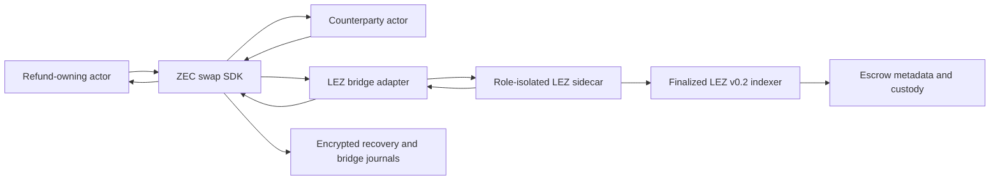
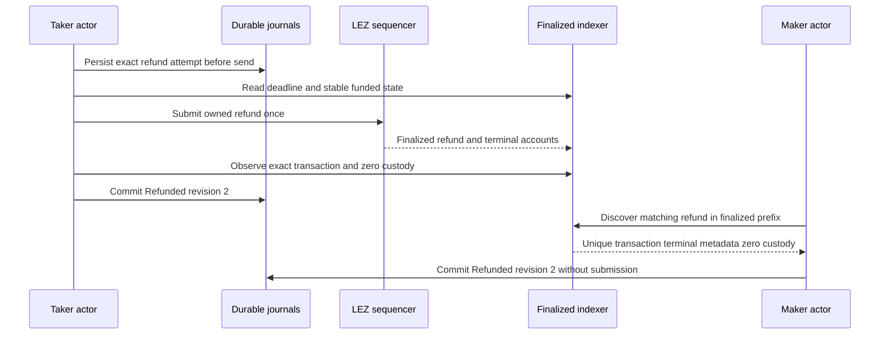

# ADR 0102: observe refunds from finalized window prefixes

- Status: Accepted component design; intervention-assisted actual-node LEZ
  recovery observed; clean application replay remains
- Date: 2026-07-29

## Context

An owner can identify its prepared refund transaction exactly. Its counterparty
cannot know that transaction ID before submission and instead discovers the
unique refund whose program, swap ID, ordered accounts, and authority match the
agreement. The LEZ observer previously refused every counterparty discovery
request until the complete configured window had finalized. That made a refund
already finalized near the start of a long window temporarily invisible and
prevented the other role from converging to the same terminal state.

Returning an incomplete absence as terminal would be unsafe. Returning an exact
matching finalized refund is different: later blocks cannot remove that result
inside the finality model already accepted for the local v0.2 indexer.

## Decision

Both exact and terms-based refund observation scan the available finalized
prefix after the window start. A unique matching refund can be returned
immediately. An absence is terminal only when the adapter proves that the whole
window is covered; a prefix-only absence remains `Unstable` and cannot advance
the SDK.

The observer validates the refund variant as well as its common fields.
Hashlock terms require the exact SHA-256 preimage authority and digest.
Witnessed terms require the exact aggregate authority key and account. Mixed
variants fail closed. Terminal evidence requires a finalized containing block,
stable by-ID and by-hash identity, valid ancestry, the deadline, exact program
and accounts, terminal metadata, and zero custody at that block. Historical
work remains bounded by the configured window and the fixed descendant limit.

An exact owner observation may classify a stable finalized `Funded` snapshot as
absent without scanning the entire window. This permits the existing durable
at-most-once submit path to act. Discovery absence never receives that shortcut.

## Recovery sequence and atomicity

There is no cross-chain database transaction and this ADR does not claim one.
The recovery safety argument is instead:

1. only the depositor for a leg may submit that leg's refund, and only after its
   signed deadline;
2. the exact intent is durable before network submission, so an ambiguous
   restart observes rather than creating a second effect;
3. when both legs are funded, the agreement orders LEZ recovery before Zcash
   recovery; a one-leg abandonment refunds only the funded leg;
4. the counterparty has observation authority only and cannot submit the
   owner's refund;
5. both roles accept only the same unique finalized transaction and the same
   terminal metadata and zero-custody snapshot; and
6. a missing transaction in a partial window is never terminal evidence.

This preserves value atomicity under the documented chain-finality and
authoritative-indexer assumptions. It does not make LEZ and Zcash one atomic
state machine, and it does not remove the upstream lack of proof-bearing LEZ
historical accounts recorded as LOGOS-016.

## Verified local result

The isolated local run `m5fresh-a390dd8-20260728a-app3` began from a deliberate
one-leg state: only the Taker-owned LEZ amount 50000 was locked. After expiry,
the Taker submitted refund transaction
`3a7ffaa55817e0dfe19e5aef35bae678c78cc01220638dff58f65c4bdc116e25`.
It occurs exactly once in finalized block 608, whose by-ID and by-hash indexer
responses agree. Historical state at that block has metadata balance zero and
custody balance zero. The Taker then reached `Refunded` revision 2. With this
decision implemented, the Maker discovered the same finalized refund and also
reached `Refunded` revision 2 without submitting a transaction.

This is an intervention-assisted checkpoint, not a reproducible application
recovery. The originally provisioned observation window was 193 through 448,
while the refund finalized at block 608. The retained run therefore required
manual rotation of both actor observation windows to 590 through 845 and manual
retirement of an older active bridge-journal row before the two actor commands
could converge. Those operations are neither a supported operator procedure nor
daemon/CLI evidence. A durable observation cursor or supported bounded-window
rotation plus daemon-supervised replay remains required before this result can
upgrade the M5 certification claim.

The focused test was RED on the old `Unavailable` guard, then GREEN. The full
finalized-refund observer suite is 25 of 25 GREEN across exact and discovery,
hashlock and witnessed authorities, deadlines, ancestry, moving tips,
ambiguity, custody, and bounded windows.

## Consequences

- A finalized recovery is visible as soon as it exists, rather than after an
  unrelated future window boundary.
- Prefix absence remains a polling state and cannot be misreported as a refund.
- The same rule works for the legacy ZEC hashlock and witnessed asset corridors
  without weakening either authority shape.
- This closes an actual-node two-role ZEC recovery slice. Durable application
  manual-action intents, daemon-supervised actual-node recovery, concurrent
  composed swaps, and BTC and XMR application lifecycle completion remain M5
  work, so no M5 completion tag is authorized by this result.
