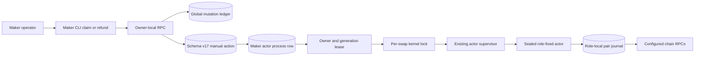
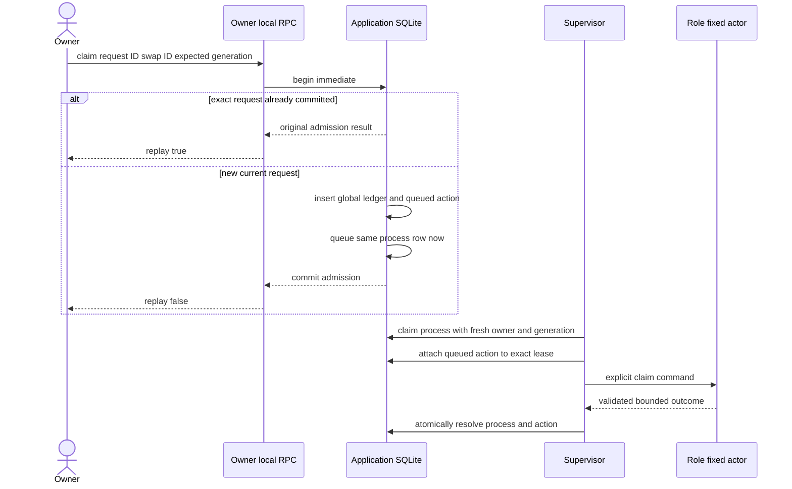
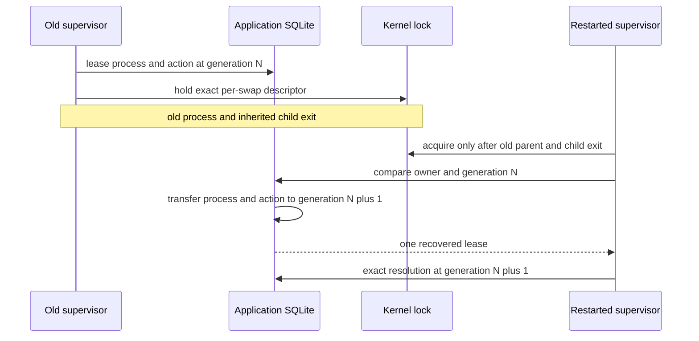

# ADR 0103: Persist replay-safe manual actor actions

- Status: Accepted foundation; actor and RPC routing pending
- Date: 2026-07-29
- Milestone: M5

## Context

The maker actor supervisor already has one durable process row, a random
process-lifetime owner, a monotonic lease generation, a per-swap kernel lock,
and sealed actor artifacts. A maker `claim` or `refund` command must reuse that
authority. Running an actor directly from the RPC handler would create a second
writer, while translating `claim` to generic `drive` could perform funding or
another lifecycle effect that the operator did not request.

Retries must be exact after a lost RPC response or daemon restart. A request
must not be inserted into a worker that is already running, and a stale worker
must not resolve a newer request. The user-facing monitor must eventually show
validated secret-free actor progress, but schema v17 deliberately does not
claim that RPC or projection layer yet.

## Decision

Schema v17 adds `maker_actor_manual_actions` and adds
`actor_action_request` to the existing global maker mutation ledger. Each
request binds one request ID, swap ID, explicit `claim` or `refund` action, and
the actor generation observed at admission. A partial unique index permits only
one `queued` or `leased` action per swap.

New requests require the caller's current generation. An unleased row is queued
immediately. A request arriving during a live lease remains queued for a
strictly later generation and cannot attach to the worker already running.
Admission uses one `BEGIN IMMEDIATE` transaction. An exact request replay is
checked before the current generation, so the original result remains readable after later
leases or restart. Reusing the request ID for any other maker mutation or payload fails
closed.

The next worker leases the action only after proving that its process row still
contains the same owner and generation. Nonterminal resolution returns the
action to `queued`; explicit successful terminal resolution marks it
`completed`; an unrelated terminal or permanent failure marks it `failed`.
Abandoned-process recovery can retarget a leased action only in the same
transaction that transfers the process row, and only while holding the exact
per-swap kernel lock.

This schema foundation does not add a new network endpoint, chain RPC, Docker
container, faucet, or dependency. The eventual actor command and RPC layers
must use the same row and must never bypass the lease or lock.

## Enqueue and exact replay flow

## Crash transfer flow

## Why the transition is atomic

- Admission inserts the global request result, inserts the action, and wakes
  the process row in one immediate transaction. A crash exposes all or none.
- Exact replay compares the canonical stored payload. The later process
  generation cannot turn a lost response into a second action.
- Action authority is not the request row alone. It is the conjunction of the
  request, exact process owner and generation, and held kernel lock.
- Process resolution and action resolution commit together. A stale or forged
  lease updates neither row.
- Abandoned transfer updates both leased rows under the nonforgeable lock
  capability. Wall-clock expiry never steals an action.
- `Terminal` and `ManualActionCompleted` are distinct store outcomes. An actor
  that terminalized for a different reason cannot silently certify the manual
  request as successful.

These properties preserve the pair protocol's existing effect atomicity: the
application action grants no new signing capability and does not replace the
pair journal's persist-before-send and exact-observation rules. It only selects
which already role-authorized state machine the fenced worker may invoke.

## Evidence and remaining work

Focused RED first failed on the absent schema-v17 API. Four GREEN integration
tests now prove exact replay, global request-ID conflict, stale-generation and
wrong-owner rejection, one-open-action enforcement, nonterminal requeue,
explicit terminal completion, SQLite reopen, and kernel-locked abandoned
transfer. The complete `lez-swap-store` suite, strict all-target Clippy, and
warning-free Rustdoc are GREEN.

The foundation is not yet a user flow. Remaining work is validated secret-free
progress, explicit ZEC `claim`, command-specific supervisor allowlists,
owner-local Maker `monitor/claim/refund`, symmetric Taker actor provisioning and
role-validated commands, process restart tests, two disjoint live swaps, and a
fresh actual-node replay. BTC claim and the unified XMR actor remain later M5
scope. No M5 tag is authorized by this component result.
