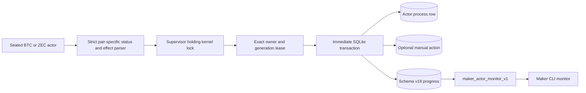
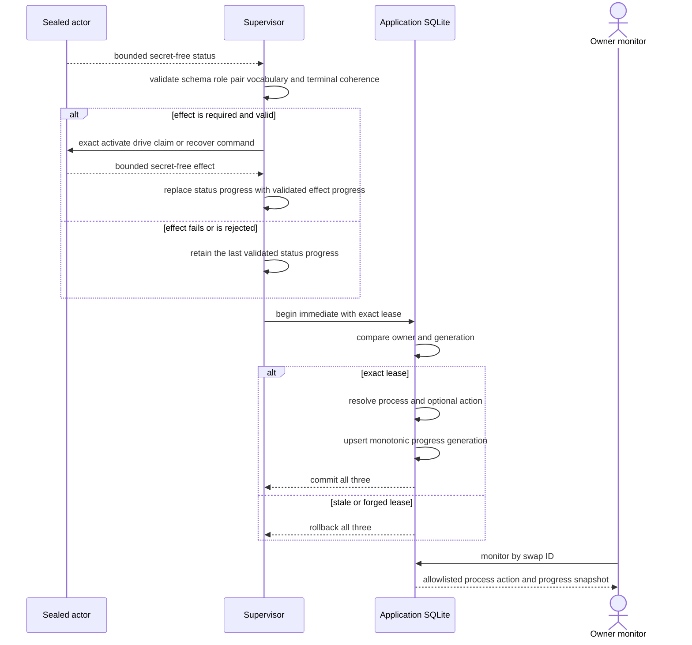

# ADR 0104: Commit actor progress with fenced resolution

- Status: Accepted; store, supervisor projection, and Maker RPC/CLI GREEN
- Date: 2026-07-29
- Milestone: M5

## Context

An owner `monitor` command must not open the private role database, invoke an
actor beside a live worker, or trust transient child output. The application
already resolves each worker through an owner-and-generation lease while
holding the per-swap kernel lock. Progress must share that authority or a stale
worker could publish an observation after a replacement generation took over.

The projection must remain secret-free. Both pair actors legitimately begin active life at
revision zero, so `not_activated` versus `active` is the lifecycle discriminator;
revision zero cannot be rejected as absence. Private paths, artifact hashes, lease
owners, child identities, keys, capabilities, preimages, and raw child output
do not belong in the operator view.

## Decision

Schema v18 adds one `maker_actor_progress` row per registered actor. It stores
only the swap ID, actor kind, source generation, trusted observation time, and
a versioned bounded observation. An observation is either `not_activated` or an
active lowercase snake-case phase, actor-owned revision, and lowercase snake-case
next action. Each public label is limited to 64 bytes.

The supervisor accepts only the phase and next-action vocabularies emitted by the
actual ZEC and BTC actor schemas. It validates terminal phase/next-action
coherence and pair-specific terminal outcomes before publication. ZEC effect
outputs already carry `next_action`; BTC effect output now reuses the same
actor-owned derivation as offline status, preventing the supervisor from
reimplementing protocol state.

Progress is written only by `resolve_maker_actor_attempt_with_progress`. The
method first proves the exact leased process owner and generation, resolves any
attached manual action, and upserts progress in the same `BEGIN IMMEDIATE`
transaction. The source generation can only stay equal or increase. The
read-only API joins the progress actor kind back to the registered process kind
and revalidates the stored payload before returning it.

## Resolution flow

## Why the projection is atomic

- Progress cannot commit before or after its process resolution; both are in
  the same transaction.
- An attached action completes, requeues, or fails in that transaction too, so
  monitor never observes a successful action with an older process resolution.
- The process owner and generation are compared before the upsert. A stale or
  forged lease changes no row.
- The source generation is monotonic even if an externally corrupted caller
  reaches the upsert path.
- The kernel lock remains the nonforgeable execution capability. Schema v18
  adds no second worker or effect authority.

The owner response includes only schema version, swap ID, actor kind, scheduler
state, lease generation, attempt count, validated progress, and latest manual
action state. It omits manifest paths and hashes, state-database paths,
lease-owner identity, child PID/start ticks, and every private actor value.
`monitor` reads only application SQLite; it does not open the role-local actor
database, spawn an actor, or contact a chain RPC.

This is application-level publication atomicity. Pair-level chain atomicity is
still supplied by the existing role journals, persist-before-send transitions,
claim ordering, timeout ordering, and canonical evidence checks. The progress
row grants no signing or submission capability.

## Evidence and remaining work

The store RED failed on the absent progress type, read API, and atomic resolution
method. Its GREEN suite proves bounded-label validation, the real revision-zero
post-activation state, process/action/progress completion in one call, SQLite
reopen, exact actor-kind binding, and stale-owner rollback that preserves the
prior snapshot.

The supervisor RED then proved real manual claim and refund flows reached their
terminal process/action state without a progress row. The GREEN implementation
parses actual BTC and ZEC schemas, publishes effect-derived progress, publishes
terminal status without spawning an effect, and preserves the last validated
status when a later effect is rejected. Parser tables reject cross-pair actions,
unknown phases, incoherent terminal phase/action pairs, and effect revision
regression while preserving the preceding status. Actual BTC actor
tests cover revision-zero activation, completed claim, intermediate recovery,
and terminal refund outputs across both roles and directions. The supervisor
integration suite is 12 of 12 GREEN.

BTC effect schema v1 gained the additive `next_action` field by factoring the
same actor-local function already used by status. An older sealed BTC actor
without that field fails closed at the new supervisor boundary and must be
reprovisioned with its new executable hash; no compatibility fallback guesses
protocol state.

Maker `monitor/claim/refund` RPC and CLI are now GREEN. The versioned methods
return the allowlisted view above and require the caller-supplied expected
process generation for every action. Exact replay returns the original durable
admission after restart; the daemon never substitutes a newer generation. ZEC
exposes claim and refund, while BTC exposes refund only. The black-box operator
journey proves read-only monitoring, exact claim replay, payload conflict,
missing-actor classification, and an identical monitor view after restart.
Symmetric role-validated Taker provisioning and direct kernel-locked commands are GREEN; acceptance-receipt and actual-node composition follow. Complete Maker
(with crash hooks), swap-store, and BTC actor suites, strict all-target and
all-feature Clippy, warning-free Rustdoc, formatting, and diff hygiene are
GREEN. The lifecycle methods use the existing owner-local Unix socket; they add
no chain service, container, faucet, or public resource. This slice does not
authorize an M5 tag.
