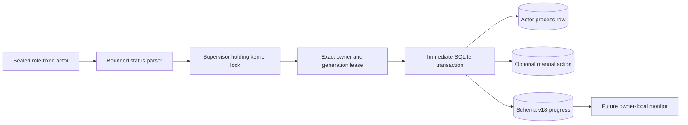
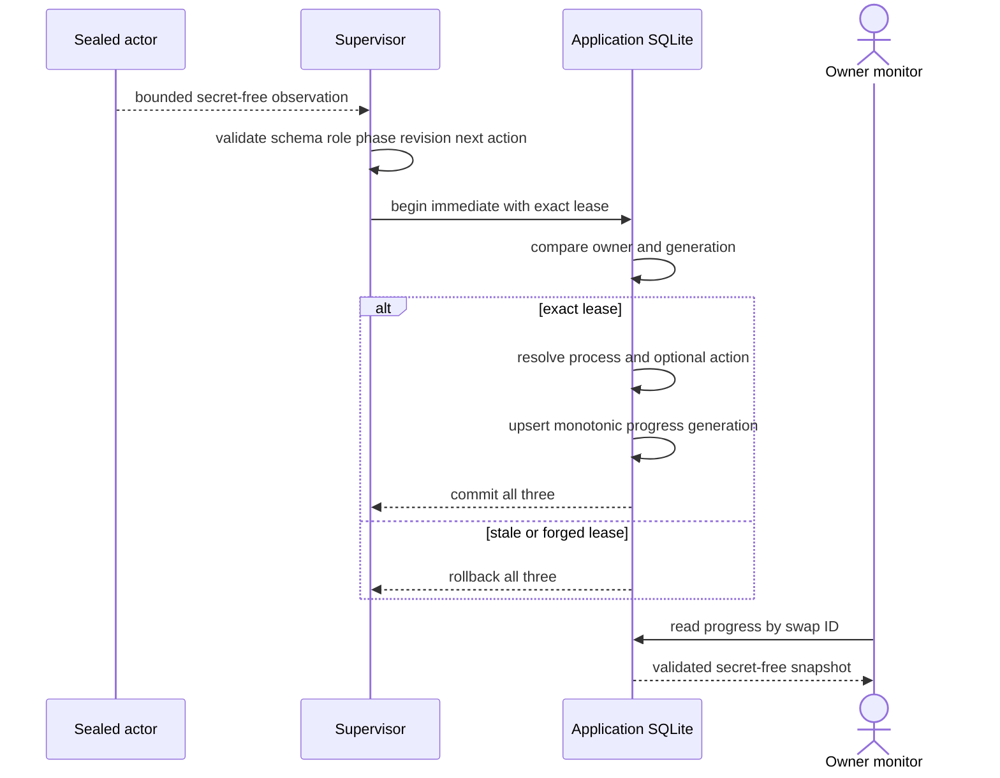

# ADR 0104: Commit actor progress with fenced resolution

- Status: Accepted foundation; supervisor projection and RPC/CLI pending
- Date: 2026-07-29
- Milestone: M5

## Context

An owner `monitor` command must not open the private role database, invoke an
actor beside a live worker, or trust transient child output. The application
already resolves each worker through an owner-and-generation lease while
holding the per-swap kernel lock. Progress must share that authority or a stale
worker could publish an observation after a replacement generation took over.

The projection must remain secret-free. Private paths, artifact hashes, lease
owners, child identities, keys, capabilities, preimages, and raw child output
do not belong in the operator view.

## Decision

Schema v18 adds one `maker_actor_progress` row per registered actor. It stores
only the swap ID, actor kind, source generation, trusted observation time, and
a versioned bounded observation. An observation is either `not_activated` or an
active lowercase snake-case phase, nonzero revision, and lowercase snake-case
next action. Each public label is limited to 64 bytes.

Progress is written only by `resolve_maker_actor_attempt_with_progress`. The
method first proves the exact leased process owner and generation, resolves any
attached manual action, and upserts progress in the same `BEGIN IMMEDIATE`
transaction. The source generation can only stay equal or increase. The
read-only API joins the progress actor kind back to the registered process kind
and revalidates the stored payload before returning it.

## Resolution flow

## Why the projection is atomic

- Progress cannot commit before or after its process resolution; both are in
  the same transaction.
- An attached action completes, requeues, or fails in that transaction too, so
  monitor never observes a successful action with an older process resolution.
- The process owner and generation are compared before the upsert. A stale or
  forged lease changes no row.
- The source generation is monotonic even if an externally corrupted caller
  reaches the upsert path.
- The kernel lock remains the nonforgeable execution capability. Schema v18
  adds no second worker or effect authority.

This is application-level publication atomicity. Pair-level chain atomicity is
still supplied by the existing role journals, persist-before-send transitions,
claim ordering, timeout ordering, and canonical evidence checks. The progress
row grants no signing or submission capability.

## Evidence and remaining work

The RED failed on the absent progress type, read API, and atomic resolution
method. Two new GREEN cases prove bounded-label rejection, process/action/
progress completion in one call, SQLite reopen, exact actor-kind binding, and
stale-owner rollback that preserves the prior snapshot. The complete
`lez-swap-store` suite, strict all-target Clippy, warning-free Rustdoc,
formatting, and diff checks are GREEN.

The supervisor does not yet write this row, and no RPC or CLI exposes it.
Next, strict pair-specific status/effect parsing must produce this observation
and resolve through the new method. Maker `monitor/claim/refund` can then return
an allowlisted view without serializing process manifests or lease owners.
No dependency, endpoint, RPC, chain service, container, faucet, or public
resource was added by this foundation. It does not authorize an M5 tag.
