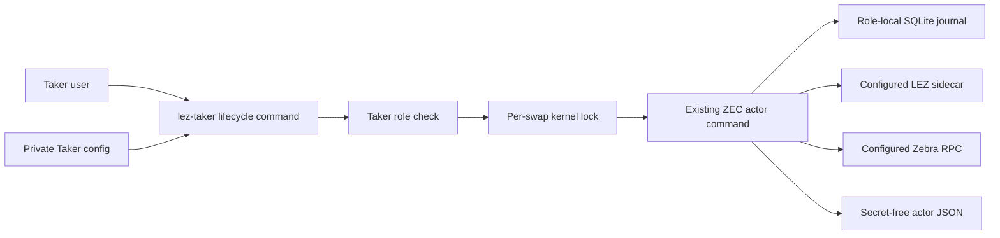
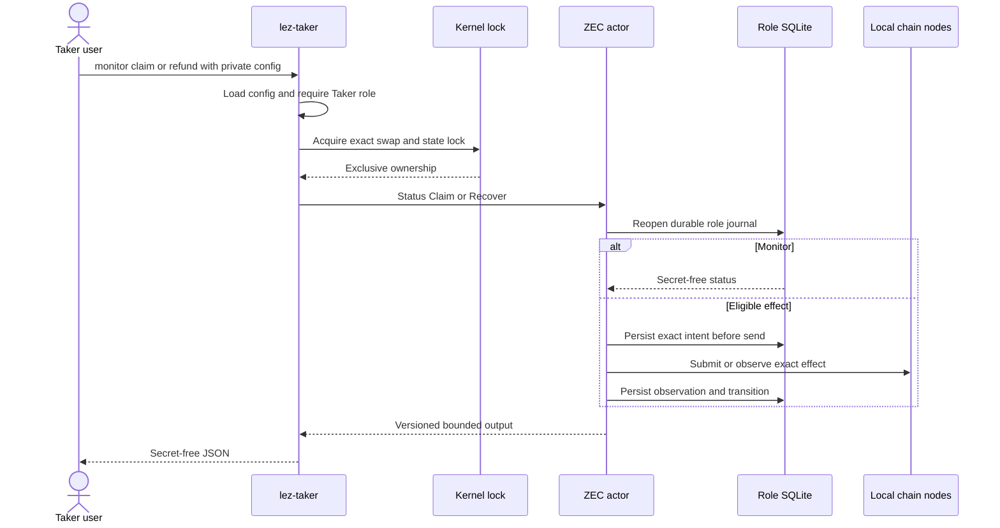

# ADR 0105: Run Taker lifecycle commands from role-local state

- Status: Accepted; ZEC process component GREEN
- Date: 2026-07-28
- Milestone: M5 progressive local-functional PoC

## Context

RFP-003 requires the Taker CLI to monitor, claim, and refund. Recovery after the
first lock must depend only on local state and chain nodes. Routing those actions
through Maker or Chat would transfer Taker authority to the counterparty and make
recovery depend on a pre-lock transport.

The ZEC reference actor already implements status, claim, and recover from one
role-fixed private config and durable SQLite journal. The Maker supervisor also
already owns a secure per-swap kernel lock. Duplicating either mechanism would
create inconsistent recovery and concurrency semantics.

## Decision

Add `monitor`, `claim`, and `refund` subcommands to the real `lez-taker` binary.
Each command requires one owner-private Taker actor config, rejects the Maker
role before state access, acquires the same deterministic nonblocking kernel lock
as the Maker supervisor, and invokes the existing ZEC actor command boundary.

Discovery and Chat arguments are not accepted by these subcommands. Monitor uses
only the config, recovery key, and role database. Claim and refund may use only
the chain routes and credentials already pinned by that Taker config. Output is
the existing versioned actor JSON; errors are payload-free and never include the
config path, keys, capabilities, or local root.

## Components and authority

Maker, Delivery, and Chat are deliberately absent from the post-lock authority
path. Monitor does not contact LEZ or Zebra. Claim and refund contact a chain
route only when the durable actor phase makes that exact effect eligible.

## Command sequence

## Atomicity argument

This CLI does not create a cross-chain transaction. Cross-chain atomicity remains
the signed ZEC BIP-199 plus LEZ hashlock/refund construction: the party learning
the claim secret enables the counterparty claim, while signed deadlines preserve
refund recovery if progress stops.

Local execution preserves that construction because:

1. the private config fixes the role, agreement, swap, state database, routes,
   and credentials;
2. one kernel lock excludes concurrent processes for that exact role state;
3. the existing actor journals exact intent before a public send and observes
   persisted or canonical state before considering another send;
4. claim and recover admission comes from the signed agreement and durable phase,
   not a CLI flag alone; and
5. replay reopens the same role database and converges through the actor's
   existing idempotence and observation rules.

There is no atomic commit between SQLite and either chain. Persist-before-send,
one-attempt journals, bounded canonical observation, and fail-closed unknown
outcomes are the explicit compensation for that unavoidable boundary.
