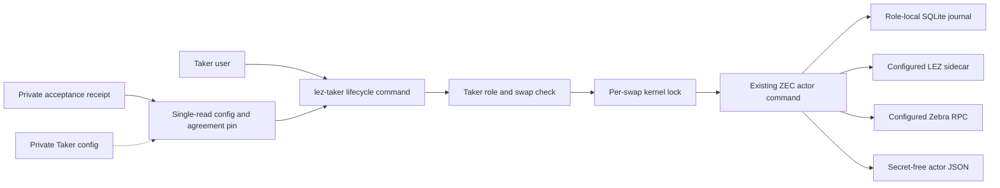
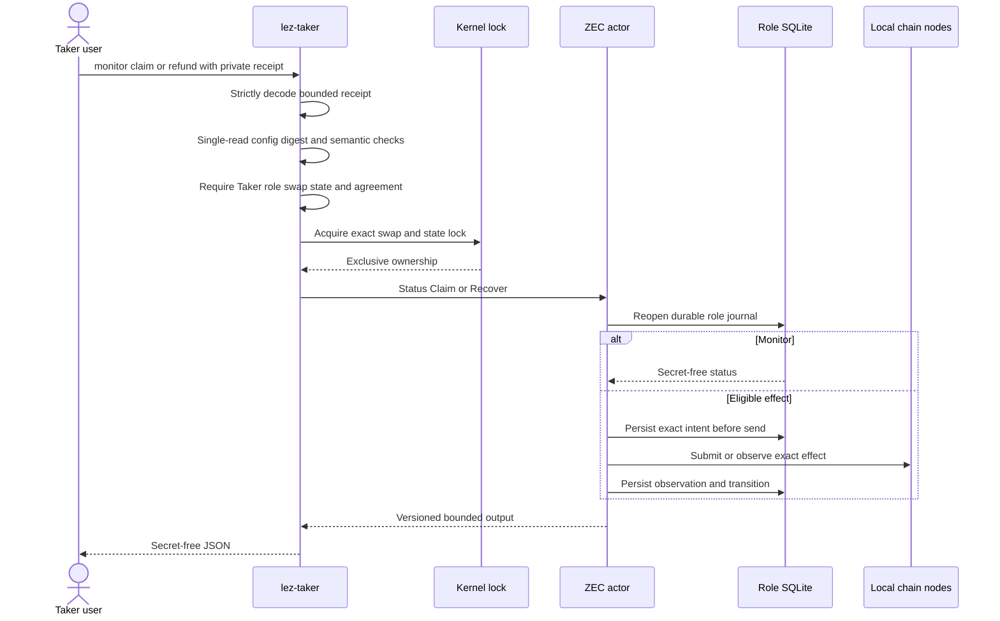
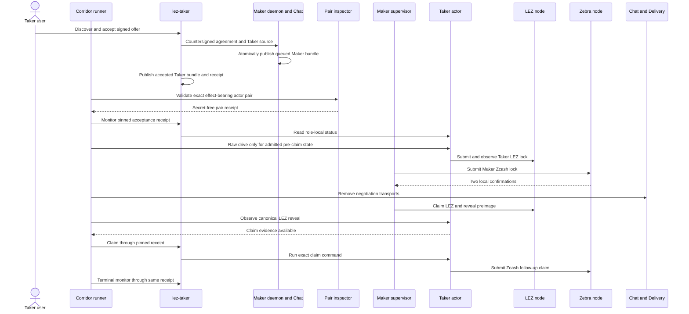

# ADR 0105: Run Taker lifecycle commands from role-local state

- Status: Accepted; receipt-bound runner contract GREEN; fresh actual-node execution pending
- Date: 2026-07-28
- Milestone: M5 progressive local-functional PoC

## Context

RFP-003 requires the Taker CLI to monitor, claim, and refund. Recovery after the
first lock must depend only on local state and chain nodes. Routing those actions
through Maker or Chat would transfer Taker authority to the counterparty and make
recovery depend on a pre-lock transport.

The ZEC reference actor already implements status, claim, and recover from one
role-fixed private config and durable SQLite journal. The Maker supervisor also
already owns a secure per-swap kernel lock. Duplicating either mechanism would
create inconsistent recovery and concurrency semantics.

## Decision

Add `monitor`, `claim`, and `refund` subcommands to the real `lez-taker` binary.
Each command requires exactly one owner-private actor source. The normal accepted-
swap path uses the acceptance receipt emitted only after successful Maker Chat
completion. The loader strictly decodes that bounded receipt, hashes and parses
the selected config from one identified read, and requires its exact byte digest,
Taker role, swap ID, state path, and countersigned-agreement digest. A direct
`--actor-config` source remains an explicit component-debug and manual-recovery
escape hatch; it does not represent the final accepted-swap handoff.

After source validation, the command rejects Maker authority before state access,
acquires the same deterministic nonblocking kernel lock as the Maker supervisor,
and invokes the existing ZEC actor command boundary.

Discovery and Chat arguments are not accepted by these subcommands. Monitor uses
only the config, recovery key, and role database. Claim and refund may use only
the chain routes and credentials already pinned by that Taker config. Output is
the existing versioned actor JSON; errors are payload-free and never include the
config path, keys, capabilities, or local root.

## Components and authority

Maker, Delivery, and Chat are deliberately absent from the post-lock authority
path. Monitor does not contact LEZ or Zebra. Claim and refund contact a chain
route only when the durable actor phase makes that exact effect eligible.

## Command sequence

## Composed application sequence

The M5 application runner now uses the acceptance-provisioned Taker config and
state rather than the separately finalized legacy pair. Before activation, a
small inspector reuses `validate_rebound_actor_pair` to prove that the queued
Maker bundle and receipt-provisioned Taker bundle are one exact swap despite
having distinct agreement files. Every receipt CLI invocation is bracketed by
mode, owner, link-count, size, device/inode, and SHA-256 checks. Raw `drive` is
admitted only for the fixed happy-path phase/action pairs and cannot cross the
`claim_zcash` boundary; the exact `claim_evidence_available` plus `claim_zcash`
state routes to `lez-taker claim --receipt` after transport cutover.

This diagram is the executable runner contract. A fresh isolated LEZ v0.2 and
Zebra Regtest replay is still required before treating these exact arrows as
new actual-node evidence.

## Atomicity argument

This CLI does not create a cross-chain transaction. Cross-chain atomicity remains
the signed ZEC BIP-199 plus LEZ hashlock/refund construction: the party learning
the claim secret enables the counterparty claim, while signed deadlines preserve
refund recovery if progress stops.

Local execution preserves that construction because:

1. the post-completion receipt fixes the exact Taker config bytes, role, swap,
   state database, and countersigned-agreement digest;
2. that private config fixes the routes and credentials, and the digest check
   and parse share one identified read rather than a check/use pair;
3. one kernel lock excludes concurrent processes for that exact role state;
4. the existing actor journals exact intent before a public send and observes
   persisted or canonical state before considering another send;
5. claim and recover admission comes from the signed agreement and durable phase,
   not a CLI flag alone; and
6. replay reopens the same role database and converges through the actor's
   existing idempotence and observation rules;
7. the pre-effect rebound-pair validator rejects role, run, swap, agreement,
   chain, endpoint, signer, funder, config, or mutable-path divergence between
   the effect-bearing Maker and Taker bundles; and
8. the runner pins the receipt identity and bytes around every receipt-based
   monitor or claim invocation,
   admits raw drive only from exact non-claim states, and binds every monitor and
   claim trace entry to the accepted swap and receipt digest.

There is no atomic commit between SQLite and either chain. Persist-before-send,
one-attempt journals, bounded canonical observation, and fail-closed unknown
outcomes are the explicit compensation for that unavoidable boundary.
