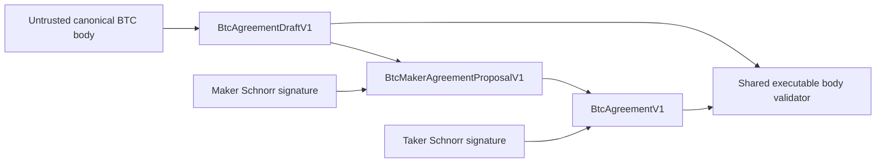
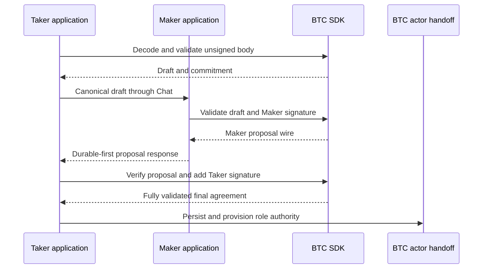

# ADR 0106: negotiate BTC with validated drafts and role signatures

- Status: Accepted for the SDK component boundary; application composition pending
- Date: 2026-07-29
- Milestone: M5 progressive application plane

## Context

The M3 BTC corridor starts from a fully countersigned agreement. M5 instead
needs distinct Maker and Taker application processes to agree on the exact
executable terms before either actor can touch Bitcoin or LEZ. The public BTC
SDK previously accepted either an untrusted body or a record containing both
signatures at once. Application code therefore had no safe type for a validated
unsigned draft or a Maker-only proposal.

An offer identifier and amount are insufficient to construct BTC authority.
The signed body also fixes the Bitcoin outpoint and claim transaction, LEZ
accounts and deadline, both participant keys, the network policy, and the
recovery schedule. These values must remain explicit owner-provided inputs;
the CLI must not invent deterministic hidden keys or chain facts.

## Decision

Add two types to the existing `lez-btc-swap-sdk` agreement module:

- `BtcAgreementDraftV1` bounded-decodes a canonical body and runs every existing
  non-signature executable-body invariant, with policy-pinned entry points that
  reject a different local Bitcoin genesis or confirmation requirement before
  a role may sign;
- `BtcMakerAgreementProposalV1` verifies the Maker Schnorr signature over that
  body.s fixed-domain commitment and can add the Taker signature only by
  delegating to the existing final `BtcAgreementV1` validator; its policy-pinned
  decoder applies the same guard before the Taker may countersign.

The implementation refactors the derived contract, cooperative claim, refund,
recovery schedule, and coordinator checks into one private validator shared by
draft and final agreement validation. It adds no dependency and defines no
second cryptographic format. The proposal wire is the version-one schema,
canonical body, canonical commitment, and Maker signature. The final wire
remains byte-for-byte the existing version-one agreement record.

## Signing and validation flow

The last two Chat and actor-handoff steps describe the target composition. This
checkpoint implements and verifies only the SDK calls shown through final
agreement validation; durable staging, role provisioning, and daemon/CLI wiring
remain explicit M5 work.

## Atomicity argument

This boundary performs no RPC, persistence, or chain effect. A draft cannot be
mistaken for an accepted agreement because it has a distinct Rust type and no
role signatures. A proposal cannot be mistaken for an accepted agreement
because it has only the verified Maker signature. `complete` constructs the
existing final record and returns authority only if both role signatures and
all executable fields pass the final validator together.

Consequently, changing any signed body field changes the commitment and
invalidates both signatures. A wrong-role signature, trailing bytes, malformed
body, derived Bitcoin drift, or unsafe recovery schedule fails before an actor
handoff. This is cryptographic all-or-nothing binding, not yet the database
atomicity of offer consumption, actor registration, and replay results; that
transaction remains the next application slice.

Both role boundaries must use the policy-pinned entry points in the M5 Chat path.

## Security and resource boundary

- All wire input is bounded by the existing maximum agreement-record size.
- Decoding rejects truncation, trailing bytes, non-canonical reconstruction,
  unsupported schemas, and invalid derived chain fields.
- Exact local Bitcoin genesis and confirmation policy are required before the
  Maker signs and again before the Taker signs.
- Signing keys stay outside the SDK types; callers provide only signatures.
- No Docker service, chain RPC, faucet, DNS service, public network, or public
  funds participate in these tests.
- The implementation uses the already reviewed `bitcoin`, `borsh`, `sha2`, and
  constant-time comparison dependencies; no license or supply-chain addition
  is introduced.

## Consequences and remaining work

The M5 BTC application can now negotiate without forging a zero-signature final
record or duplicating agreement validation. The next slices must bind the
authenticated offer and reservation to the draft, stage the Maker proposal
before response, atomically consume the offer and register the Maker actor,
provision role-fixed no-clobber bundles, and expose the explicit draft, signing
key, and per-swap authority inputs in the real daemon and Taker CLI.

This component result does not certify a BTC application swap, BTC Chat, actor
provisioning, any local-node effect, or M5 completion. No milestone tag is
authorized by this decision.
