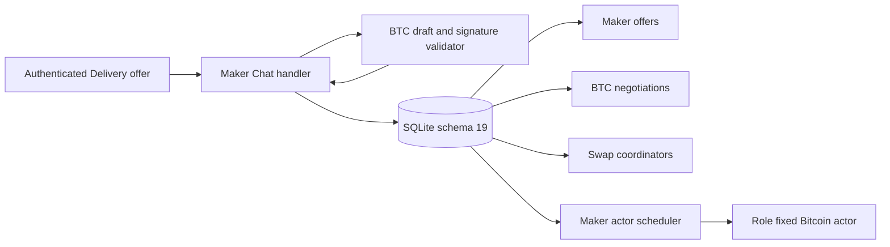
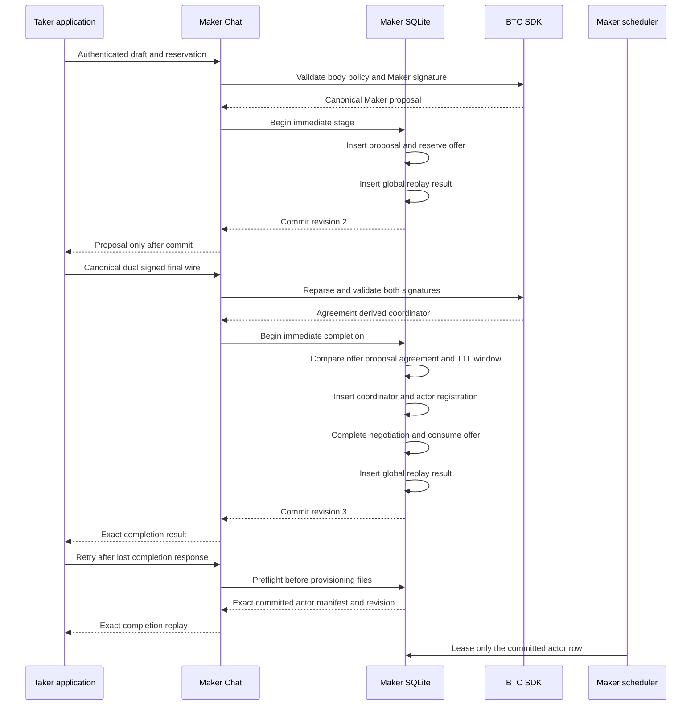

# ADR 0107: stage and complete BTC negotiations atomically

- Status: Accepted for the durable application boundary
- Date: 2026-07-29
- Milestone: M5 progressive application plane

## Context

ADR 0106 introduced a validated unsigned BTC draft and Maker-signed proposal,
but it deliberately did not decide where Chat may expose a proposal or how a
final agreement becomes executable authority. A process crash after responding
but before reservation, or separate commits for the coordinator and actor,
could otherwise create an unowned transcript or a partially activated swap.

The existing recovery acceptance type retains bytes after caller validation and
does not itself parse signatures. The application store therefore cannot trust
that wrapper, a caller-supplied coordinator, or nonempty database blobs. It must
reparse the canonical proposal and final wire and bind them to the winning
offer before any actor is registered.

## Decision

Schema 19 adds a strict pair-specific `maker_btc_negotiations` table. Staging
validates the real Maker-signed SDK proposal, exact offer price and Bitcoin
amount, reservation-derived swap identity, both role keys, and the
caller-authenticated Delivery commitment. The store cannot derive that envelope
commitment; the Chat boundary must prove it against the discovered signed offer. One `BEGIN IMMEDIATE` transaction inserts the proposal,
reserves the active unexpired offer, advances its revision, and records global
request replay before Chat may send the proposal.

Completion reparses the dual-signed `BtcAgreementV1`, reconstructs its initial
coordinator, and exact-compares the final body with the durable proposal. A second `BEGIN IMMEDIATE` transaction inserts the coordinator, registers the
immutable Bitcoin Maker actor, completes the negotiation, consumes the offer,
and records the replay result. The generic offer-consume path refuses any offer
with a staged BTC or ZEC negotiation.

## Negotiation and activation flow

## Atomicity argument

There is no distributed cross-chain database transaction. Atomicity at this
application boundary is instead two local linearization points followed by the
pair protocol:

- Before staging commits, Chat has no proposal it is allowed to expose. A
  rollback leaves the offer active and no BTC negotiation row.
- After staging commits, exactly one reservation owns one canonical signed
  proposal. A competing request sees the advanced offer revision.
- Before completion commits, no swap row or scheduler authority exists. A
  failure at the final replay insert rolls back the coordinator, actor,
  negotiation, and offer writes together.
- After completion commits, exact replay verifies the consumed offer, completed
  final wire, coordinator bytes, and immutable actor manifest without changing
  scheduler time. A different request payload conflicts.
- The final agreement body equals the durable proposal body and both signatures
  cover its commitment. Changing the route, amount, keys, Bitcoin policy,
  recovery schedule, offer commitment, or reservation changes a validated
  binding and fails before activation.

Once the actor starts, cross-chain atomicity remains the M3 construction: exact
signed lock and recovery terms, durable effect authority, reveal ordering, and
claim or refund paths. This SQLite transaction prevents partial local
activation; it does not claim a simultaneous commit across Bitcoin and LEZ.

## Replay, time, and crash rules

- Fresh stage requires `offer created_at <= reserved_at < offer expiry` and exact
  signed-proposal direction equality with the offer. Exact replay ignores the retry
  wall clock but revalidates that the durable original reservation time remains in
  that half-open window and that both durable rows still name the stage request.
- Fresh completion requires `reserved_at <= accepted_at < offer expiry`.
- Completion replay excludes actor scheduling time from request identity and
  never resets a leased, backed-off, or terminal scheduler row.
- A read-only preflight reparses the complete staged proposal and final agreement,
  then rebinds the consumed offer route, quote, revision, coordinator, and immutable
  actor before recovering provisioning authority after a lost response.
- Completed rows are not trusted on load: the store reparses the final SDK wire
  and rechecks proposal body, exact Maker signature, commitment, and coordinator
  identity equality.
- Schema 18 migration rebuilds the global mutation allowlist while preserving
  sequence numbers and prior request rows.

## Resources and evidence boundary

The focused test uses a real deterministic SDK draft, Maker Schnorr signature,
Taker Schnorr signature, strict SQLite tables, and an injected trigger failure.
It uses no Bitcoin node, LEZ node, Docker service, RPC, faucet, DNS, public
network, or public funds. It therefore proves durable application binding and
rollback, not a BTC application swap or chain behavior. Local Bitcoin Core
Regtest and LEZ v0.2 composition remain a later M5 checkpoint.

## Consequences and remaining work

The store can now safely support a real BTC Chat handler without inventing a
second agreement format or accepting partially durable authority. The next
vertical slice is role-fixed, no-clobber BTC Maker and Taker provisioning plus
daemon and Taker CLI handoff. Fresh local-node execution, unavailable-chain
isolation, two concurrent applications, XMR application composition, and M5
closure gates remain open. This decision does not authorize an M5 tag.
