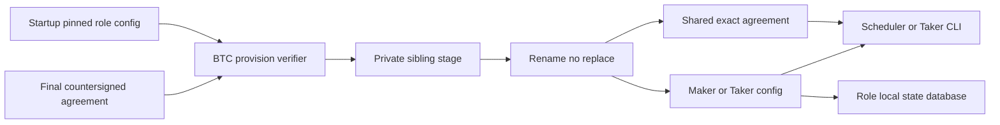
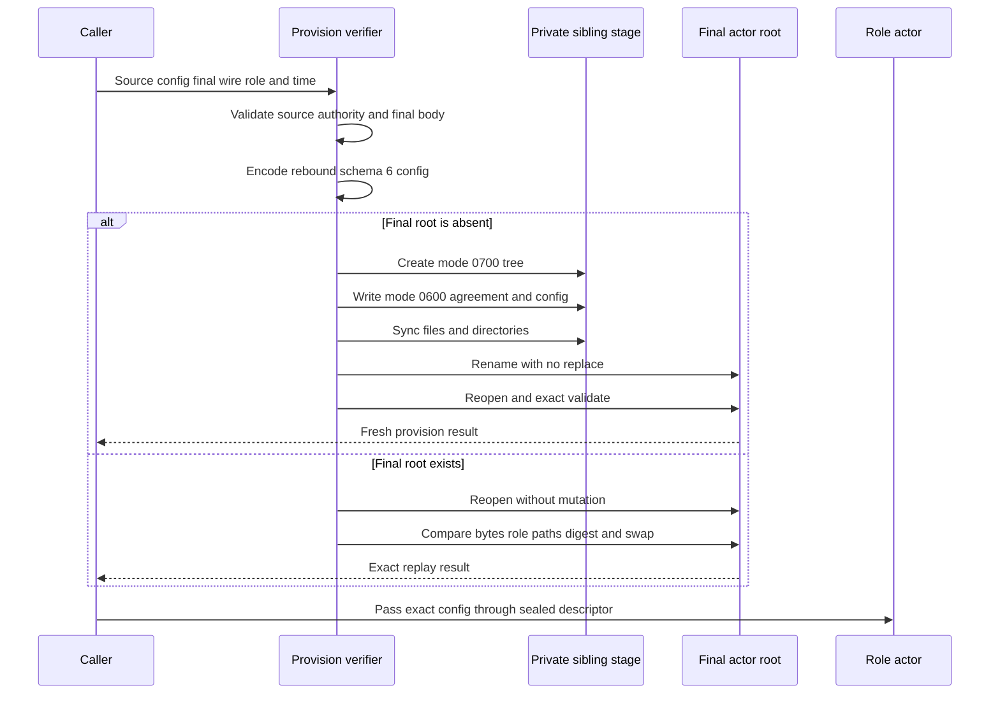

# ADR 0108: provision role-fixed BTC actors without clobber

- Status: Accepted for the BTC application provisioning boundary
- Date: 2026-07-29
- Milestone: M5 progressive application plane

## Context

ADR 0107 makes the final BTC agreement, coordinator, consumed offer, and Maker
scheduler row one durable database authority. The scheduler and Taker CLI still
need independent role configurations before either process may act. Reusing one
combined fixture tree would expose counterparty paths, while writing directly
into a final directory could leave a partial actor after a crash or overwrite a
pre-existing operator artifact.

The BTC reference actor already has one strict schema-6 configuration format,
role validation, exact agreement digest binding, and sealed descriptor 196
execution. Provisioning therefore reuses that format rather than introducing a
second application-specific actor configuration.

## Decision

The BTC actor crate exposes symmetric Maker and Taker provisioning functions.
Each accepts a startup-pinned schema-6 source authority, a canonical final
agreement, the trusted acceptance time, and one new owner-private output root.
The provisioner:

1. validates the source role, exact source agreement, and complete activation
   authority;
2. reparses the final dual-signed agreement and requires its executable body to
   equal the source body, while allowing independently generated valid signature
   bytes;
3. preserves role-private signer journals, credentials, recovery material, node
   endpoints, and runtime policy from the source;
4. rebinds only the exact final agreement path and digest, trusted acceptance
   time, and fresh role-local lifecycle database path;
5. writes one private sibling stage with mode-0700 directories and mode-0600
   agreement/config files, synchronizes them, and publishes the complete tree by
   `RENAME_NOREPLACE`; and
6. accepts an existing destination only after exact byte and semantic replay
   validation. The opposite role subtree must be absent.

## Publication and replay flow

## Atomicity argument

This boundary is one local filesystem publication, not a distributed chain
transaction.

- Before rename, the final actor root does not exist. A failed write cannot
  expose a partially authoritative final tree.
- `RENAME_NOREPLACE` is the publication linearization point. It either installs
  the complete sibling tree or leaves the existing destination untouched.
- A concurrent loser removes only its own stage and then must prove the winner
  is byte-identical and semantically role-correct before returning replay.
- Existing output, a counterparty subtree, changed agreement/config bytes,
  unsafe permissions, links, path drift, or role drift fails closed and is never
  replaced.
- Exact replay preserves the published agreement and config inodes and bytes.
  Mutable role lifecycle state is permitted only as one private regular file at
  the configured path.

The source adaptor signing journals are deliberately preserved rather than
rebound to empty files: they contain pre-activation signing authority. Copying
or live-snapshotting those SQLite files would require a separate transactional
import design. This local PoC keeps each source journal role-private and pinned;
packaging or rotating that authority remains production hardening.

## Resources and evidence boundary

The focused test uses deterministic cryptographic agreements, actual schema-6
actor configs, local SQLite signing authority, and test-owned private temporary
directories. It uses no Bitcoin node, LEZ node, RPC endpoint, Docker service,
faucet, DNS, public network, or public funds. It proves role and filesystem
authority publication, not a chain effect or complete application swap.

## Consequences and remaining work

The Maker scheduler and Taker CLI can consume the same proven BTC actor format
without sharing a role tree or accepting partial output. The next M5 slice adds
BTC Chat proposal/completion methods, daemon-side Maker provisioning, Taker CLI
provisioning and receipt replay, then composes those actors with isolated
Bitcoin Core Regtest and LEZ v0.2. Broader crash injection, orphan-stage cleanup,
different-UID isolation, credential rotation, and atomic signer-journal import
remain hardening work. This decision does not authorize an M5 tag.
