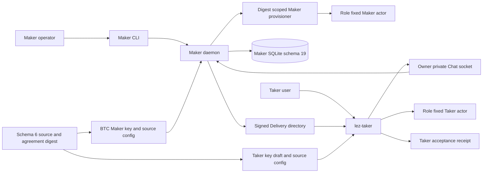
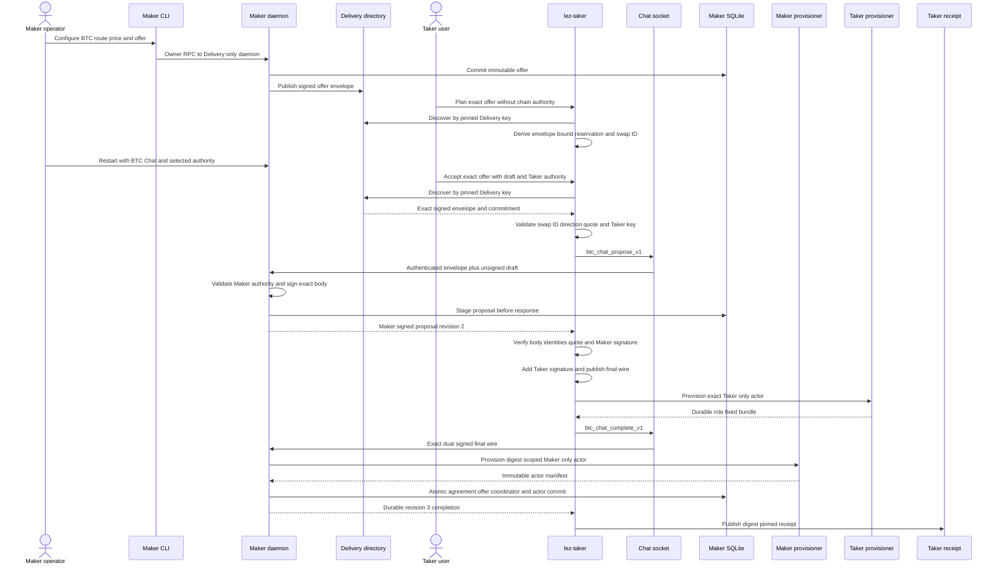
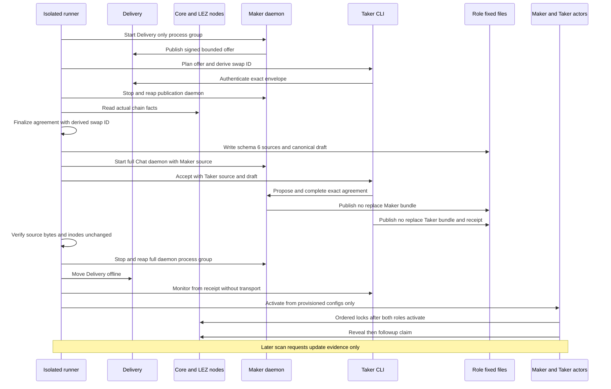
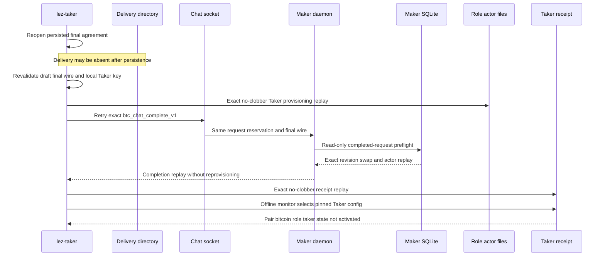

# ADR 0109: hand off BTC from Chat to role-fixed actors

- Status: Accepted for the BTC application pre-effect process boundary
- Date: 2026-07-29
- Milestone: M5 progressive application plane

## Context

ADRs 0106 through 0108 prove the canonical BTC signing format, the schema-19
one-winner database transaction, and role-fixed no-clobber actor publication.
They did not prove that the actual maker daemon and `lez-taker` process compose
those boundaries. A process handoff also has two distinct identities: the
Delivery signer authenticates the offer transport, while the BTC agreement
signer is selected by the explicit unsigned draft and daemon authority. Treating
those keys as interchangeable would either couple unrelated key rotation or let
transport identity silently replace agreement authority.

## Decision

The maker daemon accepts a complete optional BTC Chat authority group:

- one or more startup-loaded schema-6 Maker source configs;
- a dedicated owner-private BTC Maker agreement key;
- an existing owner-private root for digest-scoped Maker actor bundles; and
- the exact BTC actor executable plus its SHA-256 identity.

The group is all-or-none. A Chat-enabled daemon must have a complete Delivery
transport and at least one complete ZEC or BTC pair authority. BTC-only Chat no
longer requires ZEC claim or preimage material.

Before an agreement exists, the daemon may instead start with only a complete
Delivery directory/key pair. This publication-only mode exposes offer RPCs but
has no Chat listener, agreement signer, provisioner, or actor authority. Pair
authority is rejected unless Chat is configured, and Chat is rejected unless at
least one complete pair authority is configured. The operator can therefore
publish first, let `lez-taker --plan-btc-offer` authenticate the exact envelope
and derive its reservation-bound swap ID without disclosing private material,
then restart the daemon with the already selected per-swap authority.

`btc-local-poc-provision export-draft` extracts the canonical unsigned body from
the finalized actual-node fixture. It reparses the final agreement under its
exact Bitcoin policy and publishes a new mode-0600 draft beneath a canonical
mode-0700 directory with no-clobber semantics. The application never retypes or
maintains a second representation of executable chain terms.

For actual-node composition, the direction runner creates schema-6 Maker and
Taker source authority from that same finalized agreement and records its exact
SHA-256 in both configs. The initial discovery range is one bounded 4,096-block
window. This is broad enough for the isolated lifecycle without changing signed
terms and remains within the actor's existing bound. It is source authority,
not the final published bundle: the no-clobber provisioner remains the only
linearization point for the configs consumed after application acceptance.

The real Taker CLI accepts one authenticated BTC offer, canonical unsigned
draft, owner-private Taker agreement key, role-fixed schema-6 source config,
fresh actor root, final-wire output, and receipt output. It validates the
Delivery commitment, reservation-derived swap ID, direction, quote, both role
identities, Maker Schnorr signature, and exact draft body before adding its own
Schnorr signature. It publishes the exact final wire before asking the daemon
to complete. After daemon completion, it publishes an owner-private receipt
that pins the Taker config digest, agreement digest, role, swap, and state path.

## Fresh acceptance flow

## Actual-node composition flow

This sequence deliberately disables daemon actor supervision for the first
splice. The daemon owns negotiation and atomic local registration, then exits

## Lost-response and offline replay flow

## Atomicity argument

There is no distributed transaction across two chains, two hosts, and SQLite.
The handoff preserves the narrower authorities needed before chain execution:

1. The canonical body commitment covers the swap ID, direction, both role
   identities, both chain terms, amounts, locks, claims, and recovery schedule.
   Maker and Taker Schnorr signatures therefore either validate over the same
   executable body or the agreement is rejected.
2. The daemon stages the Maker signature and winning reservation in one SQLite
   transaction before returning it. A competing reservation cannot obtain a
   second authoritative proposal.
3. The Taker publishes the final wire and its role-only actor with no-clobber
   filesystem linearization before requesting Maker completion. A failure can
   leave reusable private authority, but cannot expose an acceptance receipt or
   mutate an existing different artifact.
4. Maker completion atomically commits the final agreement, consumed offer,
   agreement-derived coordinator, completed negotiation, immutable Maker actor
   row, and global replay result. Trigger-forced rollback proves there is no
   partially visible database acceptance.
5. The Taker receipt is published only after that durable completion response.
   It pins one stable config read and cannot grant authority to changed bytes.
6. A lost response replays the completed database authority before current-time
   checks or provisioning, while the role files and receipt retain their
   original bytes and inodes.
7. Daemon readiness is synchronized in a private sibling file, then published
   without replacement. An observer sees no path or the complete socket path,
   never the create-before-write empty state exposed by a locked/offline replay.
8. Draft export revalidates the canonical final body and Bitcoin policy, then
   uses owner-private create-new publication. Retry cannot replace the draft or
   change the executable terms used by Chat.

These guarantees make application acceptance all-or-nothing at each local
authority boundary. Cross-chain atomicity begins only after actor activation;
it still depends on the agreement-ordered lock, reveal, claim, and refund flows
documented for the M3 BTC corridor.

The agreement digest prevents a source config from silently selecting different
executable terms. It does not make a mutable source pathname atomic; that
property begins only at the provisioner's no-replace publication described in
ADR 0108.

## Resources and evidence boundary

The process PoC executes the real maker daemon, Maker CLI, Taker CLI, Unix RPC,
Delivery directory, Chat socket, SQLite store, Schnorr validation, role
provisioners, and offline Taker monitor. The source agreement and schema-6
authority are deterministic test-owned fixtures. The daemon is restarted once
so those fixtures bind the actual signed offer commitment and reservation.

It starts no Bitcoin Core, LEZ, Docker, or public service. It uses no chain RPC,
faucet, DNS, public network, public deployment, or public funds. Runtime is
therefore fast and deterministic, but it proves only the pre-effect application
handoff. The next slice configures the same published actor configs for isolated
Bitcoin Core Regtest and LEZ v0.2; changing to a public route remains a config
and deployment operation, not a negotiation-format change. The exact
process boundary now includes a real Delivery-only boot, Maker CLI publication,
Taker planning, an authority-bearing daemon restart, and canonical draft export.
The next proof uses those exact identities and terms in the isolated nodes. The exact
locked/offline test first exposed the readiness publication race, then passed ten
consecutive process replays after atomic publication replaced direct
create-before-write. That hardening changes no chain or negotiation authority.

## Consequences and remaining work

BTC discovery, initiation, dual-role signing, durable completion, role-only
provisioning, exact lost-response replay, receipt publication, and offline
monitoring now cross real process boundaries. Actual local-node actor activation
and terminal claim/refund, unavailable-node pair isolation, concurrent
application composition, and the XMR application handoff remain before literal
M5 closure. Production key provisioning, signer-journal import or rotation,
crash injection at every filesystem boundary, and public-route review remain
later hardening. This decision does not authorize an M5 tag.
